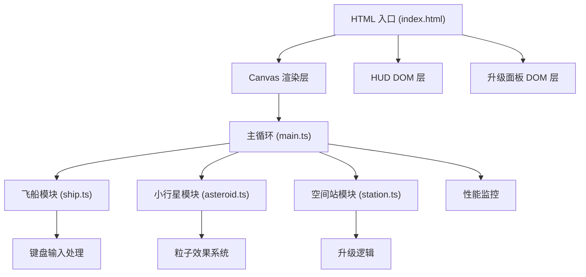
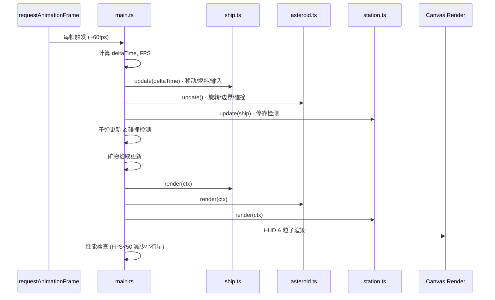

## 1. 架构设计



## 2. 技术描述

- **前端框架**：原生 TypeScript + Vite（不使用 React/Vue 框架）
- **渲染技术**：HTML5 Canvas 2D API
- **项目初始化**：Vite vanilla-ts 模板
- **音频**：Web Audio API（方波蜂鸣音效）
- **类型系统**：TypeScript 严格模式，目标 ES2020，模块 ESNext

## 3. 文件结构

| 文件路径 | 用途 |
|---------|------|
| `package.json` | 项目依赖与脚本（typescript、vite，npm run dev 启动） |
| `index.html` | 入口页面，包含 Canvas 主游戏区域、HUD 状态栏、升级面板 |
| `tsconfig.json` | TypeScript 严格模式配置 |
| `vite.config.js` | Vite 基础构建配置 |
| `src/main.ts` | 游戏主循环，场景状态管理，驱动三大模块更新渲染 |
| `src/ship.ts` | 飞船类：属性、移动、采集、受击、升级、键盘控制 |
| `src/asteroid.ts` | 小行星类：大小、旋转、矿物类型、击碎分裂、矿物掉落 |
| `src/station.ts` | 空间站类：停靠检测、升级菜单、出售矿物、六边形绘制 |

## 4. 核心数据模型

### 4.1 飞船状态 (Ship)

```typescript
interface ShipState {
  x: number;
  y: number;
  vx: number;
  vy: number;
  angle: number;
  fuel: number;          // 初始 100，每秒 -1
  maxFuel: number;       // 初始 100
  armor: number;         // 初始 20
  maxArmor: number;
  cargo: number;         // 已用量
  maxCargo: number;      // 初始 50
  weaponDamage: number;  // 初始 5
  weaponLevel: number;
  minerals: {
    iron: number;
    silver: number;
    gold: number;
    diamond: number;
  };
  totalCollected: number;
}
```

### 4.2 小行星 (Asteroid)

```typescript
type MineralType = 'iron' | 'silver' | 'gold' | 'diamond';

interface AsteroidState {
  x: number;
  y: number;
  size: number;          // 10-40 像素
  rotation: number;
  rotationSpeed: number; // 0.01-0.05 rad/frame
  mineralType: MineralType;
  hp: number;
  vx: number;
  vy: number;
}
```

### 4.3 矿物属性

| 类型 | 颜色 | 概率(普通) | 概率(外围) | 价值 |
|------|------|-----------|-----------|------|
| iron | `#8B4513` | 40% | 20% | +1 |
| silver | `#C0C0C0` | 30% | 30% | +2 |
| gold | `#FFD700` | 20% | 30% | +4 |
| diamond | `#00BFFF` | 10% | 20% | +8 |

### 4.4 升级配置

| 升级项 | 消耗 | 效果 |
|-------|------|------|
| 护甲 | 10铁 + 5银 | +10 护甲 |
| 引擎 | 5金 + 10铁 | 燃料上限 +50 |
| 货舱 | 5星钻 + 20银 | 货舱容量 +10 |
| 武器 | 15铁 + 10金 | 子弹伤害 +2 |

## 5. 游戏循环架构



## 6. 性能优化策略

- 帧率监控：每 500ms 计算一次平均 FPS
- 动态降级：FPS < 50 时移除 3 颗小行星，直到 FPS 恢复
- 渲染优化：星空背景预渲染至离屏 Canvas
- 对象池：子弹与粒子对象复用，减少 GC
