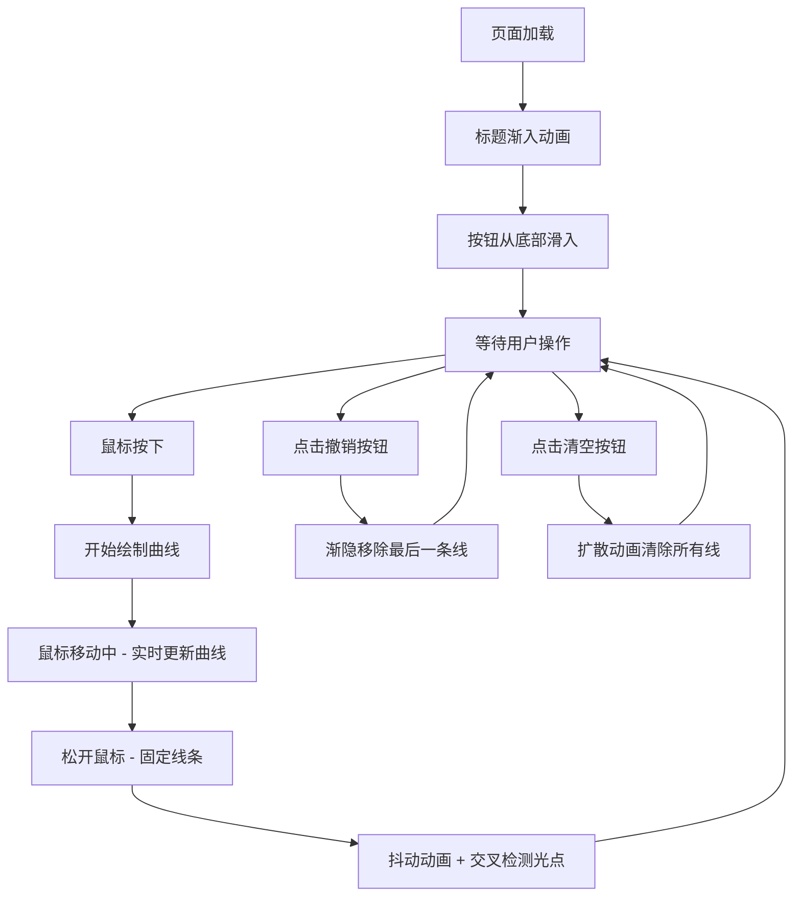

## 1. 产品概述

丝线缠绕生成器是一款基于Canvas的交互式艺术创作工具，用户通过鼠标拖拽绘制彩色贝塞尔曲线，创造类似「牵线木偶」或「绕线画」的沉浸式视觉体验。

- **核心目标**：在浏览器中提供流畅、直观的丝线艺术创作体验
- **目标用户**：艺术爱好者、设计师、普通用户
- **产品价值**：零门槛的抽象艺术创作，丝滑流畅的交互体验

## 2. 核心功能

### 2.1 功能模块

1. **主画布区域**：贝塞尔曲线实时绘制、丝线缠绕效果、光点打结效果
2. **撤销操作**：撤销上一条绘制的线条（最多50步），带渐隐动画
3. **清空操作**：一次性清除所有线条，带扩散淡出动画
4. **状态面板**：实时显示线条总数和鼠标移动速度

### 2.2 功能详情

| 模块名称 | 功能描述 |
|---------|---------|
| 贝塞尔曲线绘制 | 按下鼠标拖拽时实时绘制，颜色从12色调色板随机选择，粗细随鼠标速度变化（1px-8px） |
| 丝线抖动效果 | 新线条生成后0.5秒内两端产生轻微抖动（振幅2px，频率5Hz） |
| 打结光点效果 | 线条交叉距离小于5px时，产生白色渐变光点（半径3px，持续1.5秒） |
| 撤销功能 | 右下角圆形按钮，撤销最后一条线条，渐隐动画0.3秒，最多保留50步 |
| 清空功能 | 左上角圆形按钮，清除全部线条，扩散淡出动画0.5秒 |
| 状态面板 | 左下角显示线条总数和鼠标速度，速度每0.2秒更新，颜色随速度变化 |

## 3. 核心流程

## 4. 用户界面设计

### 4.1 设计风格
- **主色调**：深灰黑色背景（#0D0D0D ~ #1E1E1E），金色点缀（#FFD700）
- **配色方案**：12种彩色丝线调色板 + 深色背景 + 金色边框/文字
- **按钮风格**：圆形，悬停变色，简洁扁平
- **字体**：现代无衬线字体，标题金色发光
- **布局**：画布居中，角落放置操作按钮和状态面板

### 4.2 页面设计

| 区域 | 元素 | UI细节 |
|-----|------|--------|
| 页面顶部 | 标题「丝线缠绕生成器」 | 24px，#FFD700，字间距2px，0.5秒渐入，下方金色细横线 |
| 画布区域 | Canvas | 90%宽×80%高，居中，深灰径向渐变背景，2px金色发光边框 |
| 左上角 | 清空按钮 | 圆形（半径25px），红色#C0392B，滑入动画 |
| 右下角 | 撤销按钮 | 圆形（半径25px），灰色#555悬停#888，滑入动画 |
| 左下角 | 状态面板 | 显示线条数和速度，速度颜色随数值变化（绿/橙/红） |

### 4.3 动画设计
- 页面加载：标题0.5秒渐入，按钮0.4秒从底部滑入
- 绘制：线条实时跟随鼠标，粗细动态变化
- 新线条：两端抖动动画0.5秒
- 撤销：渐隐动画0.3秒
- 清空：向外扩散淡出0.5秒
- 光点：1.5秒渐隐消失

### 4.4 性能要求
- 200条线条时帧率 ≥ 55FPS
- 超过500条线条时自动冻结最早的线条（透明度降至0.1）

## 5. 技术要求

- **技术栈**：TypeScript + Vite，无Canvas绘图库依赖
- **构建工具**：Vite
- **浏览器兼容性**：现代浏览器（Chrome、Firefox、Safari、Edge最新版）
