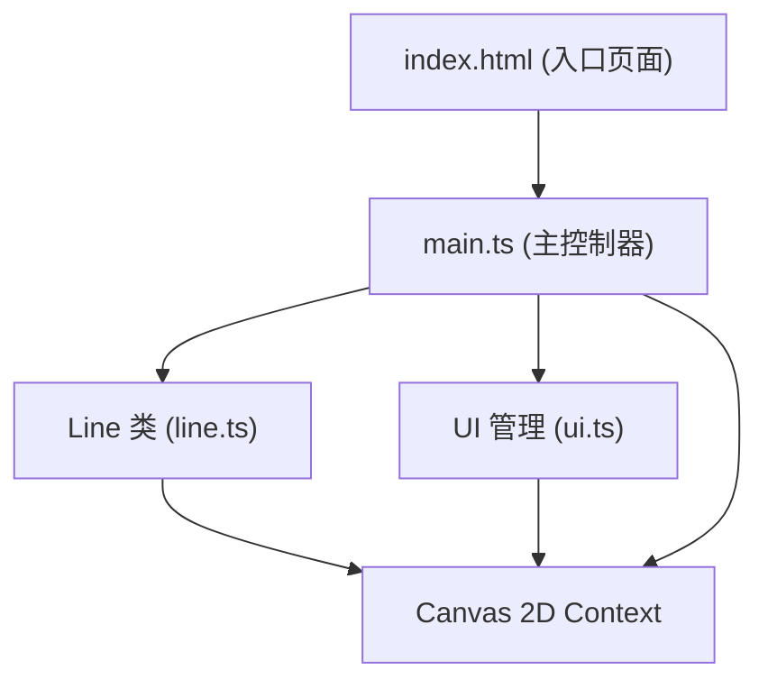

## 1. 架构设计



## 2. 技术选型

- **前端框架**：原生 TypeScript (无框架)
- **构建工具**：Vite
- **渲染方式**：HTML5 Canvas 2D Context
- **状态管理**：内部数组管理，无需额外状态库

## 3. 文件结构

| 文件路径 | 职责描述 |
|---------|---------|
| package.json | 项目依赖和启动脚本配置 |
| index.html | 入口HTML，包含Canvas、按钮、状态面板DOM结构 |
| tsconfig.json | TypeScript配置（严格模式，ES2020目标，ESNext模块） |
| vite.config.js | Vite基础构建配置 |
| src/main.ts | 主入口：初始化Canvas和UI、注册事件监听、管理线条数组、协调渲染循环 |
| src/line.ts | Line类：贝塞尔曲线绘制、抖动动画、光点生成、透明度动画 |
| src/ui.ts | UI管理：撤销按钮、清空按钮、速度面板的DOM交互与样式 |

## 4. 数据模型

### 4.1 Line 类结构

```typescript
interface Point {
  x: number;
  y: number;
}

interface GlowPoint {
  x: number;
  y: number;
  startTime: number;
  duration: number;
}

class Line {
  points: Point[];           // 曲线控制点数组
  color: string;             // 颜色（HEX）
  thickness: number;         // 基础粗细
  opacity: number;           // 当前透明度
  createdAt: number;         // 创建时间戳
  isWobbling: boolean;       // 是否处于抖动状态
  wobbleDuration: number;    // 抖动持续时间
  glowPoints: GlowPoint[];   // 光点列表
  isFrozen: boolean;         // 是否被性能保护冻结
  isUndoing: boolean;        // 是否正在撤销动画中
  undoStartTime: number;     // 撤销开始时间
  isClearing: boolean;       // 是否正在清空动画中
  clearStartTime: number;    // 清空开始时间
  clearOrigin: Point;        // 清空动画扩散原点
}
```

### 4.2 应用状态

```typescript
interface AppState {
  lines: Line[];                 // 所有已绘制线条
  currentLine: Line | null;      // 当前正在绘制的线条
  isDrawing: boolean;            // 是否正在绘制
  mouseSpeed: number;            // 当前鼠标速度 (px/s)
  lastMousePos: Point;           // 上一次鼠标位置
  lastMouseTime: number;         // 上一次鼠标位置时间戳
  canvasWidth: number;           // 画布宽度
  canvasHeight: number;          // 画布高度
  maxHistory: number;            // 最大撤销步数（50）
  performanceThreshold: number;  // 性能保护阈值（500条线）
}
```

## 5. 核心算法

### 5.1 贝塞尔曲线平滑绘制
- 收集鼠标轨迹点，使用二次或三次贝塞尔曲线进行平滑
- 每两个相邻点之间绘制贝塞尔曲线，控制点取中点

### 5.2 鼠标速度计算
```
速度 = 两点距离 / 时间差 (px/s)
线宽 = 映射(速度, [0, 200], [8, 1])  // 速度越快越细
```

### 5.3 丝线抖动效果
```
偏移量 = sin(时间 × 频率 × 2π) × 振幅 × 衰减因子
衰减因子 = 1 - (已过时间 / 总时长)
```

### 5.4 线条交叉检测
- 新线条生成时，遍历所有已有线条
- 采样曲线上的点，计算与其他曲线采样点的最小距离
- 距离 < 5px 时生成光点

### 5.5 性能保护机制
- 每帧检测线条总数
- 超过500条时，将最早的线条标记为 frozen，opacity 降至 0.1
- frozen 线条跳过动画计算，仅静态绘制

## 6. 渲染循环

```
requestAnimationFrame →
  1. 计算增量时间 deltaTime
  2. 更新所有线条动画状态（抖动、光点、撤销、清空）
  3. 性能保护检查
  4. 清空画布
  5. 绘制背景径向渐变
  6. 遍历绘制所有线条（含当前正在绘制的临时线）
  7. 绘制所有光点
  8. 更新UI状态面板
```

## 7. 事件处理

| 事件 | 处理逻辑 |
|-----|---------|
| mousedown | 开始绘制，创建新Line，记录起点 |
| mousemove | 更新当前Line的轨迹点，计算鼠标速度 |
| mouseup | 结束绘制，加入线条数组，触发抖动+交叉检测 |
| mouseleave | 等同于mouseup（如果正在绘制） |
| 撤销按钮click | 标记最后一条线为撤销动画，0.3秒后移除 |
| 清空按钮click | 标记所有线为清空动画，0.5秒后清空数组 |

## 8. 调色板

```typescript
const COLOR_PALETTE = [
  '#FF6B6B', '#4ECDC4', '#45B7D1', '#96CEB4',
  '#FFEAA7', '#DDA0DD', '#98D8C8', '#F7DC6F',
  '#BB8FCE', '#85C1E9', '#F0B27A', '#82E0AA'
];
```
