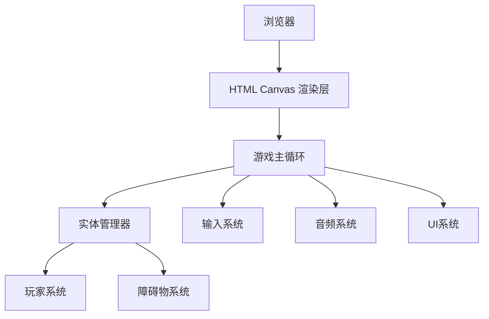

## 1. 架构设计



## 2. 技术描述
- 前端：TypeScript + HTML5 Canvas + Vite
- 构建工具：Vite
- 无后端服务
- 程序化生成所有资源

## 3. 文件结构
```
/
├── package.json
├── index.html
├── tsconfig.json
├── vite.config.js
└── src/
    ├── main.ts          # 入口：Canvas初始化、音频加载、游戏循环、输入处理
    ├── game.ts          # 核心逻辑：实体管理、碰撞检测、分数生命、音效控制
    ├── player.ts        # 玩家类：跳跃物理、二段跳、动画、碰撞响应
    └── obstacles.ts    # 障碍物生成器：节拍生成、平台光带、对象池
```

## 4. 核心数据模型

### 4.1 玩家状态
```typescript
interface PlayerState {
  x: number;
  y: number;
  velocityY: number;
  isJumping: boolean;
  canDoubleJump: boolean;
  jumpCount: number;
  squash: number; // 挤压动画参数
}
```

### 4.2 障碍物
```typescript
interface Obstacle {
  type: 'gap' | 'spike';
  x: number;
  width: number;
  height: number;
  rotation: number;
  beatIndex: number;
}
```

### 4.3 游戏状态
```typescript
interface GameState {
  score: number;
  lives: number;
  beatMultiplier: number;
  bpm: number;
  isPaused: boolean;
  isGameOver: boolean;
}
```
