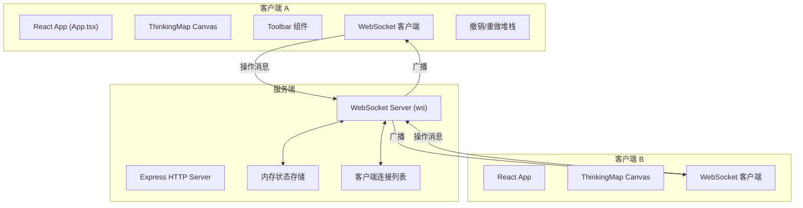

## 1. 架构设计



## 2. 技术说明

- 前端：React 18 + TypeScript + Vite
- 后端：Node.js Express 4 + ws (WebSocket库)
- 存储：服务端内存存储（无需数据库）
- 渲染：HTML5 Canvas 2D API
- 构建工具：Vite（代理 /api 和 /ws 到后端端口 3001）

## 3. 文件组织

| 文件路径 | 说明 |
|----------|------|
| package.json | 项目依赖（react、react-dom、express、ws、typescript、vite等）和启动脚本 |
| index.html | 入口页面，包含根 div#root |
| tsconfig.json | TypeScript 严格模式配置，目标 ES2020，模块 ESNext |
| vite.config.js | Vite 构建配置，代理设置 |
| src/App.tsx | 主组件，WebSocket 连接管理，撤销/重做堆栈，全局状态 |
| src/components/ThinkingMap.tsx | Canvas 绘制组件，渲染节点/连线/网格，处理鼠标事件 |
| src/components/Toolbar.tsx | 顶部工具栏，导出/导入按钮，在线用户显示 |
| server/index.js | Express + WebSocket 服务器，内存存储，消息广播 |

## 4. 数据模型

### 4.1 节点数据结构
```typescript
interface MindMapNode {
  id: string;
  parentId: string | null;
  x: number;
  y: number;
  shape: 'circle' | 'rect';
  radius?: number;      // 圆形节点半径
  width?: number;       // 矩形节点宽度
  height?: number;      // 矩形节点高度
  color: string;        // 16进制颜色值
  text: string;         // 节点文本（最多200字）
  label?: 'todo' | 'in_progress' | 'done' | 'question' | 'important';
  createdAt: number;
}
```

### 4.2 用户数据结构
```typescript
interface OnlineUser {
  id: string;
  name: string;
  color: string;  // 随机分配的头像颜色
}
```

### 4.3 操作消息结构
```typescript
interface WSMessage {
  type: 'init' | 'node_create' | 'node_update' | 'node_delete' | 
        'node_drag' | 'users_update' | 'undo' | 'redo';
  payload: any;
  senderId?: string;
}
```

## 5. 核心算法

### 5.1 贝塞尔曲线连线
- 使用二次贝塞尔曲线（quadraticCurveTo）
- 控制点取父节点和子节点连线中点的垂直偏移
- 连线颜色：将父节点 HSL 颜色的饱和度降低 20%

### 5.2 撤销/重做堆栈
- 使用两个数组：undoStack（最大20项）、redoStack
- 每次操作前保存当前状态快照到 undoStack
- 撤销时弹出 undoStack 最后一项恢复，当前状态压入 redoStack
- 重做时弹出 redoStack 最后一项恢复

### 5.3 碰撞检测
- 圆形节点：点到圆心距离 ≤ 半径
- 矩形节点：点坐标在矩形 x/y 范围内

## 6. 性能优化策略
- 使用 requestAnimationFrame 统一渲染循环
- 节点和连线数据缓存，仅在数据变化时重新计算
- 拖拽时仅更新受影响节点的连线
- 文本尺寸预先计算并缓存
