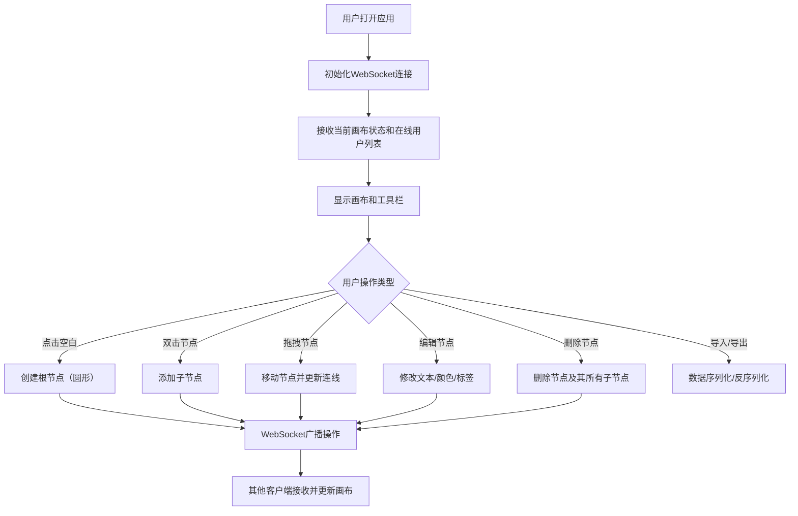

## 1. 产品概述

实时协作思维导图应用，解决远程团队头脑风暴时缺乏直观思维整理工具、无法多人同步编辑节点关系的问题。
- 目标用户：远程协作团队、产品经理、设计师、开发人员
- 核心价值：提供直观的可视化思维整理工具，支持多人实时同步编辑，提升远程协作效率

## 2. 核心功能

### 2.1 用户角色
| 角色 | 注册方式 | 核心权限 |
|------|----------|----------|
| 普通用户 | 自动分配身份（无需注册） | 创建节点、编辑节点、拖拽移动、导出导入、查看在线用户 |

### 2.2 功能模块
1. **思维导图画布**：Canvas绘制、节点管理、连线渲染、网格背景、缩放平移
2. **节点编辑器**：文本编辑（200字限制）、颜色选择器（12色预设）、标签选择器（5种状态标签）
3. **实时协作系统**：WebSocket同步、在线用户显示、远程拖拽动画
4. **数据管理**：导出PNG/JSON、导入JSON、撤销/重做（20步）

### 2.3 页面详情
| 页面名称 | 模块名称 | 功能描述 |
|----------|----------|----------|
| 主页面 | 顶部工具栏 | 导出PNG按钮、导出JSON按钮、导入JSON按钮、在线用户状态显示 |
| 主页面 | 思维导图画布 | 点击空白创建根节点、双击添加子节点、拖拽移动、滚轮缩放、空格+拖拽平移 |
| 主页面 | 节点编辑面板 | 文本输入（200字）、颜色选择器、标签选择器、删除节点 |

## 3. 核心流程

用户打开应用后自动加入协作房间，画布默认显示居中的标题节点。用户可以点击空白处创建根节点（圆形），双击任意节点添加子节点（矩形/圆形），通过拖拽调整位置。所有操作通过WebSocket实时同步给其他在线用户。用户可随时导出当前思维导图为PNG或JSON文件，也可导入JSON文件恢复画布。支持Ctrl+Z撤销和Ctrl+Shift+Z重做最近20步操作。

## 4. 用户界面设计

### 4.1 设计风格
- 主色调：#2C3E50（工具栏深蓝灰）、#45B7D1（标题节点青蓝）、#FF6B6B（根节点珊瑚红）
- 节点形状：圆形（根节点）、矩形（子节点）
- 连线：贝塞尔曲线，颜色取自父节点并降低饱和度20%
- 背景：浅灰#F0F0F0 + 细密网格点（间隔30px，灰点#D0D0D0）
- 字体：无衬线系统字体，节点文本14px起，超过20字自动缩小至10px并换行
- 动效：节点创建放大动画（0.2s）、删除缩小淡出（0.15s）、远程拖拽平滑过渡（0.2s）

### 4.2 页面设计概述
| 页面名称 | 模块名称 | UI元素 |
|----------|----------|---------|
| 主页面 | 顶部工具栏 | 半透明背景#2C3E50，高40px，左对齐导出/导入按钮，右对齐在线用户头像列表 |
| 主页面 | 画布区域 | 全屏画布，浅灰网格背景，视差偏移效果，节点带颜色和标签徽章 |
| 主页面 | 节点编辑 | 点击节点显示编辑面板，文本域+12色调色板+5标签按钮 |

### 4.3 响应式设计
- 桌面端优先设计，工具栏始终固定在顶部
- 画布区域自适应剩余空间
- 触控设备支持双指缩放和长按拖拽

### 4.4 性能要求
- 200个节点+500条连线时，拖拽和缩放保持30FPS以上
- 使用Canvas 2D API渲染，requestAnimationFrame驱动动画循环
- 采用脏矩形区域优化，仅重绘变化区域
