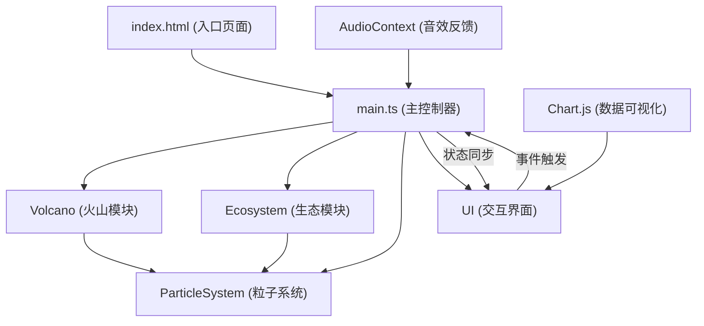
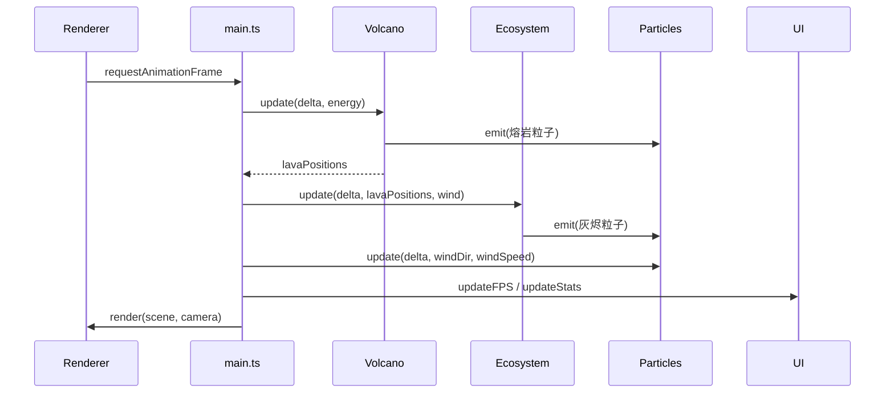

## 1. 架构设计

本项目采用模块化单页应用架构，以Three.js作为3D渲染核心，通过TypeScript进行类型安全封装，Vite作为构建工具提供快速开发体验。整体划分为5个核心模块，职责清晰、松耦合。



## 2. 技术说明

- **前端框架**：原生 TypeScript + ES Modules，不引入额外UI框架，保持轻量高性能
- **3D渲染引擎**：Three.js @latest，使用WebGLRenderer，启用抗锯齿与自适应像素比
- **构建工具**：Vite @latest，配置TypeScript插件与ES模块热更新
- **数据可视化**：Chart.js @latest，轻量级Canvas绘制实时生态指标曲线
- **音频系统**：Web Audio API (AudioContext)，时域噪声合成熔岩噼啪声
- **性能优化**：Quadtree空间索引、对象池化粒子、InstancedMesh植被渲染

## 3. 文件结构

```
项目根目录
├── package.json              # 依赖定义与脚本配置
├── index.html                # 入口HTML，包含Canvas与UI容器
├── tsconfig.json             # TypeScript严格模式配置
├── vite.config.js            # Vite构建配置
└── src/
    ├── main.ts               # 初始化场景/相机/渲染器，驱动动画循环
    ├── volcano.ts            # 火山锥体、熔岩喷发、熔岩河流模块
    ├── ecosystem.ts          # 植被分布、动物AI、生态恢复模块
    ├── ui.ts                 # 控制面板、滑块、FPS、指标显示模块
    └── particles.ts          # 通用粒子系统（火山灰/熔岩/灰烬）
```

## 4. 模块接口定义

### 4.1 Volcano 类 (volcano.ts)

```typescript
export class Volcano {
  constructor(scene: THREE.Scene);
  update(delta: number, energy: number): void;
  getLavaRiverPositions(): THREE.Vector3[];
  onEruption: () => void;  // 喷发回调（震动/音效）
}
```

### 4.2 Ecosystem 类 (ecosystem.ts)

```typescript
export type VegetationType = 'tree' | 'shrub' | 'grass';
export type AnimalType = 'rabbit' | 'wolf';

export interface EcoStats {
  vegetationCoverage: number;  // 0-100%
  animalCount: number;
  airToxicity: number;         // 0-100%
}

export class Ecosystem {
  constructor(scene: THREE.Scene);
  update(delta: number, lavaPositions: THREE.Vector3[], windDir: number, windSpeed: number): void;
  getStats(): EcoStats;
  startRecovery(): void;
  getTrackedAnimalPosition(): THREE.Vector3 | null;
}
```

### 4.3 ParticleSystem 类 (particles.ts)

```typescript
export interface ParticleConfig {
  maxCount: number;
  spawnRate: [number, number];
  size: [number, number];
  colorStart: THREE.Color;
  colorEnd: THREE.Color;
  opacity: [number, number];
  lifetime: [number, number];
  gravity: number;
  windAffected: boolean;
}

export class ParticleSystem {
  constructor(scene: THREE.Scene, config: ParticleConfig);
  emit(position: THREE.Vector3, direction?: THREE.Vector3, count?: number): void;
  update(delta: number, windDir?: number, windSpeed?: number): void;
}
```

### 4.4 UI 类 (ui.ts)

```typescript
export interface UIState {
  energy: number;           // 0-100
  windDirection: number;    // 0-360
  windSpeed: number;        // 0-5
  viewMode: 'top' | 'side' | 'track';
}

export class UI {
  constructor(container: HTMLElement);
  getState(): UIState;
  updateFPS(fps: number): void;
  updateStats(stats: EcoStats): void;
  onStateChange: (state: UIState) => void;
  onViewModeChange: (mode: 'top' | 'side' | 'track') => void;
  triggerShake(): void;     // 喷发震动效果
}
```

## 5. 性能优化策略

| 优化点 | 实现方案 | 预期收益 |
|--------|----------|----------|
| 粒子系统 | 对象池化，BufferGeometry动态更新，单次Draw Call | 1300粒子仅2个Draw Call |
| 植被渲染 | InstancedMesh批量绘制同种植被 | 100+植被降低至3个Draw Call |
| 碰撞检测 | Quadtree空间分区，每帧仅查询活动区域 | 动物碰撞检测O(log n) |
| 动画循环 | delta time计算，固定步长物理更新 | 帧率独立，避免卡顿 |
| 材质复用 | 共享Material实例，仅修改uniforms | 减少GPU状态切换 |
| LOD策略 | 远距离植被降低面数，动物简化模型 | 远距离渲染开销降低50% |

## 6. 动画循环时序


