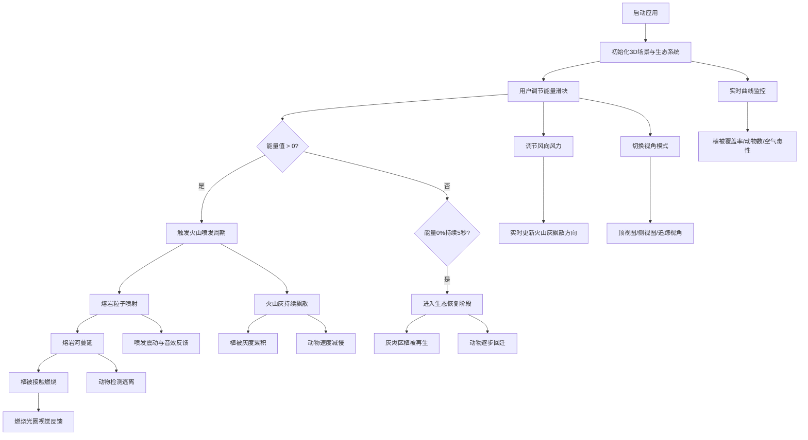

## 1. 产品概述

火山生态交互式模拟系统是一款基于Web 3D技术的地质教育演示应用，通过沉浸式3D场景直观展示活火山喷发过程及其对周边生态系统的渐进式影响。

- **核心目标**：解决地质教育中难以可视化火山喷发物（熔岩、火山灰、毒气）对不同生命形态（植被、动物、微生物）的毁灭与重生过程
- **目标用户**：地质学教师、学生、科普爱好者
- **产品价值**：将抽象的地质过程转化为可交互、可调节参数的实时模拟，显著提升学习效果与参与感

## 2. 核心功能

### 2.1 用户角色

| 角色 | 使用方式 | 核心需求 |
|------|----------|----------|
| 教育工作者 | 课堂演示 | 参数可调控、过程可视化、数据可量化 |
| 学生 | 自主探索 | 交互反馈强、动画直观、响应迅速 |
| 科普爱好者 | 趣味体验 | 视觉效果震撼、生态逻辑真实 |

### 2.2 功能模块

1. **火山喷发系统**：3D火山锥模型、熔岩粒子喷射、熔岩河流动态流动、喷发能量控制
2. **生态系统模拟**：三种植被类型（树木/灌木/草地）、两类动物AI（食草/食肉）、植被燃烧与动物逃离行为
3. **大气粒子系统**：火山灰持续飘散、风向风力控制、粒子沉降与灰度累积效果
4. **生态恢复机制**：停止喷发后的植被再生、动物回迁、实时数据曲线
5. **交互控制面板**：能量滑块、风向风力调节、视角切换、FPS与生态指标显示
6. **音频反馈系统**：熔岩噼啪声、喷发震动音效

### 2.3 页面详情

| 页面名称 | 模块名称 | 功能描述 |
|-----------|-------------|---------------------|
| 主场景 | 3D火山锥 | 半径5、高度8的锥体，渐变贴图，顶部火山口 |
| 主场景 | 熔岩喷射 | 粒子系统，红橙过渡，抛物线路径，能量影响高度 |
| 主场景 | 熔岩河流 | 动态宽度流动，0.05单位/帧，接触植被触发燃烧 |
| 主场景 | 生态区域 | 半径10圆形区域，三种植被分布 |
| 主场景 | 动物AI | 15-25只，游走/逃离/追踪行为 |
| 主场景 | 火山灰 | 每帧20-40粒子，风向风力影响，灰度累积 |
| 主场景 | 恢复机制 | 能量0%持续5秒后开始再生 |
| 控制面板 | 能量进度条 | 左上角红色进度条，200×20px，0-100%滑块 |
| 控制面板 | 风向风力 | 左上角水平滑块，风向0-360°，风力0-5m/s |
| 控制面板 | FPS计数器 | 右上角绿色Consolas 16px |
| 控制面板 | 生态指标 | 右上角三色彩色圆形标签（植被覆盖率、动物数量、空气毒性） |
| 控制面板 | 视角切换 | 底部居中按钮，顶视图/侧视图/追踪动物循环切换 |
| 控制面板 | 实时曲线 | 右下角Chart.js曲线图，三大指标动态变化 |
| 控制面板 | 响应式 | 屏幕<768px折叠为侧边栏图标 |

## 3. 核心流程

用户启动应用后进入3D火山场景，可通过左上角滑块调节喷发能量与风向风力，观察火山喷发、熔岩蔓延、植被燃烧、动物逃离等连锁反应；将能量调至0%并持续5秒后，生态系统进入恢复阶段，植被逐步再生、动物回迁；右下角曲线图实时记录整个过程的生态指标变化。

## 4. 用户界面设计

### 4.1 设计风格

- **主色调**：暗色系背景 #1A1110，火山区域暖色系（红/橙/黄），生态区域冷灰绿色调
- **视觉风格**：地质科幻风，暗物质背景配合暖光火山，营造戏剧化对比
- **按钮风格**：半透明深色背景，圆角10px，边框细微发光
- **字体**：控制面板使用Consolas等宽字体，数据显示清晰锐利
- **交互反馈**：滑块拖动实时更新数值，喷发时屏幕边缘红色震动，燃烧处橘黄光圈闪烁

### 4.2 页面设计概述

| 页面名称 | 模块名称 | UI元素 |
|-----------|-------------|-------------|
| 主场景 | 3D视口 | 全屏Canvas，背景#1A1110，暖色火山，冷色生态区 |
| 主场景 | 火山锥 | #5D3A1A→#3E2214渐变，锥顶火山口凹陷 |
| 主场景 | 植被 | 树木#2E8B57→#1B6B3A，灌木#3CB371，草地#4CAF50 |
| 主场景 | 熔岩 | 红→橙过渡粒子，流动熔岩暖光自发光 |
| 主场景 | 动物 | 兔子白色球+椭球，狼灰色球+尖锥 |
| 控制面板 | 能量条 | 左上角红色渐变进度条，200×20px，白色百分比数字 |
| 控制面板 | 风向风力 | 水平滑块，风向带箭头指示器，宽度120px |
| 控制面板 | FPS | 右上角#00FF00绿色Consolas 16px |
| 控制面板 | 生态指标 | 三色彩色圆形标签（绿/蓝/橙），带数值与单位 |
| 控制面板 | 视角按钮 | 底部居中，半透明黑底圆角10px，白色文字 |
| 控制面板 | 曲线图 | 右下角Chart.js，三色系折线，半透明背景 |

### 4.3 响应式设计

- **桌面端（≥768px）**：控制面板分散布局在画面四角，信息一目了然
- **移动端（<768px）**：控制面板折叠为左侧悬浮图标，点击展开侧边抽屉式面板
- **触控优化**：滑块增大触控区域，按钮最小尺寸44×44px

### 4.4 3D场景指导

- **环境与氛围**：深色雾效（FogExp2，密度0.015），暗红褐色背景，营造地底/黄昏感
- **光照设置**：环境光强度0.3（暗灰），方向光模拟月光0.5（冷白），火山口PointLight强度2.0（橙红色，20单位范围）
- **相机设置**：PerspectiveCamera，fov 60，初始位置侧视角(15, 12, 15)看向原点，支持三种预设视角切换
- **构图与焦点**：火山锥位于场景中心偏左，生态区环绕，视角切换时相机平滑过渡（lerp插值）
- **交互与动画**：OrbitControls鼠标交互（追踪视角时禁用），熔岩粒子抛物线物理，动物骨骼式简化动画
- **后处理效果**：喷发时屏幕空间轻微抖动，燃烧处橘黄光晕，熔岩自发光Bloom效果（可选，性能允许时启用）
- **性能预算**：总面数控制在5万面以内，粒子总数≤1300（火山灰1000+熔岩300），Draw Call≤50
