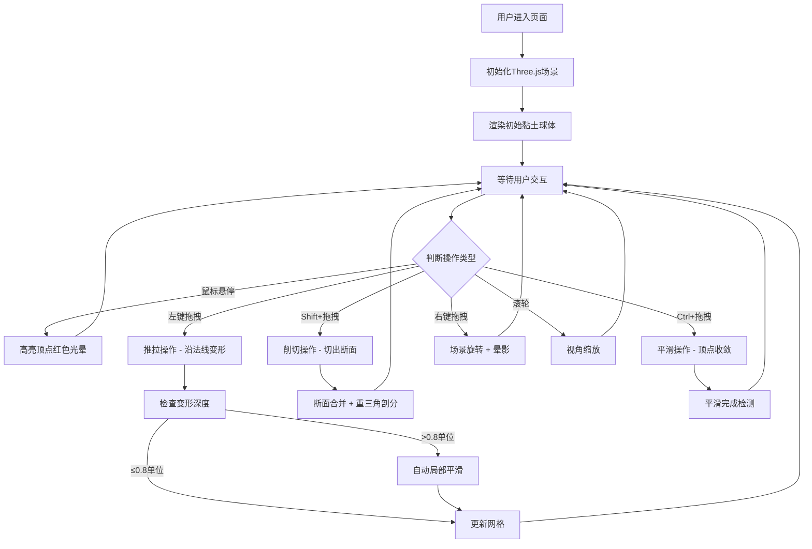

## 1. 产品概述

3D黏土雕塑模拟器是一款基于WebGL的创意工具，用户可在浏览器中通过鼠标和键盘对虚拟黏土块进行自由雕刻创作，塑造个性化的立体造型（小动物、抽象几何体等）。

- 目标用户：数字艺术家、3D爱好者、教育场景师生
- 核心价值：降低3D建模门槛，提供沉浸式、即时反馈的数字化雕塑体验

## 2. 核心功能

### 2.1 用户角色
无需登录，所有用户均为访客模式，可直接使用全部功能。

### 2.2 功能模块
1. **3D雕塑主场景**：可变形黏土网格、顶点高亮、实时渲染
2. **四种雕刻操作**：推（凸起）、拉（凹陷）、削（切面）、平滑
3. **控制面板**：撤销/重做、重置、变形强度、网格显示切换
4. **性能监控**：顶点计数、FPS显示、LOD自动简化
5. **视角控制**：场景旋转、缩放、晕影特效

### 2.3 功能详情

| 功能模块 | 子功能 | 详细描述 |
|---------|--------|---------|
| 黏土网格 | 初始形态 | 半径3单位的球体，哑光#C4956D材质，指纹凹凸贴图 |
| 黏土网格 | 变形限制 | 最大变形深度±1.5单位，超0.8单位自动触发局部平滑 |
| 推拉操作 | 顶点选择 | 鼠标悬停高亮红色光晕（半径0.3单位） |
| 推拉操作 | 变形执行 | 点击拖拽沿法线方向位移，0.1单位/帧 |
| 削切操作 | 执行方式 | Shift+拖拽沿路径切出平整断面 |
| 削切操作 | 断面样式 | #B87D4B颜色，0.05单位边缘高光线 |
| 削切操作 | 拓扑修复 | 松开后断面顶点与相邻网格合并重三角剖分 |
| 平滑操作 | 执行方式 | Ctrl键激活，半径2单位内顶点向平均位置收敛 |
| 平滑操作 | 参数 | 平滑力度0.3/帧，2秒后法线差<15°视为完成 |
| 平滑操作 | 视觉反馈 | 表面暂变为淡蓝#A0C4E8，8个飘散光点（绿→红渐变） |
| 控制面板 | 撤销/重做 | 最多50步历史记录 |
| 控制面板 | 重置按钮 | 恢复为初始球体 |
| 控制面板 | 强度滑块 | 0.05-0.3范围，默认0.1，实时数值显示 |
| 控制面板 | 网格开关 | 切换线框显示模式 |
| 性能监控 | 顶点计数 | 左上角"Vertices: XXXX"显示 |
| 性能监控 | FPS计数 | 低于30时数字红色闪烁 |
| 性能监控 | LOD简化 | 顶点>8000时自动合并<0.05单位顶点并提示 |
| 视角控制 | 旋转 | 鼠标右键拖拽旋转 |
| 视角控制 | 缩放 | 滚轮缩放，范围4-20单位 |
| 视角控制 | 晕影 | 旋转时动态半黑晕影，0.5秒过渡 |

## 3. 核心流程

## 4. 用户界面设计

### 4.1 设计风格
- **主色调**：深灰#1E1E1E背景 + 暖木色#C4956D黏土主体
- **辅助色**：淡蓝#A0C4E8（平滑激活）、断面#B87D4B、红色高亮
- **按钮样式**：圆角8px，悬停背景变亮（0.2秒过渡）
- **字体**：衬线字体（信息区白色文字）
- **面板**：右侧240px宽半透明毛玻璃背景
- **特效**：平滑时8个飘散光点（绿→红渐变，1.5秒消失）

### 4.2 页面布局

| 区域 | 位置 | UI元素 |
|------|------|--------|
| 3D视口 | 全屏 | Three.js渲染画布 |
| 性能信息 | 左上角 | Vertices计数 + FPS（衬线字体，白色） |
| 控制面板 | 右侧（240px宽） | 撤销/重做/重置按钮、强度滑块、网格开关 |
| 晕影层 | 全屏边缘 | 旋转时动态半黑渐变（0.5秒过渡） |

### 4.3 响应式设计
- 桌面端优先，全屏3D视口
- 控制面板固定右侧，宽度240px
- 信息区固定左上角，不随滚动移动

### 4.4 3D场景指南
- **环境**：深灰纯色背景，柔和环境光 + 两盏方向光模拟工作室光照
- **光照**：环境光强度0.4，主光从右上(10,10,10)，补光从左下(-5,3,-5)
- **相机**：PerspectiveCamera，初始位置(8,6,8)看向原点
- **材质**：MeshStandardMaterial，roughness=0.85，metalness=0.05，带BumpMap模拟指纹
- **后处理**：晕影效果（旋转时激活）
