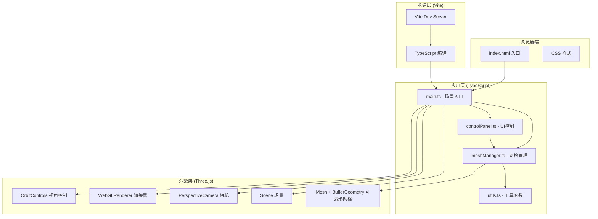
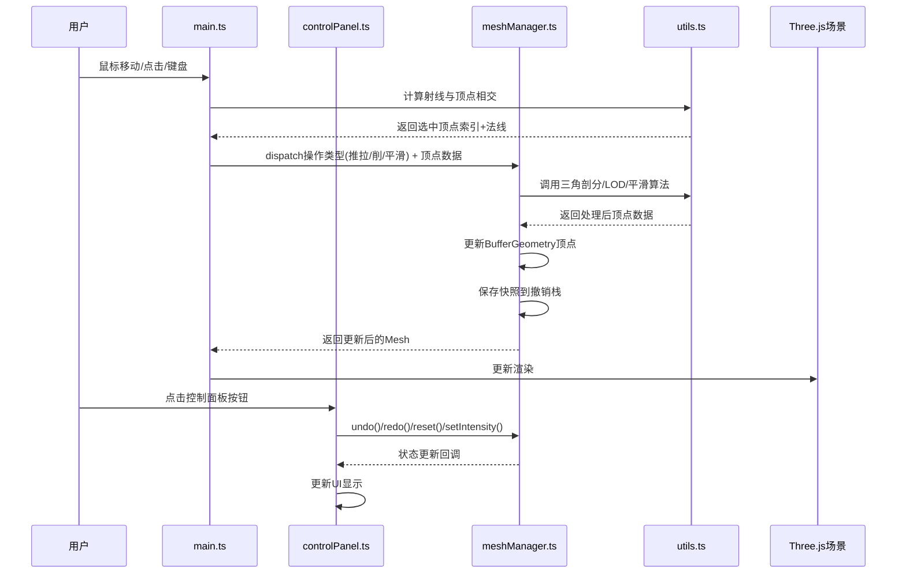

## 1. 架构设计



## 2. 技术选型说明

| 技术 | 版本/说明 | 用途 |
|------|----------|------|
| three | ^0.160.0 | WebGL 3D渲染引擎，核心渲染与网格操作 |
| @types/three | ^0.160.0 | Three.js TypeScript类型定义 |
| typescript | ^5.3.0 | 静态类型检查与编译 |
| vite | ^5.0.0 | 开发服务器与构建工具，支持HMR热更新 |

- **前端框架**：原生 TypeScript + Three.js（无React/Vue，保持轻量，专注3D渲染性能）
- **构建工具**：Vite（快速冷启动 + 原生ES模块支持）
- **样式方案**：原生CSS（内联样式 + `<style>` 标签，避免额外依赖）

## 3. 文件结构定义

```
auto126/
├── package.json              # 项目依赖与脚本配置
├── index.html                # 入口HTML（全屏视口、字体引入）
├── tsconfig.json             # TypeScript配置（严格模式、ES2020目标）
├── vite.config.js            # Vite构建配置
└── src/
    ├── main.ts               # 入口：初始化场景/相机/渲染器/控制面板，启动循环
    ├── meshManager.ts        # 黏土网格核心：推拉削平滑操作、拓扑维护、撤销栈
    ├── controlPanel.ts       # 右侧控制面板UI渲染与事件绑定
    └── utils.ts              # 工具函数：顶点选择、三角剖分、LOD、颜色插值
```

## 4. 核心模块数据流向

### 4.1 交互数据流


### 4.2 模块职责定义

**main.ts** - 场景入口与事件中枢
- 创建 Scene、PerspectiveCamera、WebGLRenderer、OrbitControls
- 绑定全局鼠标/键盘事件，分发到对应模块
- 启动 requestAnimationFrame 渲染循环
- 渲染左上角性能信息（Vertices / FPS）
- 管理晕影效果层
- 挂载 controlPanel 到DOM

**meshManager.ts** - 网格变形核心
- 维护初始球体顶点快照（用于重置与深度计算）
- 实现 push(推) / pull(拉) 沿法线位移算法
- 实现 cut(削切) 断面生成与三角剖分
- 实现 smooth(平滑) 顶点平均收敛算法
- 维护 undoStack / redoStack（上限50，快照为顶点位置Float32Array克隆）
- 监控变形深度，超过0.8自动触发局部平滑
- 触发平滑特效（淡蓝材质 + 飘散粒子）

**controlPanel.ts** - UI控制面板
- 渲染右侧240px毛玻璃面板DOM
- 按钮：撤销 ↶ / 重做 ↷ / 重置 / 显示网格
- 滑块：变形强度 0.05~0.3，实时显示数值
- 事件总线回调机制与 main.ts / meshManager 通信
- 按钮悬停 0.2s 过渡效果

**utils.ts** - 算法工具集
- `pickVertices(ray, mesh, radius)`: 射线拾取范围内顶点
- `laplacianSmooth(vertices, indices, strength, iterations)`: 拉普拉斯平滑
- `retriangulate(vertices, cutPath)`: 断面三角剖分（ear clipping）
- `simplifyLOD(vertices, indices, threshold)`: LOD顶点合并
- `lerpColor(color1, color2, t)`: 颜色插值
- `computeVertexNormals(vertices, indices)`: 顶点法线计算

## 5. 关键算法策略

### 5.1 推拉变形
- 射线命中点为中心，半径0.3范围内顶点选中
- 每帧沿顶点法线方向位移 intensity 单位（默认0.1）
- 使用衰减函数：`weight = 1 - distance/radius`（边缘柔和过渡）
- 限制条件：相对初始位置 ±1.5 单位硬限制

### 5.2 削切断面
- 记录鼠标拖拽路径点集
- 用路径点拟合平面方程 ax+by+cz+d=0
- 对所有三角形执行平面切割：
  - 全在一侧 → 保留/丢弃
  - 跨平面 → 在交点处拆分三角形，生成新顶点
- 断面填充：ear clipping 算法三角剖分开口多边形

### 5.3 平滑操作
- 拉普拉斯平滑：每个新位置 = (1-α)·原位置 + α·邻接点平均位置
- α = 0.3（平滑力度）
- 收敛条件：连续2秒操作后，区域内相邻法线夹角 < 15°

### 5.4 撤销栈
- 每次操作前保存顶点位置数组的深拷贝（Float32Array）
- 栈深度50，超出时丢弃最早快照
- undo/redo 直接替换 geometry.attributes.position.array

## 6. 性能优化策略

- **BufferGeometry 直接操作**：避免重建Geometry，只更新 position.array 并标记 needsUpdate
- **局部更新**：变形只更新受影响顶点子集
- **LOD简化**：顶点数 > 8000 时，将间距 < 0.05 单位的顶点合并
- **FPS节流**：DOM信息显示每500ms更新一次，避免每帧重绘
- **法线缓存**：变形后按需重新计算法线，非每帧计算
