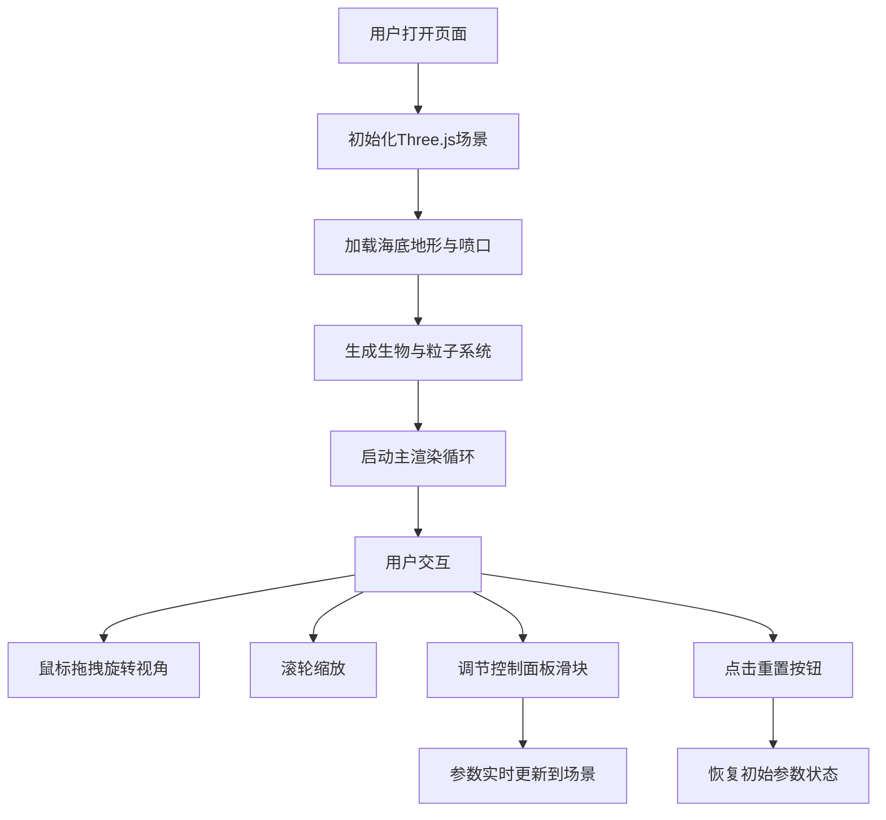

## 1. 产品概述

深海热液喷口生态系统交互式3D模拟器，面向海洋生物研究者和公众教育，可视化展示热液喷口周围独特的光合与化能合成生态系统动态过程。

- 主要用途：教育展示、科研可视化、科普互动
- 目标用户：海洋生物研究者、学生、科普爱好者
- 产品价值：将难以直接观测的深海生态系统以直观的3D交互形式呈现，提升公众对深海生态的认知

## 2. 核心功能

### 2.1 用户角色
| 角色 | 注册方式 | 核心权限 |
|------|----------|----------|
| 访客用户 | 无需注册 | 浏览3D场景、调节参数、切换视角 |

### 2.2 功能模块
1. **3D主场景**：海底地形、热液喷口、烟囱粒子喷发、矿物沉积、深海悬浮粒子
2. **生物系统**：管虫、蛤类、细菌席三种生物按温度梯度分布并带脉动动画
3. **参数控制面板**：喷发强度滑块、温度分布滑块、重置按钮
4. **视角与状态显示**：FPS计数器、视角切换按钮、参数值实时标签

### 2.3 页面详情
| 页面名称 | 模块名称 | 功能描述 |
|----------|----------|----------|
| 主页面 | 3D视口 | 全屏Three.js渲染场景，支持鼠标拖拽旋转、滚轮缩放 |
| 主页面 | 控制面板 | 左下角浮动面板，含喷发强度(0-100%)、温度分布(0-100%)滑块和重置按钮 |
| 主页面 | 状态显示区 | 右上角FPS计数器和视角切换按钮，滑块变化时显示当前数值标签 |

## 3. 核心流程

用户打开页面后，3D场景自动加载并开始动画循环。用户可通过鼠标交互旋转缩放视角，通过控制面板调节喷发强度和温度分布参数，所有参数变化实时反馈到3D场景中。点击重置按钮恢复初始状态。

## 4. 用户界面设计

### 4.1 设计风格
- **主色调**：深蓝灰 #0D1117 背景，蓝色 #4A90D9、橙色 #FF8C00、紫色 #8A2BE2 点缀
- **按钮/控件**：圆角8px，半透明深色背景 rgba(20,20,30,0.85)，蓝色高亮 #00BFFF
- **字体**：无衬线字体，14px主体，12px小字
- **布局**：全屏3D视口，左下角控制面板(220px宽)，右上角FPS与视角控制
- **视觉风格**：深海暗色调，冷暖对比，半透明层叠效果

### 4.2 页面设计概览
| 页面名称 | 模块名称 | UI元素 |
|----------|----------|--------|
| 主页面 | 3D视口 | 海底平面(20x20)、中央喷口(锥台+粒子+沉积)、生物群落、悬浮粒子、方向光+点光源带阴影 |
| 主页面 | 控制面板 | 半透明圆角面板、自定义滑块(灰轨+蓝柄)、重置按钮、数值标签微光闪烁 |
| 主页面 | 状态显示 | 白色FPS(半透黑背景)、视角切换按钮、参数值临时显示标签 |

### 4.3 响应式适配
- 桌面端优先设计
- 窗口宽度 < 768px 时：控制面板宽度缩小至160px，字体12px，FPS计数器移至左上角

### 4.4 3D场景指引
- **环境氛围**：深海黑暗环境，深蓝灰背景色，悬浮粒子营造深海感
- **光照设置**：上方偏左蓝色方向光(#4A90D9, 强度0.8) + 喷口下方橙色点光源(#FF8C00, 强度1.5, 距离10)，投射阴影
- **相机设置**：PerspectiveCamera，OrbitControls支持拖拽旋转和滚轮缩放
- **交互动画**：烟囱粒子旋转飘散抖动、生物正弦脉动、矿物沉积径向渐变增长、滑块反馈微光闪烁
- **性能预算**：总粒子≤300个(自动回收)，生物实例≤150个(InstancedMesh)，帧率≥30FPS
