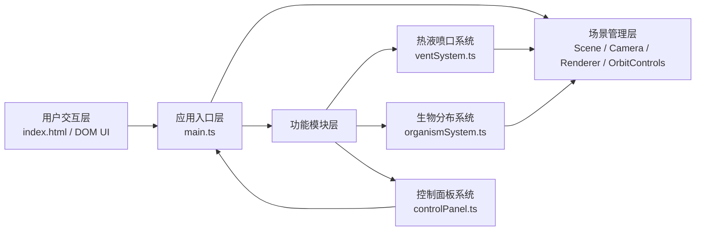

## 1. 架构设计

本项目为纯前端3D可视化应用，采用分层模块化架构：



**数据流向说明：**
1. 用户通过DOM控制面板(`controlPanel.ts`)调节参数
2. 参数通过回调传递到主入口(`main.ts`)
3. 主入口将参数分发到`ventSystem.ts`和`organismSystem.ts`
4. 两个功能模块更新Three.js场景中的对象
5. 主循环(`requestAnimationFrame`)驱动所有动画更新并渲染

## 2. 技术选型

- **前端框架**：原生 TypeScript + Three.js（无React/Vue，按用户需求）
- **构建工具**：Vite 5.x
- **3D渲染**：Three.js 最新版 + @types/three
- **编程语言**：TypeScript（严格模式，ES2020目标，ESNext模块）

## 3. 目录结构与文件职责

```
auto129/
├── index.html              # 入口页面，全屏3D视口+控制面板UI
├── package.json            # 项目依赖与脚本
├── vite.config.js          # Vite构建配置
├── tsconfig.json           # TypeScript严格模式配置
└── src/
    ├── main.ts             # 应用入口：场景初始化、主循环、参数分发
    ├── ventSystem.ts       # 热液喷口系统：锥台、烟囱粒子、矿物沉积
    ├── organismSystem.ts   # 生物系统：管虫/蛤类/细菌席分布与脉动
    └── controlPanel.ts     # UI控制面板：滑块、按钮、FPS显示
```

**调用关系：**
- `main.ts` → 导入并实例化 `VentSystem`, `OrganismSystem`, `ControlPanel`
- `ventSystem.ts` → 对外暴露 `update(delta, params)`, `dispose()`, 及Three.js Group对象
- `organismSystem.ts` → 对外暴露 `update(delta, params)`, `dispose()`, 及Three.js Group对象
- `controlPanel.ts` → 通过回调函数向 `main.ts` 传递用户参数变更

## 4. 核心类与接口定义

### 4.1 VentSystem 类
```typescript
interface VentParams {
  eruptionIntensity: number;  // 0-100
}

class VentSystem {
  group: THREE.Group;
  constructor(scene: THREE.Scene);
  update(delta: number, params: VentParams): void;
  dispose(): void;
}
```
- 内部管理：烟囱粒子池(上限~100)、矿物沉积Mesh、喷口锥台Mesh

### 4.2 OrganismSystem 类
```typescript
interface OrganismParams {
  temperatureGradient: number;  // 0-100
}

class OrganismSystem {
  group: THREE.Group;
  constructor(scene: THREE.Scene);
  update(delta: number, params: OrganismParams): void;
  dispose(): void;
}
```
- 内部管理：管虫InstancedMesh、蛤类InstancedMesh、细菌席Mesh，实例总数≤150

### 4.3 ControlPanel 类
```typescript
interface ControlParams {
  eruptionIntensity: number;
  temperatureGradient: number;
}

interface ControlCallbacks {
  onEruptionChange: (v: number) => void;
  onTemperatureChange: (v: number) => void;
  onReset: () => void;
  onViewChange: () => void;
}

class ControlPanel {
  constructor(callbacks: ControlCallbacks);
  getParams(): ControlParams;
  updateFPS(fps: number): void;
}
```

## 5. 性能优化策略

1. **InstancedMesh渲染**：所有重复生物（管虫、蛤类）使用THREE.InstancedMesh，减少draw call
2. **对象池模式**：烟囱粒子采用对象池回收复用，避免频繁GC
3. **粒子数量上限**：烟囱粒子≤100，悬浮粒子=200，总计≤300自动回收旧粒子
4. **生物实例上限**：三种生物合计≤150个实例
5. **材质复用**：同类对象共享材质，减少显存占用
6. **阴影优化**：仅对主要对象启用投射/接收阴影

## 6. 参数映射公式

| 参数 | 滑块值(0-100) | 映射目标 |
|------|---------------|----------|
| 喷发强度 | intensity | 粒子发射率 = 5 + intensity×0.25 (个/秒) |
| 喷发强度 | intensity | 粒子速度 = 0.1 + intensity×0.007 (单位/帧) |
| 喷发强度 | intensity | 沉积增长 = intensity×0.005 (单位/10分钟) |
| 温度分布 | temp | 管虫内圈 = 2 + (temp-50)×0.04, 外圈 = 4 + (temp-50)×0.04 |
| 温度分布 | temp | 蛤类内圈 = 4 + (temp-50)×0.04, 外圈 = 6 + (temp-50)×0.04 |
| 温度分布 | temp | 细菌席内圈 = 6 + (50-temp)×0.04, 外圈 = 8 + (50-temp)×0.04 |
| 温度分布 | temp | 脉动幅度 = 0.02 + \|temp-50\|×0.0012 (上限0.08) |
