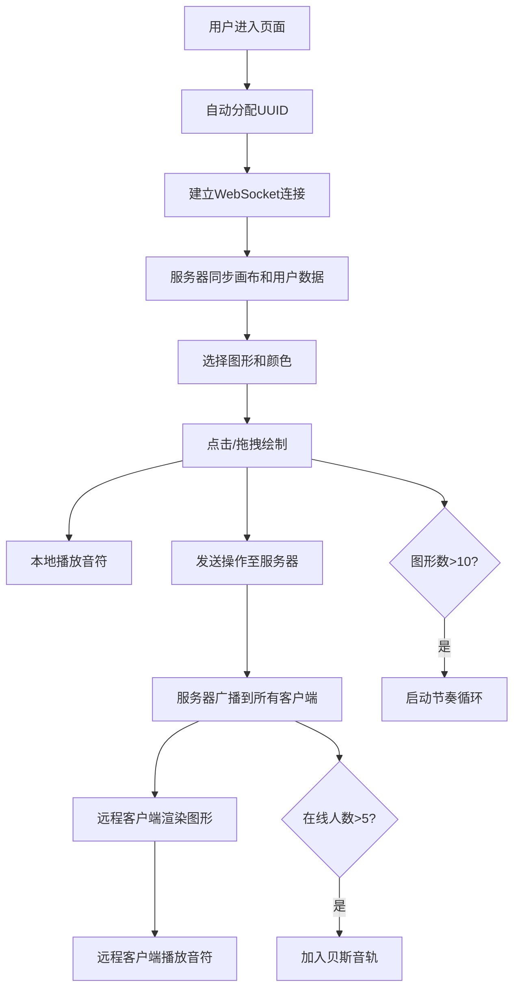

## 1. 产品概述

在线联机抽象艺术绘制与实时背景音乐合成平台，允许多个用户同时在共享画布上创作，每次绘制操作触发对应音符，实时混合生成沉浸式音乐体验。面向艺术爱好者、音乐创作者和协作社交场景，打造"视觉即听觉"的多感官互动体验。

## 2. 核心功能

### 2.1 用户角色

| 角色 | 注册方式 | 核心权限 |
|------|----------|----------|
| 访客用户 | 自动分配UUID | 实时画布绘制、音乐聆听、操作同步 |

### 2.2 功能模块

1. **主画布页面**：共享绘制画布、左侧工具栏、右侧日志面板、在线人数显示
2. **图形绘制系统**：三种基础图形（圆/三角/方）、12色调色板、弹性缩放动画、自动连接线
3. **实时音乐合成**：Web Audio API音符触发、和弦叠加、背景节奏循环、动态贝斯音轨
4. **多用户实时同步**：WebSocket通信、画布状态同步、操作事件广播、在线人数统计

### 2.3 页面详情

| 页面名称 | 模块名称 | 功能描述 |
|----------|----------|----------|
| 主画布页面 | 共享画布 | 自适应窗口尺寸（最小600x400px），渐变暗色背景，支持点击和拖拽绘制图形 |
| 主画布页面 | 左侧工具栏 | 三种图形选择按钮、12色调色板、悬停放大效果、选中发光边框 |
| 主画布页面 | 右侧日志面板 | 半透明背景，滚动显示最近20条操作记录，带颜色指示块和淡入动画 |
| 主画布页面 | 在线人数 | 右上角发光字体显示（#00FF88），实时更新 |
| 主画布页面 | 音乐系统 | 图形对应音符触发、和弦叠加、超过10个图形循环节奏、5人以上动态贝斯 |

## 3. 核心流程

用户进入页面 → 自动分配唯一ID并连接WebSocket → 服务器同步当前画布状态和在线用户 → 用户选择图形与颜色 → 点击/拖拽绘制图形 → 本地播放对应音符 → 操作广播至服务器 → 服务器转发给所有在线用户 → 各客户端渲染同步图形并播放音符 → 画布图形超过10个触发节奏循环 → 在线人数超过5人加入贝斯音轨

## 4. 用户界面设计

### 4.1 设计风格

- **主色调**：深色渐变背景（#1A1A2E → #16213E），强调色霓虹绿（#00FF88），面板蓝（#0F3460）
- **图形风格**：简洁几何形状，边缘连接线使用半透明混合色
- **字体**：现代无衬线字体，数字使用等宽风格
- **按钮样式**：方形工具按钮，悬停1.1倍放大+阴影，选中状态1px发光边框
- **动效**：图形生成弹性缩放（0.8→1.0→0.95，0.5s），日志条目0.3s淡入

### 4.2 页面设计概览

| 页面名称 | 模块名称 | UI元素 |
|----------|----------|--------|
| 主画布页面 | 共享画布 | 全屏渐变背景、几何图形、连接线、弹性动画 |
| 主画布页面 | 左侧工具栏 | 垂直布局、图形按钮组、12色调色板网格、悬停放大、发光选中态 |
| 主画布页面 | 右侧日志面板 | 220px宽、80%不透明度、滚动区域、色块指示、时间倒序、淡入动画 |
| 主画布页面 | 在线人数 | 右上角定位、发光文字效果（#00FF88）、等宽数字 |

### 4.3 响应式

- 桌面优先设计，画布最小尺寸600x400px
- 窗口缩放时画布自适应，工具栏和日志面板保持固定宽度
- 触摸屏支持基础点按操作

### 4.4 视觉特效

- 画布背景使用径向+线性双重渐变营造深度感
- 在线人数文字使用text-shadow多层发光
- 连接线使用半透明混合色，创造有机连接感
- 图形边缘微发光效果，与颜色关联
