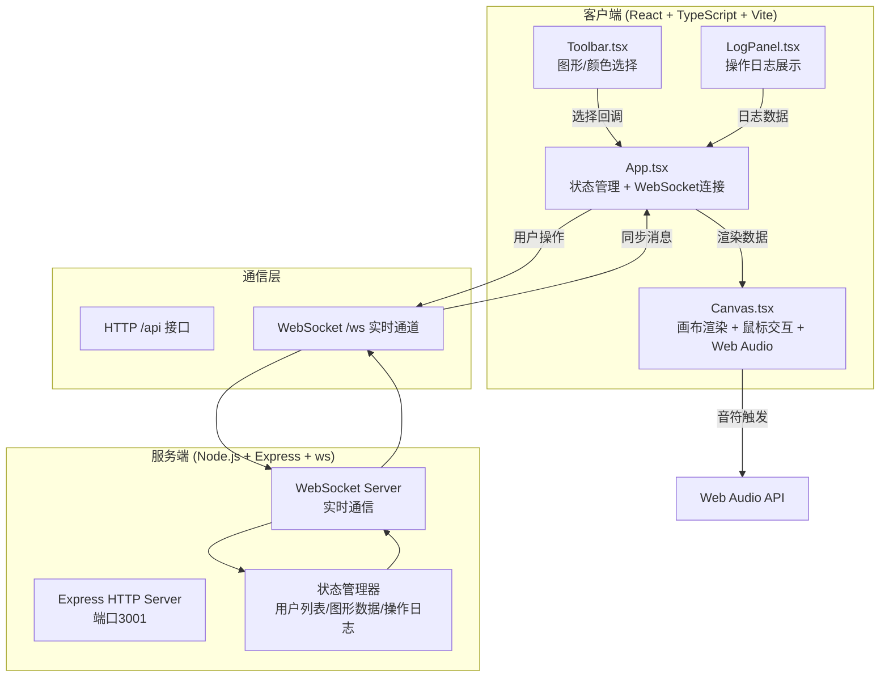
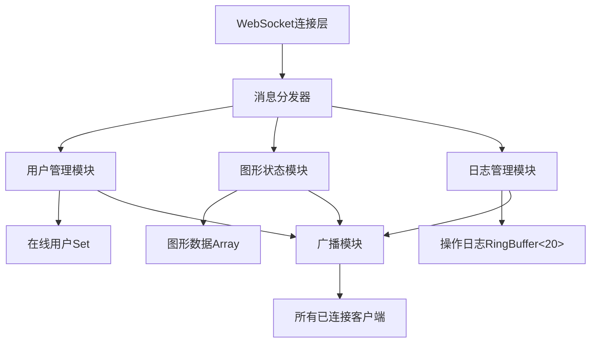
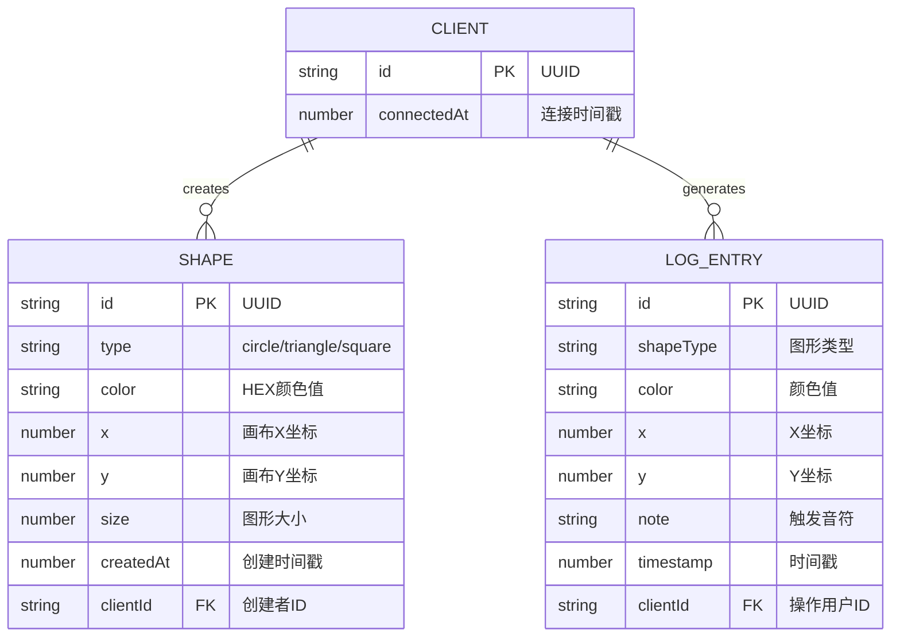

## 1. 架构设计



## 2. 技术说明

- **前端框架**：React 18 + TypeScript（严格模式）+ Vite 5
- **目标环境**：ES2020，模块ESNext
- **后端框架**：Express 4 + ws（WebSocket库）
- **唯一标识**：uuid 库生成客户端ID
- **音频处理**：浏览器原生 Web Audio API（OscillatorNode、GainNode）
- **图形渲染**：HTML5 Canvas 2D Context
- **构建工具**：Vite，代理/api和/ws到后端3001端口

## 3. 路由定义

| 路由 | 用途 |
|------|------|
| / | 前端主页面（Vite dev server提供） |
| /api/status | 服务端状态查询（可选） |
| /ws | WebSocket连接端点 |

## 4. API定义

### 4.1 WebSocket消息协议

```typescript
// 客户端→服务器消息类型
type ClientMessage =
  | { type: 'join'; clientId: string }
  | { type: 'shape-add'; data: ShapeData }
  | { type: 'shape-drag'; data: ShapeData }
  | { type: 'ping'; timestamp: number };

// 服务器→客户端消息类型
type ServerMessage =
  | { type: 'init'; state: ServerState }
  | { type: 'user-join'; clientCount: number }
  | { type: 'user-leave'; clientCount: number }
  | { type: 'shape-add'; data: ShapeData; clientId: string }
  | { type: 'shape-drag'; data: ShapeData; clientId: string }
  | { type: 'log-add'; log: LogEntry }
  | { type: 'pong'; timestamp: number };

// 图形数据
interface ShapeData {
  id: string;
  type: 'circle' | 'triangle' | 'square';
  color: string;
  x: number;
  y: number;
  size: number;
  createdAt: number;
  clientId: string;
}

// 操作日志条目
interface LogEntry {
  id: string;
  shapeType: string;
  color: string;
  x: number;
  y: number;
  note: string;
  timestamp: number;
  clientId: string;
}

// 服务器状态
interface ServerState {
  shapes: ShapeData[];
  logs: LogEntry[];
  clientCount: number;
}
```

### 4.2 音符映射规则

| 图形类型 | 音符 | 频率 |
|----------|------|------|
| circle（圆形） | C4 | 261.63 Hz |
| triangle（三角形） | E4 | 329.63 Hz |
| square（正方形） | G4 | 392.00 Hz |

颜色亮度映射力度：RGB平均亮度 (0-255) → 音量力度 (20-80)

## 5. 服务端架构



## 6. 数据模型

### 6.1 数据模型定义



### 6.2 运行时数据结构

服务端使用内存存储（无持久化）：
- `clients: Set<string>` - 在线客户端ID集合
- `shapes: ShapeData[]` - 画布上所有图形
- `logs: LogEntry[]` - 最近20条操作日志（环形缓冲）

## 7. 性能优化策略

### 7.1 画布渲染（目标45FPS+）
- 使用requestAnimationFrame循环渲染
- 脏矩形优化：仅重绘变化区域
- 图形对象缓存计算属性（如顶点坐标、连接线距离）
- 连接线计算使用空间分区减少O(n²)复杂度

### 7.2 音频延迟（目标<50ms）
- Web Audio API使用AudioContext.currentTime精确调度
- 音符创建与GainNode包络预分配
- 振荡器复用池（避免频繁创建销毁）

### 7.3 网络延迟（目标<200ms）
- WebSocket二进制/紧凑JSON消息
- 拖拽操作节流（throttle 16ms）
- 批量同步与增量更新
- 本地乐观更新+服务器确认
