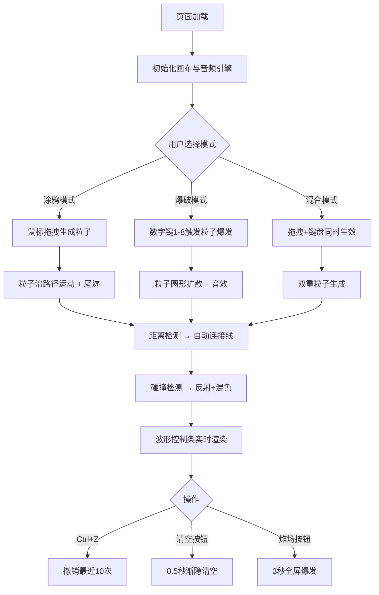

## 1. 产品概述

声音粒子形态图谱（Sonic Particle Atlas）是一款基于 Web 的音画联觉创作工具，让用户通过鼠标拖拽与键盘输入，将不同音色转化为动态可视粒子的运动轨迹，粒子碰撞时产生音色混合，创造沉浸式音画创作体验。

- **核心价值**：打破传统音乐可视化的被动观看模式，使用户成为主动创作者，通过直觉化的肢体动作（拖拽、按键）将听觉美学具象化为视觉粒子艺术
- **目标用户**：音乐爱好者、视觉艺术家、新媒体创作者、互动艺术爱好者

## 2. 核心功能

### 2.1 用户角色

| 角色 | 注册方式 | 核心权限 |
|------|----------|----------|
| 普通用户 | 无需注册，直接使用 | 全部创作功能、撤销、清空画布 |

### 2.2 功能模块

1. **主画布区**：粒子绘制与渲染、连接线网络、尾迹效果
2. **左侧控制面板**：模式切换、音量控制、炸场功能、清空与撤销
3. **底部波形控制条**：实时波形能量可视化
4. **音频引擎**：Web Audio API 音色合成（正弦波/方波/锯齿波/三角波/白噪声/脉冲波/低频振荡/和弦叠加）
5. **粒子系统**：粒子生命周期管理、碰撞检测、合并优化、尾迹与连接线

### 2.3 页面详情

| 页面名称 | 模块名称 | 功能描述 |
|----------|----------|----------|
| 主界面 | 画布区 | 全屏 Canvas，支持鼠标拖拽生成粒子，粒子发光带尾迹，距离<30px自动连接，碰撞变色混合 |
| 主界面 | 控制面板 | 三种模式切换（涂鸦/爆破/混合）、垂直音量滑块、炸场按钮、清空按钮 |
| 主界面 | 波形控制条 | 底部80px高度波形条，根据粒子能量实时渲染，渐变色抗锯齿 |

## 3. 核心流程

用户打开页面 → 深空渐变背景加载完成 → 提示"按住鼠标拖拽或按数字键1-8" →
选择创作模式：
- 涂鸦模式：按住鼠标左键拖拽 → 沿路径生成速度映射颜色的粒子 → 粒子间自动连接形成神经网络图谱 → 波形条实时响应能量变化
- 爆破模式：鼠标定位 + 按数字键1-8 → 30-60个对应音色粒子圆形扩散 → 碰撞连接线时反射并混色 → 对应音效触发
- 混合模式：以上两种方式同时生效
→ 可 Ctrl+Z 撤销最近10次操作 → 点击清空按钮0.5秒渐隐清空画布 → 点击炸场按钮3秒全屏爆发

## 4. 用户界面设计

### 4.1 设计风格

- **主色调**：深空渐变背景（#0F0C29 → #302B63 → #24243E），粒子色（#FF6B6B、#4ECDC4、#45B7D1 等），控制面板毛玻璃（#2A2A3E + backdrop-blur 10px）
- **按钮风格**：圆形模式图标，选中时 #FF6B6B 发光；悬停放大1.1倍 + 亮度提升10%
- **字体**：现代无衬线字体，深色背景浅色文字，小字号精悍
- **布局风格**：左侧250px控制面板 + 全屏画布 + 底部80px波形条；<768px时控制面板折叠为底部悬浮工具栏
- **动效**：粒子发光阴影、连接线透明度脉动（0.3-0.7，0.8秒周期）、悬停微放大、渐隐清空

### 4.2 页面设计概览

| 页面名称 | 模块名称 | UI元素 |
|----------|----------|--------|
| 主界面 | 画布区 | 深空渐变背景、发光彩色粒子（6-12px）、半透明白色连接线（1-2px）、粒子尾迹 |
| 主界面 | 控制面板 | 半透明毛玻璃面板、3个圆形模式按钮、垂直音量滑块、炸场按钮、清空按钮、撤销按钮 |
| 主界面 | 波形控制条 | 深色底（#1A1A2E）、渐变色平滑波形（#FF6B6B→#4ECDC4）、60fps更新 |
| 主界面 | 底部提示 | 半透明文字提示操作方式 |

### 4.3 响应式设计

- **桌面端**（≥768px）：左侧250px固定控制面板，画布自适应
- **移动端**（<768px）：控制面板折叠为底部悬浮工具栏，图标横向排列
- **最小尺寸**：750x500像素保证完整功能

## 5. 性能与技术约束

- **帧率目标**：55-60FPS（使用 requestAnimationFrame + Canvas 2D）
- **粒子上限**：500个以内稳定运行；超过500时自动合并距离<15px的粒子
- **撤销栈**：保留最近10次操作记录
- **音频**：Web Audio API 合成，无需外部音频资源
