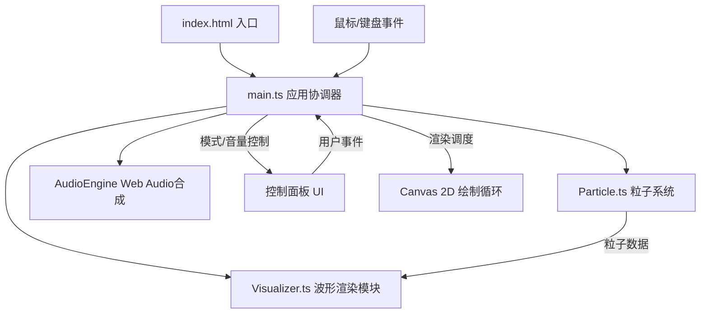

## 1. 架构设计



## 2. 技术描述

- **前端框架**：原生 TypeScript + Vite（无 React/Vue，使用 Canvas 2D 直接绘制）
- **构建工具**：Vite 5
- **音频引擎**：Web Audio API（内置合成，无外部音频资源）
- **渲染引擎**：Canvas 2D Context + requestAnimationFrame
- **类型系统**：TypeScript 严格模式，目标 ES2020，模块 ESNext

## 3. 文件结构

```
├── package.json          # 依赖：typescript、vite；脚本：dev、build
├── tsconfig.json         # strict: true, target: ES2020, module: ESNext
├── vite.config.js        # 基础 Vite 配置
├── index.html            # 入口页面，全屏深色背景，底部运行提示
└── src/
    ├── main.ts           # 应用入口：初始化画布、控制面板、键盘监听、粒子系统协调
    ├── particle.ts       # Particle 类 + ParticleSystem：位置/速度/颜色/生命周期/碰撞/尾迹/连接线/合并
    └── visualizer.ts     # WaveformVisualizer：接收粒子数据，绘制底部波形条
```

## 4. 核心类型定义

```typescript
// 粒子音色类型
type ToneType = 'sine' | 'square' | 'sawtooth' | 'triangle' | 'noise' | 'pulse' | 'lfo' | 'chord';

// 创作模式
type Mode = 'draw' | 'burst' | 'mixed';

// 单个粒子
interface Particle {
  x: number;
  y: number;
  vx: number;
  vy: number;
  radius: number;
  color: string;
  hsl: { h: number; s: number; l: number };
  tone: ToneType | null;
  life: number;
  maxLife: number;
  trail: { x: number; y: number }[];
}

// 连接线
interface Connection {
  p1: Particle;
  p2: Particle;
  bornAt: number;
}

// 撤销快照
interface HistorySnapshot {
  particles: Particle[];
  connections: Connection[];
}
```

## 5. 关键算法

1. **速度到颜色映射**：根据拖拽瞬时速度在 10 色渐变调色板中插值，慢速 → 蓝紫色，快速 → 橙红色
2. **粒子连接线**：每帧 O(n²) 遍历粒子对，距离 < 30px 记录为 Connection，保留 0.5 秒
3. **粒子合并优化**：粒子数 > 500 时，每 5 帧扫描距离 < 15px 的粒子对，合并为平均位置与平均 HSL
4. **波形能量计算**：`energy = (粒子数 × 平均速度 × 连接数密度) / 归一化系数`，映射为波形振幅
5. **碰撞混色**：HSL 色彩空间线性插值，饱和度 +10% 钳制到 100%
6. **尾迹衰减**：trail 数组保留最近 N 帧位置，渲染时透明度按 `index/trail.length` 线性衰减，总时长约 2 秒
