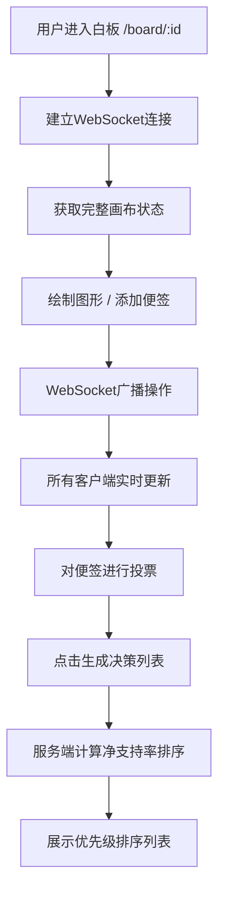

## 1. 产品概述

在线多人协作的实时白板与便签投票决策工具，让团队成员在同一块无限画布上同时绘制图形、添加便签，并对便签内容进行投票（赞成/反对），最终根据投票结果自动生成优先级排序列表。

- 解决团队远程协作中头脑风暴、方案决策效率低下的问题
- 目标用户为产品团队、设计团队、敏捷开发小组等需要快速决策的协作场景

## 2. 核心功能

### 2.1 用户角色

| 角色 | 注册方式 | 核心权限 |
|------|---------|---------|
| 团队成员 | 通过白板ID加入 | 绘制图形、添加/编辑/删除便签、投票、生成决策列表 |

### 2.2 功能模块

1. **白板画布页面**：无限画布、图形绘制、便签管理、实时同步
2. **决策结果页面**：投票结果排序展示、决策列表可视化

### 2.3 页面详情

| 页面名称 | 模块名称 | 功能描述 |
|---------|---------|---------|
| 白板画布页面 | 无限画布 | 支持鼠标滚轮缩放（0.5x-3x）、空格+拖拽平移 |
| 白板画布页面 | 图形绘制 | 矩形、椭圆、箭头三种图形，半透明蓝色填充，弹性动画 |
| 白板画布页面 | 便签管理 | 双击添加便签、多行文本编辑、删除、创建者头像与时间戳 |
| 白板画布页面 | 投票系统 | 👍赞成/👎反对按钮，支持切换投票不可重复 |
| 白板画布页面 | 实时同步 | WebSocket实时广播所有操作，新用户获取完整状态 |
| 白板画布页面 | 决策面板 | 生成决策列表、投票详情展示、清空投票（二次确认） |
| 决策结果页面 | 优先级排序列表 | 按净支持率排序展示所有便签 |

## 3. 核心流程

用户加入白板后，可以在画布上绘制图形和添加便签，所有操作通过WebSocket实时同步到其他在线用户。团队成员对便签进行投票后，点击"生成决策列表"按钮，系统根据净支持率（赞成-反对）自动排序并展示优先级列表。

## 4. 用户界面设计

### 4.1 设计风格

- 主色调：蓝色 #4285F4（Google Material Blue）
- 辅助色：米黄色 #FFF9C4（便签背景）、浅灰色 #F8F9FA（画布背景）
- 按钮风格：Material Design 圆角按钮，柔和阴影
- 字体：系统默认无衬线字体，标题加粗
- 布局风格：左右分栏（画布70% + 面板30%），卡片式便签
- 图标风格：Emoji 图标（👍👎），悬浮放大效果

### 4.2 页面设计概述

| 页面名称 | 模块名称 | UI 元素 |
|---------|---------|---------|
| 白板画布页面 | 无限画布 | 浅灰背景#F8F9FA，10x10网格线#E0E0E0（1x时可见），半透明蓝色图形 |
| 白板画布页面 | 便签卡片 | 200x150像素，#FFF9C4米黄背景，圆角边框，柔和阴影，首字母圆形头像 |
| 白板画布页面 | 右侧面板 | 白色背景，顶部标题"团队决策板"，决策列表按钮，便签缩略列表 |
| 白板画布页面 | 投票按钮 | 👍👎 Emoji，hover放大1.1倍，点击状态高亮 |

### 4.3 响应式设计

- 桌面端：左侧画布70%，右侧面板30%
- 窄屏（< 768px）：右侧面板变为底部抽屉式，可滑动展开/收起

### 4.4 动效设计

- 图形绘制：0.2秒弹性动画（从起点到终点缩放展开）
- 投票按钮：hover放大1.1倍的微交互
- 便签添加：淡入+缩放出现动画
- 面板抽屉：平滑滑动过渡
