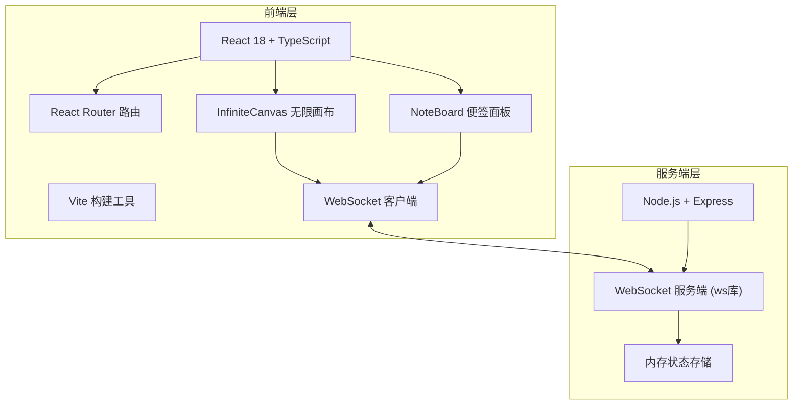
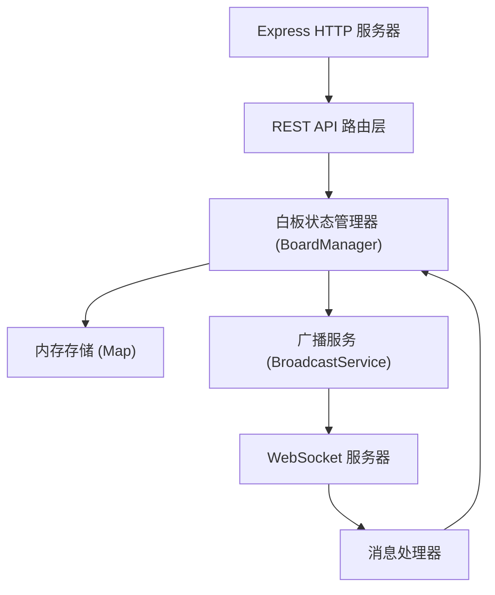
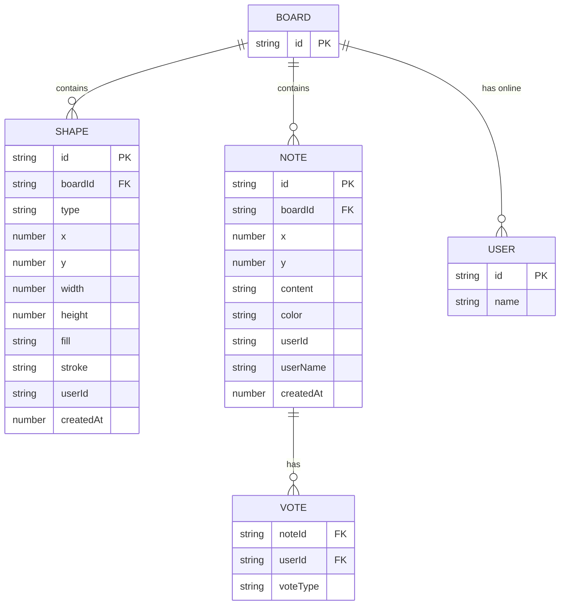

## 1. 架构设计



## 2. 技术说明

- 前端：React 18 + TypeScript + Vite + React Router DOM
- 构建工具：Vite 5.x + @vitejs/plugin-react
- 后端：Node.js + Express 4 + ws (WebSocket库)
- 其他依赖：uuid（生成唯一ID）
- 数据存储：服务端内存存储（定期保存状态）

## 3. 路由定义

| 路由 | 用途 |
|------|------|
| /board/:id | 白板画布主页面，包含无限画布和便签面板 |
| /vote-result | 投票结果优先级排序列表页面 |
| / | 重定向至默认白板 /board/default |

## 4. API 与 WebSocket 消息定义

### 4.1 WebSocket 消息类型

```typescript
// 客户端发送 -> 服务端
type ClientMessage =
  | { type: 'join'; boardId: string; userId: string; userName: string }
  | { type: 'draw'; shape: Shape }
  | { type: 'update-shape'; shape: Shape }
  | { type: 'delete-shape'; shapeId: string }
  | { type: 'add-note'; note: Note }
  | { type: 'update-note'; note: Note }
  | { type: 'delete-note'; noteId: string }
  | { type: 'vote'; noteId: string; vote: 'up' | 'down' | null; userId: string }
  | { type: 'clear-votes' }
  | { type: 'get-decision-list' };

// 服务端发送 -> 客户端
type ServerMessage =
  | { type: 'init'; state: BoardState }
  | { type: 'shape-added'; shape: Shape }
  | { type: 'shape-updated'; shape: Shape }
  | { type: 'shape-deleted'; shapeId: string }
  | { type: 'note-added'; note: Note }
  | { type: 'note-updated'; note: Note }
  | { type: 'note-deleted'; noteId: string }
  | { type: 'vote-updated'; noteId: string; votes: VoteRecord }
  | { type: 'votes-cleared' }
  | { type: 'decision-list'; list: DecisionItem[] }
  | { type: 'user-joined'; userId: string; userName: string }
  | { type: 'user-left'; userId: string };

interface Shape {
  id: string;
  type: 'rectangle' | 'ellipse' | 'arrow';
  x: number;
  y: number;
  width: number;
  height: number;
  fill: string;
  stroke: string;
  strokeWidth: number;
  userId: string;
  createdAt: number;
}

interface Note {
  id: string;
  x: number;
  y: number;
  content: string;
  color: string;
  userId: string;
  userName: string;
  createdAt: number;
  votes: VoteRecord;
}

interface VoteRecord {
  [userId: string]: 'up' | 'down';
}

interface DecisionItem {
  noteId: string;
  title: string;
  content: string;
  upVotes: number;
  downVotes: number;
  netSupport: number;
}

interface BoardState {
  shapes: Shape[];
  notes: Note[];
  users: { [userId: string]: string };
}
```

### 4.2 RESTful API

| 方法 | 路径 | 用途 |
|------|------|------|
| GET | /api/boards/:id/state | 获取指定白板的完整状态 |
| GET | /api/boards/:id/decision-list | 获取决策排序列表 |
| POST | /api/boards/:id/clear-votes | 清空所有投票 |

## 5. 服务端架构



## 6. 数据模型

### 6.1 数据模型定义



### 6.2 数据结构说明

所有数据存储在服务端内存中，以 BoardId 为键隔离不同白板。每个白板包含图形数组、便签数组和在线用户映射。WebSocket 负责实时同步操作，新用户加入时发送完整快照。
