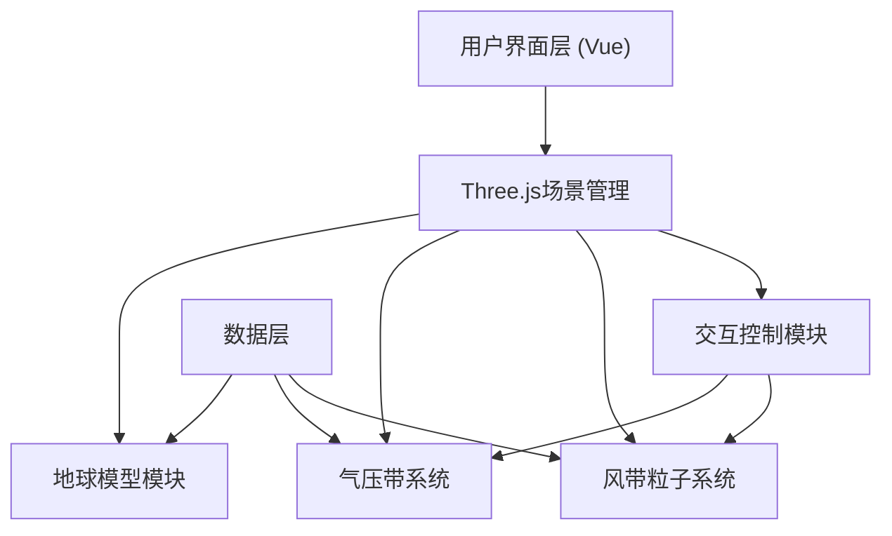

## 1. 架构设计



## 2. 技术描述
- **前端框架**：Vue@3 + TypeScript@5 + Vite@5
- **3D渲染**：three@^0.160.0 + @types/three
- **构建工具**：Vite@5 + @vitejs/plugin-vue@5
- **样式方案**：原生CSS（深色主题、响应式适配）

## 3. 文件结构

```
├── package.json          # 项目依赖配置
├── vite.config.js        # Vite构建配置（启用Vue插件）
├── tsconfig.json         # TypeScript配置（严格模式、ES2020）
├── index.html            # 入口页面
└── src/
    ├── main.ts           # 入口文件（场景初始化、渲染循环）
    └── AtmosphereSystem.ts  # 大气环流系统核心类
```

## 4. 核心数据模型

### 4.1 气压带数据结构
```typescript
interface PressureBand {
  id: string;
  name: string;           // 气压带名称
  latitude: number;       // 中心纬度（弧度）
  width: number;          // 纬度范围宽度
  color: string;          // 标识颜色
  pressure: number;       // 平均气压值 hPa
  seasonalRange: string;  // 季节变化范围
  type: 'high' | 'low';   // 高/低压类型
  windBelts: string[];    // 关联风带
}
```

### 4.2 风带数据结构
```typescript
interface WindBelt {
  id: string;
  name: string;
  minLatitude: number;
  maxLatitude: number;
  direction: 'east' | 'west';
  hemisphere: 'north' | 'south' | 'both';
  particleCount: number;
}
```

### 4.3 粒子状态
```typescript
interface Particle {
  position: THREE.Vector3;
  velocity: THREE.Vector3;
  latitude: number;
  longitude: number;
  altitude: number;
}
```

## 5. 模块数据流

### 5.1 初始化流程
```
main.ts
  ├─ 创建Scene, Camera, Renderer
  ├─ 初始化OrbitControls
  ├─ 实例化AtmosphereSystem
  │    ├─ createEarth()        → 生成地球网格与自定义纹理
  │    ├─ createPressureBands() → 生成六个气压带环带
  │    └─ createWindParticles() → 生成风带粒子系统
  └─ 启动 animate() 渲染循环
```

### 5.2 粒子更新流程
```
每帧更新:
  ├─ AtmosphereSystem.update(deltaTime, speedMultiplier)
  │    ├─ 更新地球旋转
  │    ├─ 更新气压带标签朝向相机
  │    └─ 遍历所有粒子
  │         ├─ 沿球面切向移动
  │         ├─ 经过气压带时调整高度（上升/下沉）
  │         └─ 更新位置Buffer
  └─ Renderer.render(scene, camera)
```

## 6. 性能优化策略
1. **粒子批处理**：使用BufferGeometry统一管理所有粒子，减少Draw Call
2. **视锥剔除**：启用Frustum Culling，仅渲染可见对象
3. **响应式降级**：移动端自动关闭粒子尾迹效果
4. **帧率控制**：使用requestAnimationFrame，目标30FPS+
5. **纹理优化**：Canvas程序化生成256x256尺寸纹理，避免外部资源加载
