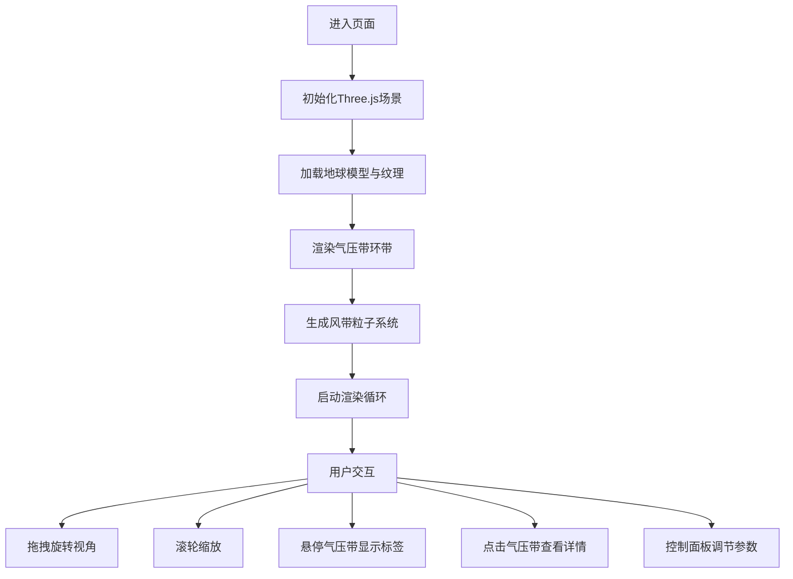

## 1. 产品概述
一款面向气象科普爱好者的3D交互式全球大气环流可视化应用，通过沉浸式三维展示帮助用户直观理解全球气压带与风带的分布及气流运动规律。

- 核心价值：将抽象的大气环流概念转化为可交互的三维可视化体验，降低气象知识的学习门槛
- 目标用户：气象科普爱好者、学生、教育工作者

## 2. 核心特性

### 2.1 用户角色
| 角色 | 注册方式 | 核心权限 |
|------|----------|----------|
| 访客用户 | 无需注册 | 浏览3D场景、交互操作、查看气压带详情 |

### 2.2 功能模块
1. **3D地球场景**：自转地球模型、自定义大陆纹理、动态光照
2. **气压带可视化**：六个半透明彩色带状环、悬停高亮效果、标签信息展示
3. **风带粒子系统**：四个风带粒子流、螺旋运动轨迹、高低空升降运动
4. **交互控制面板**：参数调节滑块、功能开关、响应式布局
5. **详情信息面板**：气压带详细数据展示、风带关联信息

### 2.3 页面详情
| 页面名称 | 模块名称 | 功能描述 |
|----------|----------|----------|
| 主页面 | 3D地球场景 | 支持鼠标拖拽旋转、滚轮缩放、自动/手动自转切换 |
| 主页面 | 气压带标识 | 半透明发光环带、悬停高亮、点击显示详情、始终面向摄像机的标签 |
| 主页面 | 风带粒子流 | 3000个粒子沿球面切向运动、颜色随纬度渐变、高低压带升降效果 |
| 主页面 | 控制面板 | 粒子速度滑块、自转速度滑块、粒子透明度滑块、尾迹开关 |
| 主页面 | 详情面板 | 显示气压带名称、气压值、季节变化、关联风带列表 |

## 3. 核心流程
用户进入页面后自动加载3D场景，通过鼠标拖拽旋转地球视角、滚轮缩放观察细节；鼠标悬停气压带时显示高亮与气压标签，点击气压带后右侧面板展开详细信息；通过右下角控制面板调节粒子速度、自转速度、透明度等参数，开启尾迹效果观察气流运动轨迹。

## 4. 用户界面设计

### 4.1 设计风格
- **主色调**：深空蓝 #0A0A1A，气压带标识色（#E74C3C 红、#F39C12 橙、#3498DB 蓝、#2ECC71 绿）
- **UI风格**：深色科技感、扁平圆角设计、半透明磨砂玻璃效果
- **字体**：现代无衬线字体，标题加粗、正文常规
- **动效**：粒子流动动画、环带发光脉冲、参数平滑过渡

### 4.2 页面设计概览
| 页面名称 | 模块名称 | UI元素 |
|----------|----------|--------|
| 主页面 | 3D视口 | 全屏自适应、深色背景、地球居中、右上方向光照 |
| 主页面 | 气压带环带 | 六种颜色半透明带状、Bloom发光效果、悬停亮度提升30% |
| 主页面 | 粒子系统 | 大小0.08单位、透明度0.6、颜色纬度渐变、可选尾迹效果 |
| 主页面 | 控制面板 | 220px宽、#1A1A2E背景、透明度0.85、圆角8px、右下角浮动 |
| 主页面 | 详情面板 | 与控制面板同风格、点击气压带时显示、展示详细参数列表 |
| 主页面 | 响应式布局 | <768px时控制面板移至底部横向布局、关闭尾迹提升性能 |

### 4.3 响应式设计
- 桌面端（>768px）：控制面板位于右下角，竖向布局，尾迹效果默认开启
- 移动端（≤768px）：控制面板移至底部，横向布局，高度100px，自动关闭尾迹效果
- 触摸优化：支持手势旋转与缩放

### 4.4 3D场景指南
- **环境氛围**：深空背景，营造宇宙空间沉浸感
- **光照设置**：右上方向平行光，强度1.2，白色光，模拟太阳光
- **相机设置**：PerspectiveCamera，初始距离3单位，支持OrbitControls轨道控制
- **后期特效**：Bloom发光（强度0.3）增强环带视觉效果
- **性能预算**：帧率≥30FPS，粒子总数≤3000
