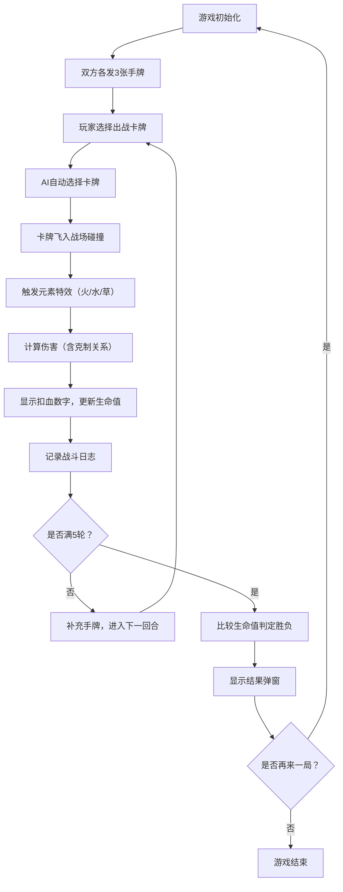

## 1. 产品概述

基于回合制策略的卡牌对战游戏，玩家通过组合不同元素属性的卡牌与AI对手进行自动结算战斗，体验策略博弈的乐趣。

- 主要目的：提供一款轻量级、策略性强的卡牌对战游戏
- 解决问题：满足碎片化娱乐需求，简单上手但富有策略深度
- 目标用户：休闲游戏爱好者、策略游戏玩家
- 产品价值：精美的视觉效果、流畅的战斗动画、清晰的元素克制策略

## 2. 核心功能

### 2.1 功能模块

1. **主战斗界面**：生命值条、战斗场地、玩家手牌区、AI手牌区、战斗日志
2. **卡牌系统**：元素属性（火/水/草）、攻击力、防御力、元素克制关系
3. **回合战斗系统**：玩家选牌、AI自动选牌、战斗动画、伤害结算
4. **游戏状态管理**：5轮对战判定、胜利/失败弹窗、重置游戏

### 2.2 页面详情

| 页面名称 | 模块名称 | 功能描述 |
|-----------|-------------|---------------------|
| 主战斗页面 | 生命值条 | 顶部显示双方总生命值，扣血时动画填充减少并闪白 |
| 主战斗页面 | 玩家卡牌区 | 左侧显示3张手牌，悬停放大1.1倍，点击选中出战 |
| 主战斗页面 | AI卡牌区 | 右侧显示3张卡牌背面，灰色卡背带问号图案 |
| 主战斗页面 | 战斗场地 | 中间浅灰色圆形区域，卡牌飞入碰撞展示特效 |
| 主战斗页面 | 战斗日志 | 底部滚动区域，显示战斗过程，最多保留10条 |
| 主战斗页面 | 结果弹窗 | 5轮后显示胜负，带缩放弹入动画，提供"再来一局"按钮 |

## 3. 核心流程

玩家进入游戏后，双方各持有3张手牌。每回合玩家先选择一张手牌出战，AI随即自动选牌，两张卡牌飞入战场中心碰撞，触发元素特效并结算伤害。5轮对战后根据剩余生命值判定胜负，玩家可选择重新开始游戏。

## 4. 用户界面设计

### 4.1 设计风格

- **主色调**：深色背景 #1a1a2e，渐变按钮 #667eea → #764ba2
- **元素色**：火（红→橙渐变）、水（蓝→青渐变）、草（绿→黄绿渐变）
- **卡牌样式**：圆角12px，半透明磨砂玻璃效果，微妙发光边缘
- **按钮反馈**：按压缩放至0.95，0.15秒过渡动画
- **布局风格**：左右对称布局，中间战斗场地，顶部状态栏，底部日志区

### 4.2 页面设计概述

| 页面名称 | 模块名称 | UI元素 |
|-----------|-------------|-------------|
| 主战斗页面 | 生命值条 | 玩家绿色、AI红色进度条，0.3秒动画过渡，闪白反馈 |
| 主战斗页面 | 玩家卡牌 | 矩形卡片，元素渐变背景，圆角12px，悬停放大1.1倍加深投影 |
| 主战斗页面 | AI卡牌 | 灰色卡背，问号图案，统一外观 |
| 主战斗页面 | 战斗场地 | 浅灰色半透明圆形区域，居中展示 |
| 主战斗页面 | 战斗日志 | 文本滚动区，新消息底部进入，旧消息向上淡出 |
| 主战斗页面 | 结果弹窗 | 缩放弹入动画（0.3秒弹性缓动），渐变按钮 |

### 4.3 响应式设计

- 桌面优先，适配768px到1920px宽度
- 卡牌大小等比缩放
- 按钮和进度条位置不重叠
- 使用CSS变量控制尺寸，便于响应式调整

### 4.4 动效设计

- 卡牌飞入战场：平滑位移动画
- 碰撞特效：火（爆裂粒子）、水（波浪扩散）、草（藤蔓缠绕），持续0.5秒
- 扣血数字：从卡牌上方飘出，红色渐隐
- 生命值减少：0.3秒动画填充，短暂闪白
- 弹窗出现：0.3秒弹性缓动缩放弹入
- 按钮按压：scale 0.95，0.15秒过渡
