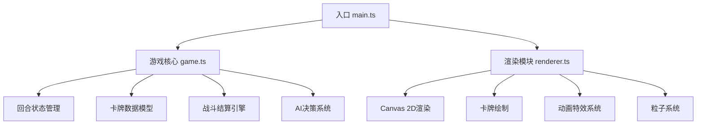

## 1. 架构设计



## 2. 技术描述

- **前端框架**：原生 TypeScript + HTML5 Canvas
- **构建工具**：Vite 5.x
- **模块系统**：ESNext
- **类型检查**：TypeScript 严格模式
- **渲染方式**：Canvas 2D API（requestAnimationFrame驱动）
- **UI样式**：原生 CSS（backdrop-filter、CSS变量、CSS动画）

## 3. 文件结构

```
auto14/
├── package.json              # 依赖配置（vite、typescript）
├── index.html                # 入口页面
├── tsconfig.json             # TypeScript配置（严格模式、ESNext）
├── vite.config.js            # Vite构建配置
└── src/
    ├── main.ts               # 游戏入口（初始化、游戏循环）
    ├── game.ts               # 核心逻辑（回合、卡牌、战斗、AI）
    └── renderer.ts           # 渲染模块（绘制、动画、粒子）
```

## 4. 数据模型

### 4.1 核心类型定义

```typescript
// 元素类型
type Element = 'fire' | 'water' | 'grass';

// 卡牌接口
interface Card {
  id: string;
  name: string;
  attack: number;
  defense: number;
  element: Element;
}

// 玩家/AI状态
interface Player {
  hp: number;
  maxHp: number;
  hand: Card[];
}

// 游戏状态
type GamePhase = 'select' | 'battle' | 'animating' | 'result';

interface GameState {
  player: Player;
  ai: Player;
  round: number;
  maxRounds: number;
  phase: GamePhase;
  battleLog: string[];
  selectedCard: Card | null;
  aiSelectedCard: Card | null;
  winner: 'player' | 'ai' | null;
}

// 动画状态
interface AnimationState {
  playerCardPos: { x: number; y: number };
  aiCardPos: { x: number; y: number };
  particles: Particle[];
  damageNumbers: DamageNumber[];
  effects: Effect[];
}
```

### 4.2 元素克制关系

```
火 → 克 → 草（火克草，双倍伤害）
草 → 克 → 水（草克水，双倍伤害）
水 → 克 → 火（水克火，双倍伤害）
```

## 5. 核心逻辑说明

### 5.1 战斗结算公式

- 基础伤害 = max(攻击力 - 对方防御力, 1)
- 克制加成：克制对方时伤害 × 2
- 最终伤害 = 基础伤害 × 克制倍率

### 5.2 AI决策策略

- 优先选择能克制玩家已选卡牌元素的卡牌
- 次选攻击力最高的卡牌
- 若手牌中无克制卡，随机选择

### 5.3 游戏循环

- 使用 requestAnimationFrame 驱动渲染
- 单帧计算时间控制在10ms以内
- 状态更新与渲染分离，逻辑帧60FPS

### 5.4 性能优化

- 对象池复用粒子对象
- 离屏Canvas缓存卡牌绘制
- 增量更新，避免每帧重绘不变元素
