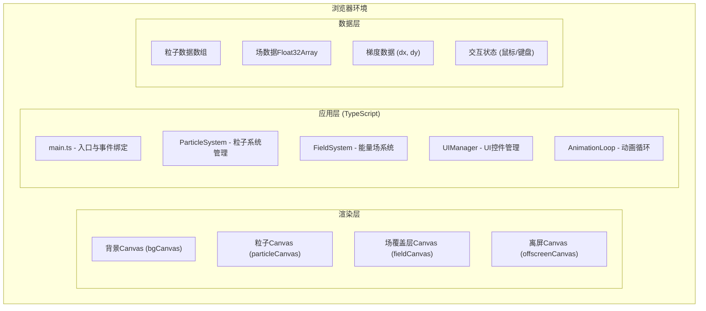

## 1. 架构设计



## 2. 技术说明

- **前端框架**: 原生 TypeScript，无框架依赖（Canvas 直接渲染）
- **构建工具**: Vite 5.x，开启 HMR 热更新
- **语言**: TypeScript 5.x，严格模式，目标 ES2020，模块 ESNext
- **渲染**: HTML5 Canvas 2D API，三层 Canvas 叠加 + 离屏 Canvas 预计算
- **无后端**: 纯前端应用，无需服务器支持

### 依赖项
```json
{
  "devDependencies": {
    "typescript": "^5.4.0",
    "vite": "^5.2.0"
  }
}
```

## 3. 文件结构

| 文件路径 | 用途 |
|----------|------|
| `package.json` | 项目依赖与脚本配置（npm run dev） |
| `index.html` | 入口页面，包含三层 Canvas 与 UI 元素 |
| `tsconfig.json` | TypeScript 编译配置（严格模式，ES2020） |
| `vite.config.js` | Vite 构建配置（HMR 开启） |
| `src/main.ts` | 应用入口：初始化 Canvas、系统、事件绑定、启动循环 |
| `src/particle.ts` | 粒子类定义：位置、速度、颜色、尾迹、更新与绘制 |
| `src/field.ts` | 能量场系统：场生成、梯度计算、等高线绘制、交互更新 |
| `src/types.ts` | （可选）共享类型定义 |
| `src/utils.ts` | （可选）工具函数：lerp、smoothstep、噪声函数等 |

## 4. 类与模块设计

### 4.1 Particle 类 (src/particle.ts)
```typescript
class Particle {
  x: number;
  y: number;
  vx: number;
  vy: number;
  color: string;
  trail: { x: number; y: number }[];
  frozen: boolean;

  constructor(x: number, y: number, color: string);
  applyForce(fx: number, fy: number, intensityScale: number): void;
  update(maxSpeed: number): void;
  draw(ctx: CanvasRenderingContext2D, frozen: boolean): void;
}
```

### 4.2 FieldSystem 类 (src/field.ts)
```typescript
class FieldSystem {
  width: number;
  height: number;
  fieldData: Float32Array;
  targetFieldData: Float32Array;
  gradientX: Float32Array;
  gradientY: Float32Array;
  intensityScale: number;
  currentType: number;
  transitionProgress: number;

  constructor(width: number, height: number);
  resize(width: number, height: number): void;
  generateField(type: number): Float32Array;
  startTransition(type: number): void;
  updateTransition(deltaTime: number): void;
  addGaussianPeak(x: number, y: number, radius: number, intensity: number): void;
  computeGradient(): void;
  getGradientAt(x: number, y: number): { dx: number; dy: number };
  drawFieldOverlay(ctx: CanvasRenderingContext2D): void;
  drawContours(ctx: CanvasRenderingContext2D, flickerAlpha?: number): void;
}
```

### 4.3 主入口 (src/main.ts)
- 初始化三层 Canvas（背景层、粒子层、场覆盖层）
- 创建离屏 Canvas 用于梯度计算
- 初始化 2000 个粒子
- 绑定鼠标、键盘、滚轮、触摸事件
- 启动 requestAnimationFrame 循环
- 实现粒子间排斥力计算（空间网格优化）

## 5. 核心算法

### 5.1 能量场类型（0-9）
| 编号 | 名称 | 算法 |
|------|------|------|
| 0 | 随机噪声场 | Value Noise + Fractal Brownian Motion |
| 1 | 单峰高斯场 | 中心单个高斯函数 exp(-r²/2σ²) |
| 2 | 双峰干涉场 | 两个错位高斯场叠加 + 余弦干涉 |
| 3 | 周期性正弦场 | sin(x/λ) * sin(y/λ) 二维乘积 |
| 4 | 涡旋场 | 极坐标 r * sin(θ * n) 旋转对称 |
| 5 | 鞍点场 | x² - y² 双曲抛物面 |
| 6 | 径向梯度场 | 距中心距离的线性/非线性函数 |
| 7 | 分形噪声场 | Perlin Noise 多八度叠加 |
| 8 | 泊松盘采样场 | 泊松盘分布点的高斯核密度估计 |
| 9 | 自定义混合场 | 多种场按权重混合 |

### 5.2 梯度计算
使用 3x3 Sobel 算子在离屏 Canvas 上计算场的 x 和 y 方向偏导数：
```
Sobel X:  [-1, 0, 1; -2, 0, 2; -1, 0, 1]
Sobel Y:  [-1, -2, -1; 0, 0, 0; 1, 2, 1]
```

### 5.3 粒子排斥力（优化）
使用空间网格（Spatial Grid）将粒子分桶，仅检查相邻网格内的粒子，复杂度从 O(n²) 降至 O(n)。

### 5.4 等高线绘制
使用 Marching Squares 算法提取等值线，连接相邻网格点的线段并绘制发光效果（shadowBlur）。

### 5.5 场过渡动画
使用 `lerp(a, b, t)` 对 `fieldData` 和 `targetFieldData` 进行逐像素线性插值，t 在 0.8 秒内从 0 过渡到 1。

## 6. 性能优化策略

1. **分层 Canvas**：背景、粒子、场覆盖层分离，仅在需要时重绘
2. **离屏 Canvas 预计算**：场梯度使用离屏 Canvas 的 getImageData 批量计算
3. **空间网格加速**：粒子排斥力计算使用网格分桶
4. **TypedArray**：场数据使用 Float32Array 提高内存访问效率
5. **粒子池**：超出 3000 时移除最早粒子，避免频繁 GC
6. **requestAnimationFrame**：与浏览器刷新率同步，使用 deltaTime 保证速率独立
7. **发光效果优化**：等高线发光使用 shadowBlur，避免逐像素计算
