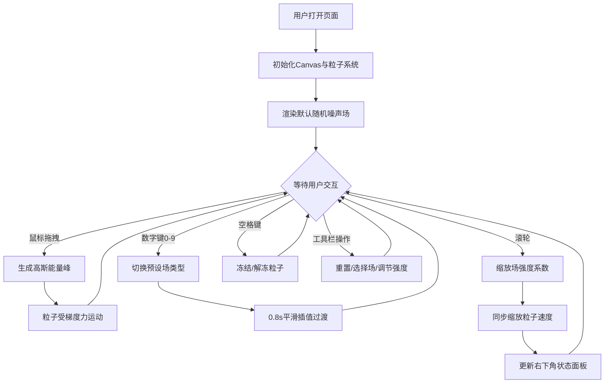

## 1. 产品概述

动态能量场形态图谱可视化应用，解决科研演示或数学艺术展示中难以直观可视化二维标量场（如电场、磁场或流体梯度）随用户交互实时变形和粒子跟随的沉浸式体验问题。

- 面向科研工作者、教育者和数字艺术爱好者，提供直观、可交互的场可视化工具
- 通过实时粒子模拟和场强可视化，将抽象的数学物理概念转化为沉浸式的视觉体验

## 2. 核心功能

### 2.1 用户角色
本应用无需用户注册，所有访问者均可直接使用全部功能。

| 角色 | 注册方式 | 核心权限 |
|------|----------|----------|
| 访客 | 无需注册 | 使用全部交互功能、切换场类型、调整参数 |

### 2.2 功能模块
1. **主画布区域**：Canvas 分层渲染（粒子层、场覆盖层、背景层），自适应窗口尺寸
2. **交互控制系统**：鼠标拖拽生成能量峰值、滚轮缩放场强、数字键切换场类型、空格键冻结
3. **粒子系统**：2000 个粒子实时运动模拟，带尾迹效果和粒子间排斥力
4. **能量场系统**：10 种预设场类型，支持平滑插值切换、梯度计算、等高线绘制
5. **顶部工具栏**：重置按钮、场类型下拉选择、强度缩放滑块
6. **状态显示面板**：右下角显示当前强度缩放系数

### 2.3 页面详情
| 页面名称 | 模块名称 | 功能描述 |
|----------|----------|----------|
| 主应用页 | Canvas 画布 | 自适应窗口（最小800x600px），背景#0A0A1A，三层渲染架构 |
| 主应用页 | 鼠标交互 | 按住左键拖拽生成高斯能量峰值，强度随速度线性增加 |
| 主应用页 | 键盘交互 | 0-9切换场类型（平滑过渡0.8s），空格键冻结/解冻粒子 |
| 主应用页 | 滚轮缩放 | 场强度缩放系数0.5-2.0（步长0.1），粒子速度同步缩放 |
| 主应用页 | 粒子系统 | 2000粒子，8色调色板，尾迹5帧，排斥力防堆积，速度上限5px/帧 |
| 主应用页 | 能量场 | 10种预设场，Sobel梯度计算，间隔10单位等高线发光青色绘制 |
| 主应用页 | 工具栏 | 重置粒子按钮、场类型下拉、强度滑块，半透明悬浮 |
| 主应用页 | 状态面板 | 右下角显示缩放系数，半透明深色背景 |
| 主应用页 | 背景粒子 | 微弱浮动粒子增强沉浸感 |

## 3. 核心流程

### 3.1 主交互流程
用户打开页面后，系统自动初始化粒子系统和默认能量场（随机噪声场）。用户可以通过以下方式进行交互：
1. 按住鼠标左键在画布上拖拽，实时生成高斯能量峰，粒子受梯度力驱动运动
2. 使用数字键 0-9 切换不同的预设能量场类型，场形态平滑过渡
3. 滚动鼠标滚轮缩放整体场强度，右下角面板实时显示系数
4. 按下空格键冻结所有粒子，再次按空格恢复运动
5. 通过顶部工具栏进行重置、场类型选择和强度调节

## 4. 用户界面设计

### 4.1 设计风格
- **主色调**：深空蓝 #0A0A1A 为背景，霓虹青 #00FFFF 和珊瑚红 #FF6B6B 为点缀
- **粒子调色板**：#FF6B6B、#4ECDC4、#45B7D1、#96CEB4、#FFEAA7、#DDA0DD、#98D8C8、#F7DC6F 共8色
- **按钮风格**：圆形重置按钮，悬停放大1.1倍并增加阴影
- **视觉风格**：科技感暗色主题，霓虹光效，半透明悬浮UI，发光等高线
- **动效**：场切换0.8s平滑过渡，工具栏展开0.3s动画，冻结时等高线2Hz闪烁

### 4.2 页面设计概览
| 页面名称 | 模块名称 | UI元素 |
|----------|----------|--------|
| 主应用页 | Canvas背景 | #0A0A1A 深色背景，微弱浮动背景粒子（1-3px，0.1px/帧，alpha 0.1-0.3） |
| 主应用页 | 粒子层 | 2px点精灵，带5帧渐隐尾迹，粒子颜色来自8色调色板 |
| 主应用页 | 场覆盖层 | 半透明强度图叠加，发光青色等高线（间隔10单位） |
| 主应用页 | 顶部工具栏 | 半透明悬浮（#00000080，圆角8px），重置按钮、下拉选择、滑块 |
| 主应用页 | 右下角面板 | #00000080 背景，圆角6px，白色字体显示缩放系数 |

### 4.3 响应式设计
- Desktop-first 设计，Canvas 自适应窗口尺寸（最小 800x600px）
- 移动端（宽度 < 768px）：顶部工具栏折叠为汉堡菜单图标，点击展开（0.3s浮现动画）
- 触摸优化：支持触摸拖拽生成能量峰，双指缩放调整场强度

## 5. 性能要求
- 粒子更新与 requestAnimationFrame 同步
- 粒子数量上限 3000，超出时自动剔除最早粒子
- 场梯度使用 3x3 Sobel 算子在离屏 Canvas 上预计算
- 整体帧率稳定 55FPS 以上
- 粒子响应延迟 ≤ 1帧，场等高线更新延迟 ≤ 2帧
