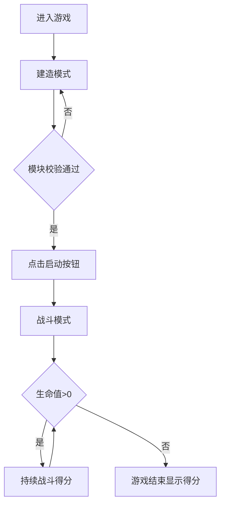

## 1. 产品概述

一款基于 Canvas 的 2D 像素风太空船建造与弹幕射击生存游戏。玩家通过拖拽组装自定义太空船，在无尽的敌机弹幕中生存并获取高分。

- 主要目的：提供建造策略与即时操作结合的休闲生存游戏体验
- 目标用户：喜欢像素风、弹幕射击、策略组装类游戏的玩家

## 2. 核心功能

### 2.1 功能模块

1. **建造模式**：10x10 网格建造区域、模块拖拽放置、连接校验、属性计算
2. **战斗模式**：敌机自动生成、弹幕发射、碰撞检测、得分与生命值系统
3. **HUD 界面**：左上角积分与生命值面板、底部建造工具栏
4. **特效系统**：爆炸粒子、蓝色光晕、敌机闪烁光效

### 2.2 页面详情

| 页面名称 | 模块名称 | 功能描述 |
|----------|----------|----------|
| 游戏主界面 | 建造区域 | 10x10 网格，拖拽放置模块，校验规则 |
| 游戏主界面 | 工具栏 | 核心/引擎/武器模块图标（32x32），启动按钮（80x30） |
| 游戏主界面 | HUD 面板 | 左上角显示得分（+100/敌机）和生命值进度条（120x16） |
| 游戏主界面 | 战斗场景 | 敌机生成、太空船移动、子弹发射、碰撞与粒子特效 |

## 3. 核心流程

玩家打开游戏 → 在建造模式拖拽模块组装太空船（核心1个，引擎需相邻核心，武器任意，≤10模块）→ 点击启动按钮进入战斗 → 控制太空船躲避敌机、武器自动瞄准射击 → 生命值归零游戏结束显示最终得分

## 4. 用户界面设计

### 4.1 设计风格

- **主色调**：深空色渐变 `#0B0B1A → #1A1A3E`，深灰 `#2C2C3E`
- **强调色**：核心灰、引擎蓝、武器红、子弹黄、敌机红、粒子橙
- **按钮**：启动按钮绿色，圆角4像素，悬停白边框高亮，点击缩放到0.9倍
- **字体**：等宽像素风字体（使用 monospace）
- **布局**：全屏 Canvas，顶部 HUD，底部工具栏，中央游戏区域
- **光效**：太空船蓝色光晕（半径5px，透明度0.3），敌机0.5秒周期闪烁

### 4.2 页面设计概述

| 页面名称 | 模块名称 | UI 元素 |
|----------|----------|---------|
| 游戏主界面 | 背景 | 深空色垂直渐变，半透明灰色网格线（#3A3A5A，1px） |
| 游戏主界面 | HUD 面板 | 半透明黑色背景，圆角8px，得分文字 + 红色生命进度条 |
| 游戏主界面 | 工具栏 | 深灰背景 `#2C2C3E`，圆角4px，模块图标 + 启动按钮 |
| 游戏主界面 | 模块图标 | 32x32像素，悬停白色边框，点击缩放动画 |

### 4.3 响应式

桌面端全屏 Canvas 优先，通过 CSS 自适应窗口大小。
