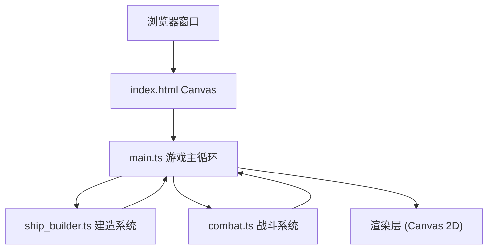

## 1. 架构设计



## 2. 技术说明

- **前端框架**：纯 TypeScript + Canvas 2D API（无 UI 框架）
- **构建工具**：Vite 5.x，开启 HMR
- **语言目标**：ES2020，严格模式 TypeScript
- **模块系统**：ESNext Modules

## 3. 文件结构

| 文件 | 职责 |
|------|------|
| `package.json` | 依赖：typescript、vite；脚本：npm run dev |
| `index.html` | 全屏 Canvas 入口，HUD 容器，底部工具栏 DOM |
| `tsconfig.json` | strict: true，target ES2020，module ESNext |
| `vite.config.js` | 基础 Vite 配置 |
| `src/main.ts` | 游戏入口，Canvas 初始化，场景切换，主循环（requestAnimationFrame） |
| `src/ship_builder.ts` | 10x10 网格、模块拖拽、连接校验、属性计算 |
| `src/combat.ts` | 敌机生成、子弹、碰撞（四叉树 8x8）、粒子、得分、生命值 |

## 4. 数据模型

### 4.1 模块类型

```typescript
type ModuleType = 'core' | 'engine' | 'weapon';

interface PlacedModule {
  type: ModuleType;
  gridX: number; // 0-9
  gridY: number; // 0-9
}
```

### 4.2 战斗实体

```typescript
interface Ship {
  x: number;
  y: number;
  modules: PlacedModule[];
  hp: number;
  maxHp: number;
  speed: number;
  fireInterval: number;
}

interface Enemy {
  x: number;
  y: number;
  speed: number;
  size: number;
  flickerPhase: number;
}

interface Bullet {
  x: number;
  y: number;
  vx: number;
  vy: number;
  radius: number;
  fromShip: boolean;
}

interface Particle {
  x: number;
  y: number;
  vx: number;
  vy: number;
  radius: number;
  color: string;
  life: number;
  maxLife: number;
}
```

## 5. 性能优化

- **帧率**：requestAnimationFrame 锁定 60FPS
- **对象池限制**：敌机 ≤ 30，子弹 ≤ 100，粒子 ≤ 50（超出丢弃最旧）
- **碰撞检测**：8x8 网格空间分区（四叉树简化版），每帧计算 ≤ 2ms
- **渲染**：Canvas 2D 离屏缓存静态元素
