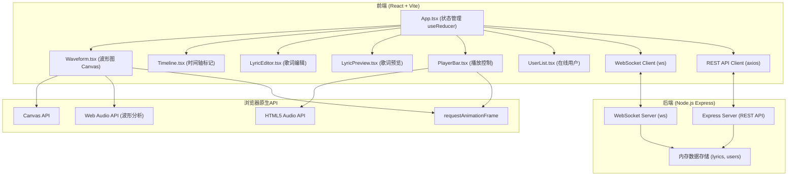
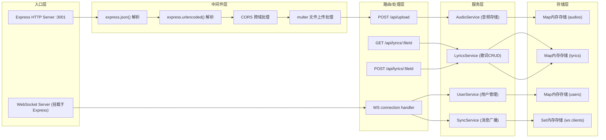

## 1. 架构设计



## 2. 技术描述

- **前端框架**：React@18 + TypeScript
- **构建工具**：Vite@5 + @vitejs/plugin-react
- **后端框架**：Express@4 + TypeScript
- **实时通信**：ws@8 (WebSocket)
- **HTTP客户端**：axios@1
- **工具库**：uuid@9 (唯一ID生成)
- **样式方案**：原生CSS (CSS变量 + Grid布局)
- **音频处理**：Web Audio API + HTML5 Audio API
- **图形绘制**：Canvas 2D API
- **状态管理**：React useReducer (复杂状态)

## 3. 路由定义

| 路由/路径 | 类型 | 用途 |
|-----------|------|------|
| / | 前端 | 主编辑页面 |
| POST /api/upload | 后端REST | 上传音频文件，返回fileId |
| GET /api/lyrics/:fileId | 后端REST | 获取指定音频的歌词数据 |
| POST /api/lyrics/:fileId | 后端REST | 保存歌词数据 |
| /ws | 后端WebSocket | 实时同步连接端点 |

## 4. API 定义

### 4.1 TypeScript 类型定义

```typescript
interface User {
  id: string;
  name: string;
  email: string;
  avatar: string;
  editingLyricId: string | null;
  connectedAt: number;
}

interface LyricLine {
  id: string;
  startTime: number;
  endTime: number;
  text: string;
  updatedAt: number;
  updatedBy: string;
  editedBy: string | null;
}

interface LyricsData {
  fileId: string;
  lines: LyricLine[];
}

interface AudioData {
  fileId: string;
  fileName: string;
  duration: number;
  url: string;
}

interface WSMessage {
  id: string;
  type: 'connect' | 'disconnect' | 'user_list' | 'lyric_add' | 'lyric_update' | 'lyric_delete' | 'lyric_lock' | 'lyric_unlock' | 'conflict';
  payload: any;
  timestamp: number;
}

interface Notification {
  id: string;
  type: 'info' | 'warning' | 'success' | 'error';
  message: string;
  duration: number;
}
```

### 4.2 WebSocket 消息协议

| 消息类型 | 发送方 | Payload 结构 | 说明 |
|----------|--------|--------------|------|
| connect | 客户端→服务端 | { user: User } | 用户建立连接 |
| disconnect | 服务端→所有客户端 | { userId: string } | 用户断开通知 |
| user_list | 服务端→客户端 | { users: User[] } | 同步在线用户列表 |
| lyric_add | 客户端→服务端→所有客户端 | { line: LyricLine } | 新增歌词行 |
| lyric_update | 客户端→服务端→所有客户端 | { line: LyricLine } | 更新歌词行（后保存覆盖） |
| lyric_delete | 客户端→服务端→所有客户端 | { lineId: string } | 删除歌词行 |
| lyric_lock | 客户端→服务端→所有客户端 | { lineId: string, userId: string } | 锁定歌词编辑状态 |
| lyric_unlock | 客户端→服务端→所有客户端 | { lineId: string, userId: string } | 解锁歌词编辑状态 |
| conflict | 服务端→客户端 | { message: string, lineId: string } | 编辑冲突通知 |

## 5. 服务器架构



## 6. 性能优化策略

### 6.1 前端性能
- **波形绘制**：使用 requestAnimationFrame 保证60fps稳定帧率
- **WebSocket分包**：单消息包限制50KB，超过自动拆分传输
- **Canvas优化**：只重绘变化区域，使用离屏Canvas缓存静态波形
- **状态更新**：useReducer批量更新，避免不必要的重渲染
- **歌词滚动**：CSS transform平滑过渡，避免触发重排

### 6.2 后端性能
- **内存存储**：使用Map进行O(1)读写操作
- **广播优化**：仅向除发送者外的客户端广播
- **消息节流**：高频编辑操作合并发送

## 7. 文件结构

```
project/
├── package.json
├── index.html
├── tsconfig.json
├── vite.config.js
├── server/
│   └── index.ts
└── src/
    ├── App.tsx
    ├── styles.css
    └── components/
        ├── Waveform.tsx
        ├── Timeline.tsx
        ├── LyricEditor.tsx
        ├── LyricPreview.tsx
        ├── PlayerBar.tsx
        └── UserList.tsx
```
