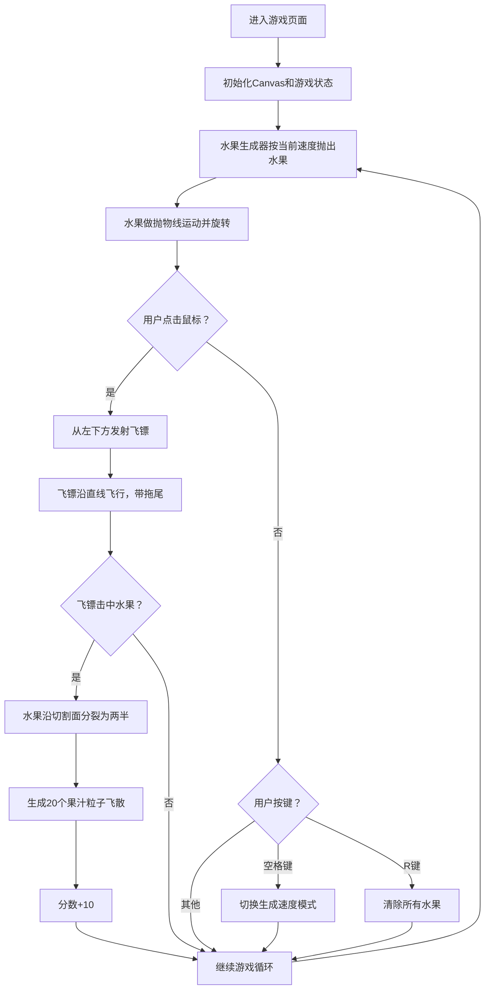

## 1. 产品概述
水果切割游戏是一款基于Canvas 2D的浏览器休闲小游戏，玩家通过鼠标点击发射飞镖切割悬浮的水果，体验爽快的切割和果汁飞溅视觉效果。
- 目标用户：休闲游戏爱好者，网页游戏玩家
- 产品价值：提供简单易上手、视觉反馈强烈的休闲娱乐体验

## 2. 核心功能

### 2.1 用户角色
无多角色区分，所有用户直接进入游戏。

### 2.2 功能模块
1. **游戏主场景**：木纹背景、弧形水果轨道、Canvas渲染画布
2. **水果系统**：水果生成、抛物线下落、旋转动画、切割分裂
3. **飞镖系统**：飞镖发射、飞行轨迹、拖尾特效、碰撞检测
4. **粒子系统**：果汁飞溅粒子、颜色渐变、大小衰减、透明度变化
5. **UI界面**：计分面板、速度模式显示、操作提示文字
6. **控制系统**：鼠标点击发射、空格键切换速度、R键重置

### 2.3 页面详情
| 页面名称 | 模块名称 | 功能描述 |
|-----------|-------------|---------------------|
| 游戏主页面 | 背景渲染 | 木纹色渐变背景（#8B5A2B→#6B4226） |
| 游戏主页面 | 水果生成器 | 沿弧形轨道随机抛出四种水果（苹果、橙子、西瓜、草莓） |
| 游戏主页面 | 飞镖发射 | 从屏幕左下方发射银色飞镖，带拖尾轨迹 |
| 游戏主页面 | 切割效果 | 水果沿飞镖轨迹垂直方向分裂为两半，反向飞出 |
| 游戏主页面 | 粒子效果 | 切割位置产生20个彩色果汁粒子，随机方向飞散 |
| 游戏主页面 | 计分面板 | 左上角显示分数，每切割一个水果+10分 |
| 游戏主页面 | 速度模式 | 右上角显示当前生成速度（慢/中/快） |
| 游戏主页面 | 操作提示 | 底部中央显示操作说明文字 |

## 3. 核心流程
用户进入页面后，水果自动从顶部弧形轨道抛出并做抛物线下落运动。用户鼠标点击任意位置，飞镖从屏幕左下方沿直线飞向点击位置。若飞镖击中水果，水果被切割为两半并飞出，同时产生果汁粒子效果，分数增加10分。用户可按空格键在慢、中、快三种水果生成速度间切换，按R键清除场上所有水果。

## 4. 用户界面设计

### 4.1 设计风格
- **主色调**：木纹色渐变背景（#8B5A2B → #6B4226）
- **水果颜色**：苹果红#FF3B30、橙子橙#FF9500、西瓜绿#34C759、草莓粉#FF2D55
- **速度指示**：绿色（慢）、黄色（中）、红色（快）
- **飞镖颜色**：银色金属质感
- **字体**：像素风格 'Press Start 2P'
- **面板样式**：圆角矩形、半透明黑色背景#00000080、白色字体带阴影

### 4.2 页面设计概览
| 页面名称 | 模块名称 | UI元素 |
|-----------|-------------|-------------|
| 游戏主页面 | 背景 | 木纹色垂直渐变填充整个画布 |
| 游戏主页面 | 水果轨道 | 顶部弧形（不可见，仅作为生成路径） |
| 游戏主页面 | 水果 | 圆形彩色水果，带旋转动画 |
| 游戏主页面 | 飞镖 | 银色三角形，尾部拖尾渐变消失 |
| 游戏主页面 | 粒子 | 圆形彩色粒子，大小和透明度随时间衰减 |
| 游戏主页面 | 计分面板 | 左上角圆角矩形，"SCORE: X" 白色像素字体 |
| 游戏主页面 | 速度模式 | 右上角文字标签 + 彩色圆点指示器 |
| 游戏主页面 | 操作提示 | 底部中央白色像素字体 |

### 4.3 响应式
- 桌面端优先设计，画布自适应窗口大小
- 最小尺寸 800x600px
- 移动端纵向显示时，所有UI元素按比例缩放自适应
- 水果生成区域始终保持距边界至少100px

### 4.4 性能要求
- 切割和粒子效果流畅运行
- 帧率不低于55fps
- Canvas 2D 原生渲染，不依赖第三方库
