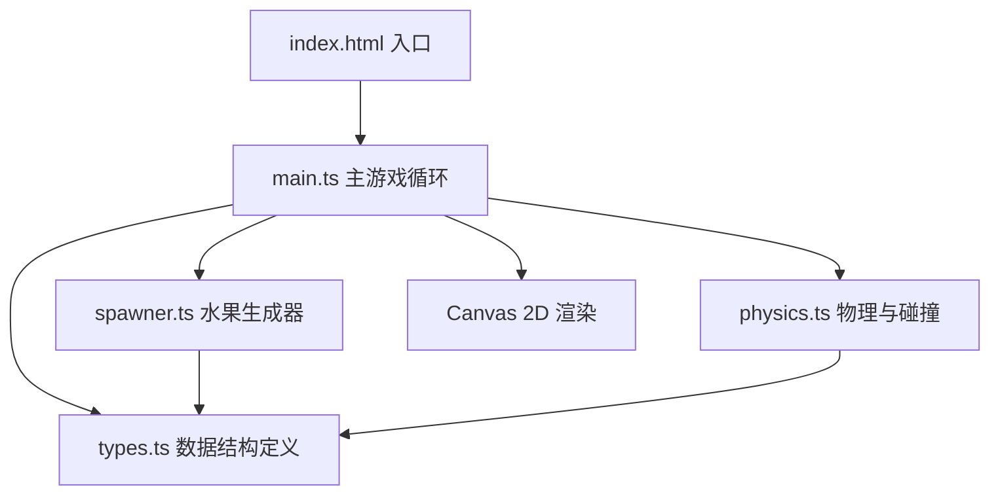

## 1. 架构设计
本项目为纯前端Canvas 2D游戏，采用模块化架构，将游戏逻辑分离为类型定义、生成器、物理引擎和主循环四个核心模块。



## 2. 技术描述
- **前端框架**：原生 TypeScript + Canvas 2D API，无第三方游戏/渲染库
- **构建工具**：Vite 5.x
- **语言版本**：TypeScript 5.x，目标 ES2020，模块 ESNext
- **字体**：Google Fonts 'Press Start 2P'（通过HTML内联样式引入）
- **初始化方式**：手动创建项目结构（用户指定了精确的文件组织）

## 3. 目录结构
```
auto147/
├── package.json
├── index.html
├── tsconfig.json
├── vite.config.js
└── src/
    ├── main.ts        # 主游戏循环、事件处理、渲染协调
    ├── types.ts       # 类型定义（Fruit、Dart、Particle等）
    ├── spawner.ts     # 水果生成逻辑、速度模式控制
    └── physics.ts     # 碰撞检测、切割计算、粒子物理更新
```

## 4. 核心数据结构（types.ts）

```typescript
// 水果类型枚举
type FruitType = 'apple' | 'orange' | 'watermelon' | 'strawberry';

// 速度模式
type SpeedMode = 'slow' | 'medium' | 'fast';

// 水果对象
interface Fruit {
  id: number;
  type: FruitType;
  x: number;
  y: number;
  vx: number;
  vy: number;
  radius: number;
  rotation: number;      // 当前旋转角度
  rotationSpeed: number; // 旋转角速度（度/帧）
  color: string;
  alive: boolean;
}

// 被切割后的水果半片
interface FruitHalf {
  id: number;
  type: FruitType;
  x: number;
  y: number;
  vx: number;
  vy: number;
  radius: number;
  rotation: number;
  rotationSpeed: number;
  color: string;
  cutAngle: number;      // 切割角度（飞镖飞行方向）
  side: 'left' | 'right'; // 左半或右半
  alive: boolean;
}

// 飞镖对象
interface Dart {
  id: number;
  x: number;
  y: number;
  vx: number;
  vy: number;
  angle: number;         // 飞行方向角度
  trail: { x: number; y: number; alpha: number }[];
  alive: boolean;
}

// 粒子对象
interface Particle {
  x: number;
  y: number;
  vx: number;
  vy: number;
  size: number;
  initialSize: number;
  color: string;
  alpha: number;
  life: number;          // 剩余生命周期（秒）
  maxLife: number;
}

// 游戏状态
interface GameState {
  score: number;
  speedMode: SpeedMode;
  fruits: Fruit[];
  fruitHalves: FruitHalf[];
  darts: Dart[];
  particles: Particle[];
  lastSpawnTime: number;
  nextFruitId: number;
  nextDartId: number;
}
```

## 5. 模块职责

### 5.1 spawner.ts - 水果生成器
- 维护三种速度模式的生成间隔：慢(2000ms)、中(1200ms)、快(700ms)
- 沿顶部弧形轨道计算随机生成位置
- 为水果赋予随机抛物线初速度
- 随机选择水果类型（苹果、橙子、西瓜、草莓）
- 确保水果在屏幕中央区域（距边界至少100px）

### 5.2 physics.ts - 物理引擎
- **重力更新**：水果和半片的抛物线运动（重力加速度约 500 px/s²）
- **旋转更新**：水果和半片的旋转动画
- **碰撞检测**：飞镖与水果的圆形碰撞检测（距离判断）
- **切割计算**：
  - 根据飞镖飞行方向确定切割角度
  - 将水果分为左右两半（分割线垂直于飞镖轨迹）
  - 两半分别获得相反方向的初速度（100px/s）和旋转角速度（3度/帧）
- **粒子生成**：在切割位置生成20个粒子，随机方向50-150px/s
- **粒子更新**：大小从6px线性衰减到0（0.8秒），透明度同步衰减
- **飞镖拖尾**：维护飞镖轨迹点，0.3秒后淡出
- **边界清理**：移除飞出屏幕的对象

### 5.3 main.ts - 主循环
- 初始化Canvas（全屏自适应，最小800x600）
- 加载 'Press Start 2P' 字体
- requestAnimationFrame 游戏循环（更新 → 渲染）
- 事件监听：
  - `click`：鼠标点击发射飞镖（从屏幕左下方飞向点击位置，速度500px/s）
  - `keydown`：空格键切换速度模式，R键重置所有水果
  - `resize`：窗口大小变化时调整Canvas尺寸
- 渲染协调：背景、水果、半片、飞镖、拖尾、粒子、UI
- UI渲染：计分面板、速度模式、操作提示

## 6. 渲染细节
- **背景**：使用 Canvas `createLinearGradient` 创建 #8B5A2B → #6B4226 垂直渐变
- **水果**：绘制圆形，填充对应颜色，使用 `ctx.save/translate/rotate/restore` 实现旋转
- **水果半片**：使用 `arc` + `lineTo` 绘制半圆，切割面绘制稍浅的颜色表示果肉
- **飞镖**：绘制银色三角形作为镖头，拖尾使用渐变色线段
- **粒子**：绘制圆形，使用 `rgba` 根据生命周期设置透明度和大小
- **UI文字**：`font = "16px 'Press Start 2P', monospace"`，`shadowColor` + `shadowBlur` 实现文字阴影
