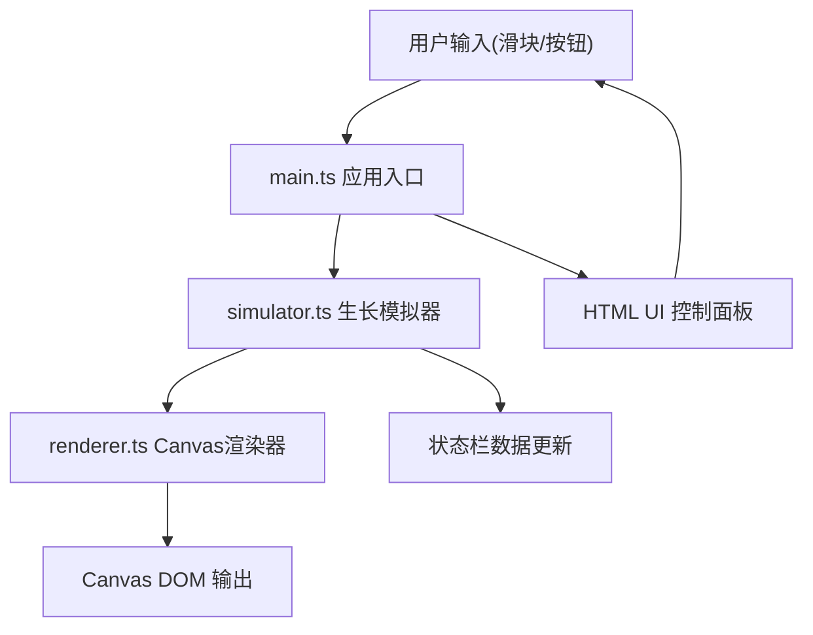

## 1. 架构设计



## 2. 技术描述
- 前端：TypeScript + Canvas API + Vite
- 初始化工具：vite-init（vanilla-ts模板）
- 后端：无（纯前端应用）
- 数据库：无（状态内存管理）

## 3. 项目文件结构

| 文件 | 职责 | 调用关系 |
|------|------|----------|
| package.json | 项目依赖配置 | typescript、vite |
| index.html | 入口页面，布局Canvas/面板/状态栏 | 加载main.ts |
| vite.config.js | Vite构建配置 | - |
| tsconfig.json | TypeScript编译配置 | 严格模式、ES2020、ESNext |
| src/main.ts | 应用入口：初始化、动画循环、事件绑定 | 调用simulator更新、调用renderer绘制 |
| src/simulator.ts | 生长模拟逻辑：参数计算、状态更新 | 接收参数，输出PlantState |
| src/renderer.ts | Canvas渲染：绘制植物、背景、UI元素 | 接收PlantState，绘制到Canvas |

## 4. 数据模型

### 4.1 环境参数 EnvironmentParams
```typescript
interface EnvironmentParams {
  light: number;      // 0-100 光照
  water: number;      // 0-100 水分
  temperature: number; // 10-40 温度(摄氏度)
}
```

### 4.2 植物状态 PlantState
```typescript
interface PlantState {
  stemHeight: number;      // 茎高 (单位，初始5，最大50)
  branches: Branch[];      // 分枝列表
  leaves: Leaf[];          // 叶子列表
  startTime: number;       // 播种时间戳
  dayCount: number;        // 生长天数
  warnings: WarningType[]; // 当前警告
}
```

### 4.3 数据流向
1. 控制面板 → EnvironmentParams → simulator.update()
2. simulator.update() → PlantState → renderer.render()
3. PlantState → 状态栏显示

## 5. 性能参数
- 模拟更新频率：30次/秒
- Canvas重绘频率：60fps
- 单帧计算预算：≤2ms
