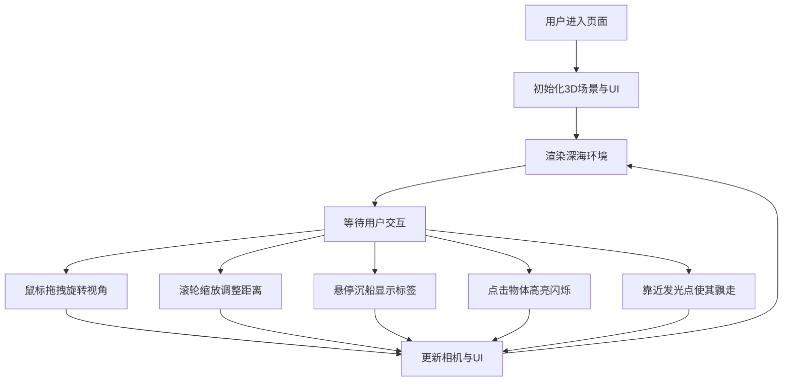

## 1. 产品概述
深海探索3D交互可视化应用，通过沉浸式3D场景模拟深海水下环境，解决用户无法亲身体验深海的问题。
- 目标用户：海洋爱好者、教育工作者、学生及对深海世界好奇的普通用户
- 产品价值：提供高仿真、可交互的深海探索体验，兼具教育意义与视觉享受

## 2. 核心功能

### 2.1 功能模块
1. **深海场景漫游**：鼠标拖拽旋转视角、滚轮缩放，自由探索3D深海世界
2. **海底地形与粒子系统**：动态起伏的沙地、岩石群，2000+浮游生物粒子悬浮效果
3. **光照与水体效果**：海面丁达尔光柱（30秒/圈旋转），水体颜色随深度渐变（浅蓝→深蓝→墨黑，深度0-100）
4. **生物发光点**：不同深度随机分布蓝绿色光晕，1-3秒周期脉动，靠近时飘走
5. **沉船模型交互**：立方体+圆柱体组合的沉船，苔藓纹理覆盖，悬停显示浮动标签
6. **UI仪表盘**：右下角深度计（垂直滑块）、罗盘（随视角旋转）
7. **视觉反馈**：点击物体白色边缘高亮闪烁，UI元素淡入过渡动画

### 2.2 页面详情
| 页面名称 | 模块名称 | 功能描述 |
|----------|----------|----------|
| 主场景 | 3D渲染画布 | 全屏Three.js渲染，黑色背景，响应式适配 |
| 主场景 | 视角控制 | 鼠标拖拽旋转、滚轮缩放、平滑过渡 |
| 主场景 | 场景元素 | 海底地形、岩石、粒子系统、光柱、发光点、沉船 |
| 主场景 | UI层 | 深度计、罗盘、悬停标签、点击高亮反馈 |

## 3. 核心流程
用户进入页面后，自动进入深海探索场景。通过鼠标拖拽旋转视角观察环境，滚轮缩放调整观察距离。鼠标悬停在沉船部位时显示信息标签，点击场景物体触发高亮反馈。当相机靠近发光生物时，生物会缓慢飘离。右下角仪表盘实时显示深度和方向。

## 4. 用户界面设计

### 4.1 设计风格
- **主色调**：纯黑背景（#000000），UI采用低饱和度蓝绿色渐变（#1a3a3a → #3a6a6a）
- **按钮/滑块样式**：圆角矩形，半透明背景，0.2秒淡入过渡动画
- **字体**：现代无衬线字体，白色/浅灰文字，确保在暗色背景下可读
- **布局风格**：全屏沉浸式3D画布，右下角浮动UI仪表盘，悬停标签跟随鼠标
- **动效风格**：平滑过渡、周期性脉动、柔和光晕，营造深海静谧氛围

### 4.2 页面设计概述
| 页面名称 | 模块名称 | UI元素 |
|----------|----------|--------|
| 主场景 | 3D画布 | 全屏Canvas，黑色背景，无滚动条 |
| 主场景 | 深度计 | 右下角垂直滑块样式，实时显示深度值（0-100），渐变色填充 |
| 主场景 | 罗盘 | 深度计上方，圆形罗盘指针随相机方向旋转 |
| 主场景 | 悬停标签 | 半透明蓝绿色背景浮动面板，显示沉船部位名称 |
| 主场景 | 高亮反馈 | 点击时物体边缘0.1秒白色闪烁 |

### 4.3 响应式
- 桌面端优先设计
- 窗口缩放时Canvas自动调整尺寸（监听resize事件）
- UI元素跟随窗口缩放比例保持合适大小
- 最小可用宽度：800px

### 4.4 3D场景指导
- **环境氛围**：深海黑暗环境，雾气效果模拟水体能见度衰减
- **光照设置**：主光源模拟海面天光，丁达尔效应使用体积光/光柱几何体，辅助光点缀生物发光
- **相机设置**：PerspectiveCamera，初始位置在深度20处，OrbitControls控制（禁用平移，限制距离范围）
- **构图**：沉船作为视觉焦点置于场景中心偏下，海底起伏地形提供层次感，粒子系统填充空间
- **交互与动画**：光柱缓慢旋转、粒子漂浮、发光点脉动、发光点逃离行为
- **后期处理**：雾效（FogExp2）、颜色深度渐变、光晕Bloom效果
- **性能预算**：粒子2000+，帧率目标60FPS（粒子系统≥30FPS），使用BufferGeometry、InstancedMesh、顶点着色器优化
