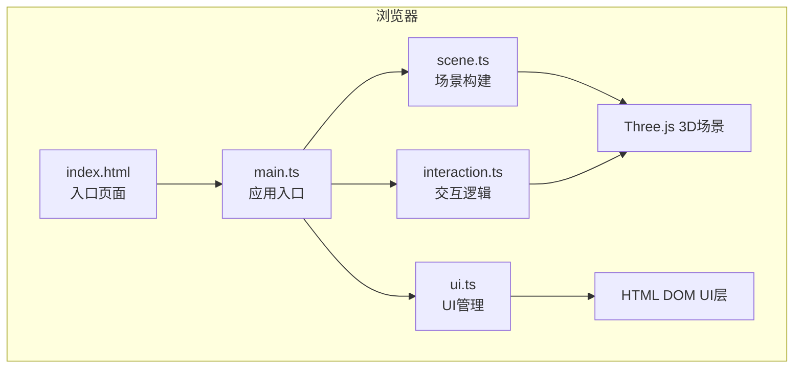

## 1. 架构设计



## 2. 技术描述
- **前端框架**：原生 TypeScript（无React/Vue），专注3D渲染性能
- **3D引擎**：Three.js（r160+），含OrbitControls、ShaderMaterial
- **构建工具**：Vite 5.x，assetsInlineLimit设为0
- **语言**：TypeScript 5.x，严格模式，ESNext模块
- **无后端**，纯前端静态应用

## 3. 路由定义
| 路由 | 用途 |
|------|------|
| / | 主场景页面（单页应用，无路由切换） |

## 4. 文件结构与职责

### 4.1 根目录配置
| 文件 | 职责 |
|------|------|
| package.json | 依赖声明（three, @types/three, vite, typescript），启动脚本 |
| vite.config.js | Vite构建配置，assetsInlineLimit: 0 |
| tsconfig.json | TypeScript严格模式配置，ESNext |
| index.html | 入口HTML，全屏Canvas容器，黑色背景，禁用滚动 |

### 4.2 src/ 源代码
| 文件 | 职责 | 导出 |
|------|------|------|
| main.ts | 入口调度：初始化各模块、启动requestAnimationFrame循环、窗口resize处理 | `initApp()` |
| scene.ts | 场景构建：海底地形、沉船、粒子系统、光柱、光照、发光点、雾效 | `initScene()` 返回 `{ scene, camera, renderer, wreckParts, glowPoints, particles, lightBeam }` |
| interaction.ts | 交互逻辑：OrbitControls封装、Raycaster拾取、悬停标签触发、点击高亮、发光点逃离行为 | `initInteraction(scene, camera, renderer, objects, callbacks)` |
| ui.ts | DOM UI创建：深度计、罗盘、悬停标签、高亮动画、CSS样式注入 | `initUI(callbacks)` 返回深度/罗盘更新方法 |

## 5. 核心数据模型

### 5.1 场景对象接口
```typescript
interface SceneContext {
  scene: THREE.Scene
  camera: THREE.PerspectiveCamera
  renderer: THREE.WebGLRenderer
  wreckParts: Array<{ mesh: THREE.Mesh; name: string }>
  glowPoints: GlowPoint[]
  particles: THREE.Points
  lightBeam: THREE.Group
}

interface GlowPoint {
  mesh: THREE.Mesh
  material: THREE.ShaderMaterial
  basePosition: THREE.Vector3
  pulsePeriod: number
  pulsePhase: number
  fleeTarget: THREE.Vector3 | null
}
```

### 5.2 UI状态接口
```typescript
interface UIState {
  depth: number
  cameraAngle: number
  hoveredPart: string | null
  hoveredScreenPos: { x: number; y: number } | null
}
```

## 6. 关键技术实现方案

### 6.1 海底地形
- 使用 `PlaneGeometry` + 顶点噪声（Simplex Noise）实现起伏沙地
- 随机散布 `DodecahedronGeometry` 岩石群，随机缩放和旋转

### 6.2 浮游粒子系统
- `BufferGeometry` + `PointsMaterial`，2500个粒子
- 位置随机分布在三维空间中，顶点着色器实现上下浮动

### 6.3 丁达尔光柱
- 多个扁平圆柱体/圆锥体几何体，使用自定义ShaderMaterial
- 透明叠加，加法混合（AdditiveBlending），模拟体积光散射
- `group.rotation.y` 随时间线性变化，周期30秒

### 6.4 生物发光点脉动
- 自定义 `ShaderMaterial`，顶点着色器中基于 `uTime` 和 `uPeriod` 计算 `sin()` 脉动
- 片元着色器输出径向衰减的蓝绿色光晕
- `SphereGeometry` 或 `PlaneGeometry`（面向相机Billboard）

### 6.5 发光点逃离行为
- 每帧计算相机与发光点距离
- 距离小于阈值（如8单位）时，计算逃离方向并插值移动位置
- 距离恢复后缓慢回归原位

### 6.6 沉船模型与苔藓纹理
- `BoxGeometry`（船体、船舱）和 `CylinderGeometry`（桅杆）组合
- 自定义 `ShaderMaterial` 或 CanvasTexture 生成绿色噪点模拟苔藓
- 每个部件独立Mesh，存储name属性用于悬停识别

### 6.7 水体颜色深度渐变
- 场景雾效 `THREE.FogExp2`，颜色随相机Y坐标插值更新
- 渲染循环中根据 depth = clamp(0, -camera.position.y, 100) 更新fog.color

### 6.8 点击高亮闪烁
- Raycaster检测点击物体
- 临时给该物体material添加emissive或使用额外的OutlinePass
- 0.1秒后恢复原状，setTimeout控制

### 6.9 深度计与罗盘
- 纯HTML+CSS实现，创建DOM元素挂载到document.body
- 深度计：垂直div背景渐变，内部填充高度映射0-100
- 罗盘：圆形div内指针元素，CSS transform: rotate() 随相机角度更新
- 所有UI元素添加CSS transition: opacity 0.2s

## 7. 性能优化策略
1. **粒子系统**：使用BufferGeometry + Points，避免逐对象矩阵更新
2. **发光脉动**：在顶点着色器中计算，GPU并行处理，不占用CPU
3. **几何复用**：岩石、发光点等重复元素尽量共享Geometry
4. **减少Draw Call**：沉船多部件可考虑合并或使用Group
5. **像素比限制**：renderer.setPixelRatio(Math.min(window.devicePixelRatio, 2))
6. **帧率监控**：开发模式可选console输出FPS辅助调试
