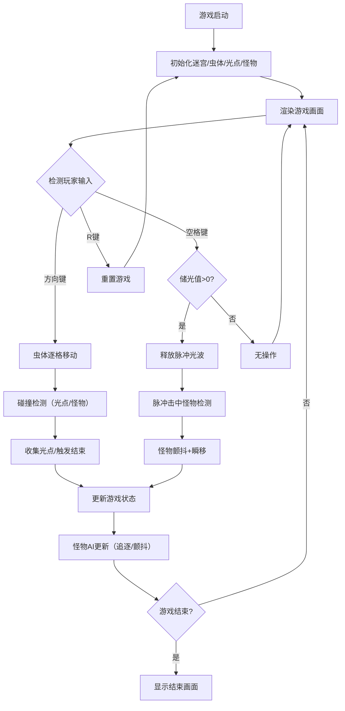

## 1. 产品概述

「光之虫」是一款2D像素风格的迷宫探索游戏，玩家操控一只发光的光之虫在黑暗迷宫中探索、吞噬光点并躲避暗影怪物的追击。游戏通过动态视野、光线衰减和实体交互反馈营造沉浸式的黑暗探索体验。

- 核心玩法：方向键控制虫体移动，收集光点增强能力，躲避或击退暗影怪物
- 目标用户：喜欢像素风格、探索类小游戏的休闲玩家
- 产品价值：提供具有紧张感和策略性的迷宫探索体验，通过光影效果营造独特氛围

## 2. 核心功能

### 2.1 功能模块

1. **游戏主界面**：迷宫画布、HUD信息显示、状态指示
2. **虫体控制系统**：方向键移动、平滑插值动画、脉冲光波释放
3. **光点收集系统**：光点随机生成、碰撞检测、储光值累积、光晕扩散效果
4. **暗影怪物AI**：怪物生成、追逐逻辑、颤抖状态、瞬移机制
5. **动态视野系统**：墙体亮度渐变、光照范围计算
6. **游戏状态管理**：探索中/危险/游戏结束状态、重置功能

### 2.2 功能详情

| 模块名称 | 功能描述 |
|----------|----------|
| 迷宫渲染 | 12x12方格迷宫（每格64px），墙体带裂缝和苔藓纹理，地面纯黑 |
| 虫体控制 | 方向键逐格移动，0.15秒平滑插值动画，虫体始终在画布中央（偏移≤20px） |
| 光点系统 | 10个随机光点，吞噬后储光值+1，每3点触发光晕扩散（半径50px，持续2秒） |
| 怪物系统 | 3只暗影怪物，曼哈顿距离≥6格生成，距离≤4格时追逐（0.7格/秒），被光晕/脉冲击中后颤抖瞬移 |
| 脉冲光波 | 空格键释放，消耗1点储光值，击退怪物，最大半径120px |
| 动态视野 | 虫体周围3格内墙体亮度从20%渐变至100% |
| HUD界面 | 左上角显示储光值和已吞噬光点数，右下角显示游戏状态 |
| 警戒边框 | 怪物距离≤4格时，画布四周出现红色闪烁边框（0.5秒交替） |
| 游戏结束 | 被怪物追上时触发，1秒淡入动画，显示Game Over和吞噬光点数，按R键重置 |

## 3. 核心流程

## 4. 用户界面设计

### 4.1 设计风格

- **主色调**：深黑背景（#0F0F23）、深色墙体（#1A1A2E）、白色虫体核心（#FFFFFF）、松石色光点（#00FFCC）、暗紫色怪物（#4A0E4E）
- **辅助色**：黄色储光值图标（#FFD700）、绿色状态文字（#00FF00）、红色警戒（#FF4444 / #FF0000）
- **字体**：Press Start 2P 像素风格字体，monospace 回退
- **视觉效果**：发光光晕、半透明渐变、粒子扩散、闪烁警戒边框、淡入动画

### 4.2 界面设计

| 区域 | 元素 | UI描述 |
|------|------|--------|
| 画布中央 | 游戏区域 | 16:9比例，1024x576最小分辨率，周围留黑边，虫体保持在中央（偏移≤20px） |
| 左上角 | HUD信息 | 黄色发光小圆图标 + 储光值数字；已吞噬光点总数 |
| 右下角 | 状态指示 | "探索中"（#00FF00）、"危险"（#FF4444）、"游戏结束"（#FFFFFF） |
| 画布四周 | 警戒边框 | 怪物接近时红色4px边框闪烁（0.5秒交替，透明→#FF000080） |
| 结束画面 | 结束UI | "Game Over" 48px白色文字带红色发光阴影，下方显示吞噬光点数，1秒淡入 |

### 4.3 响应式设计

- 游戏窗口自适应浏览器视口，保持16:9宽高比
- 最小分辨率1024x576
- 画布居中显示，周围留黑边填充

## 5. 性能要求

- 帧率稳定在30FPS以上
- 光晕和粒子总数不超过500个
- 脉冲光波每次生成不超过200个粒子
- 追逐逻辑更新频率不高于每0.1秒一次
