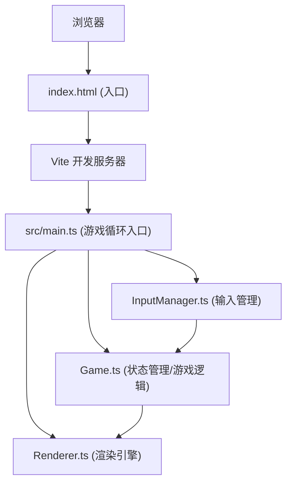

## 1. 架构设计



## 2. 技术栈

- **前端框架**：无（原生 Canvas 2D）
- **编程语言**：TypeScript (严格模式, ES2020)
- **构建工具**：Vite (开启HMR)
- **字体**：Press Start 2P (Google Fonts)

## 3. 项目结构

```
auto151/
├── package.json
├── index.html
├── tsconfig.json
├── vite.config.js
└── src/
    ├── main.ts
    ├── Game.ts
    ├── Renderer.ts
    └── InputManager.ts
```

## 4. 核心模块设计

### 4.1 src/main.ts

游戏入口文件，负责：
- 创建 Canvas 元素并设置尺寸
- 加载各模块实例
- 启动 requestAnimationFrame 游戏主循环
- 调用 update() 和 render()

### 4.2 src/Game.ts

游戏状态管理类，包含：

**数据结构**：
- `maze: number[][]` — 12x12二维数组（1=墙，0=地面）
- `wallDetails: {cracks: {x,y,w,h}[], moss: {x,y,r}[]}[][]` — 墙体细节
- `player: {x, y, targetX, targetY, moving, moveProgress, lightCharge, haloBoostTimer, haloBoostActive}` — 玩家状态
- `monsters: Monster[]` — 怪物数组
- `lightPoints: LightPoint[]` — 光点数组
- `pulses: Pulse[]` — 脉冲光波数组
- `particles: Particle[]` — 粒子数组
- `gameOver: boolean` — 游戏结束标志
- `gameOverTimer: number` — 结束画面淡入计时
- `totalCollected: number` — 总收集光点数

**核心方法**：
- `init()` — 初始化迷宫、玩家、光点、怪物
- `generateMaze()` — 生成迷宫地图
- `generateWallDetails()` — 生成墙体裂缝和苔藓
- `spawnLightPoints()` — 生成10个随机光点
- `spawnMonsters()` — 生成3只远离玩家的怪物
- `movePlayer(dx, dy)` — 处理玩家逐格移动
- `releasePulse()` — 释放脉冲光波
- `checkCollisions()` — 检测光点和怪物碰撞
- `updateMonsters(dt)` — 更新怪物AI（追逐、颤抖、瞬移）
- `update(dt)` — 每帧更新逻辑
- `reset()` — 重置游戏

### 4.3 src/Renderer.ts

渲染引擎类，负责所有绘制：

**核心方法**：
- `resize(width, height)` — 调整画布尺寸
- `clear()` — 清空画布
- `drawMaze()` — 绘制迷宫（墙体、地面、裂缝、苔藓、动态亮度）
- `drawPlayer()` — 绘制光之虫（核心、两层光晕、光晕扩散效果）
- `drawMonsters()` — 绘制暗影怪物（本体、暗光粒子）
- `drawLightPoints()` — 绘制光点
- `drawPulses()` — 绘制脉冲光波
- `drawHUD()` — 绘制HUD（储光值、收集数、状态）
- `drawWarningBorder()` — 绘制警戒边框
- `drawGameOver()` — 绘制游戏结束画面
- `render()` — 主渲染方法

### 4.4 src/InputManager.ts

输入管理类：

**核心方法**：
- `init()` — 初始化键盘监听
- `getDirection()` — 获取方向输入（返回 {dx, dy}）
- `isSpacePressed()` — 空格键是否被按下（边缘触发）
- `consumeSpacePress()` — 消费空格键事件
- `isResetPressed()` — R键是否按下
- `update()` — 每帧更新（处理边缘触发）

## 5. 关键技术实现

### 5.1 迷宫生成

采用递归回溯算法生成12x12迷宫：
- 从左上角开始，随机选择方向打通墙壁
- 确保迷宫可解
- 初始位置(1,1)为通道

### 5.2 移动插值动画

- 玩家每格移动使用线性插值，持续0.15秒
- `actualPos = startPos + (targetPos - startPos) * progress`
- progress 从 0 → 1，使用 easeOutQuad 缓动

### 5.3 动态视野光照

- 计算每个墙体方块到玩家的曼哈顿距离
- 距离 ≤ 3 时，亮度从 20% 线性渐变到 100%
- 使用 `globalAlpha` 或颜色乘子调整亮度

### 5.4 怪物AI追逐

- 使用BFS寻路算法计算最短路径
- 每0.3秒重新计算追踪方向
- 移动速度 0.7格/秒 = 44.8像素/秒
- 被光晕/脉冲击中时：颤抖1秒（随机偏移±10px），然后瞬移

### 5.5 粒子系统

- 怪物暗光粒子：每0.1秒生成一圈，扩散速度3px/帧，半径2px
- 粒子总数限制：500个以内（使用对象池或队列）
- 脉冲光波：圆环扩散，最大半径120px，线宽2px

### 5.6 性能优化

- 离屏渲染迷宫墙体到缓存Canvas
- 视口裁剪只渲染可见区域
- 粒子使用对象池复用
- 怪物AI更新频率限制（每0.1秒一次）
