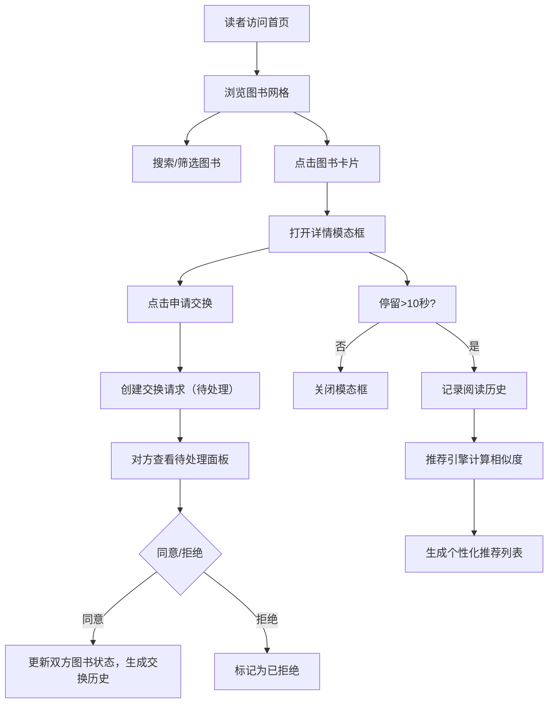

## 1. 产品概述

图书漂流站是一个面向社区读者的线上图书共享平台，读者可以上传闲置图书并与其他读者进行以书换书的虚拟交易，同时系统会依据阅读历史自动生成个性化阅读推荐。

- 核心目标：促进社区图书资源循环利用，降低阅读成本，通过个性化推荐提升读者阅读体验
- 目标用户：社区图书馆读者、热爱阅读并愿意分享图书的人群
- 市场价值：构建社区阅读文化生态，实现闲置图书的价值最大化

## 2. 核心功能

### 2.1 用户角色
| 角色 | 注册方式 | 核心权限 |
|------|----------|----------|
| 普通读者 | 系统默认分配用户ID | 上传图书、浏览图书、发起/处理交换申请、查看推荐、查看排行榜 |

### 2.2 功能模块
1. **首页**：图书网格展示、搜索筛选、排行榜侧边栏、图书详情模态框
2. **上传页**：图书信息表单提交（书名、作者、封面URL、简介、分类）
3. **交换管理**：待处理交换面板、交换历史记录
4. **推荐中心**：个性化推荐图书列表及推荐理由

### 2.3 页面详情
| 页面名称 | 模块名称 | 功能描述 |
|----------|----------|----------|
| 首页 | 图书网格 | 以响应式网格布局展示所有图书卡片，支持淡入动画 |
| 首页 | 搜索与筛选 | 顶部搜索框支持书名/作者模糊搜索（300ms防抖），分类下拉筛选 |
| 首页 | 排行榜 | 右侧sidebar展示本周最受欢迎TOP5，含热度条可视化 |
| 首页 | 详情模态框 | 点击卡片弹出，展示完整图书信息和申请交换按钮，背景模糊 |
| 首页 | 阅读记录 | 用户停留详情超过10秒自动记录阅读历史 |
| 上传页 | 图书表单 | 书名、作者、封面URL、简介（≤200字）、分类选择 |
| 交换管理 | 待处理面板 | 展示收到的交换申请，支持同意/拒绝操作 |
| 交换管理 | 交换历史 | 时间戳记录所有交换记录及状态标签 |
| 推荐中心 | 推荐列表 | 基于协同过滤算法的个性化推荐，展示推荐理由 |

## 3. 核心流程

### 3.1 图书上传流程
读者进入上传页 → 填写图书信息 → 提交表单 → 图书入库并展示在首页网格

### 3.2 图书交换流程
浏览图书 → 点击卡片查看详情 → 点击"申请交换" → 系统创建待处理请求 → 对方在待处理面板操作 → 同意则更新双方图书状态并生成历史记录 / 拒绝则标记为已拒绝

### 3.3 推荐生成流程
用户浏览图书详情（停留>10秒记录阅读历史）→ 推荐引擎计算用户间Jaccard相似度 → 生成个性化推荐列表及理由

## 4. 用户界面设计

### 4.1 设计风格
- **主色调**：书籍暖色调 #F5E6D3（米杏色背景）
- **辅助色**：#8B5E3C（深棕色文字/边框）
- **强调色**：#C0392B（暗红色按钮/高亮）
- **状态色**：待处理 #E67E22（橙色）、已同意 #27AE60（绿色）、已拒绝 #E74C3C（红色）
- **热度渐变**：#FF6B6B（最热）→ #4ECDC4（最冷）
- **按钮样式**：圆角8px，悬停有轻微缩放和阴影效果
- **字体**：使用有书籍质感的衬线字体标题 + 易读的无衬线正文字体
- **布局风格**：卡片式网格布局，顶部导航 + 侧边栏（排行榜）+ 主内容区
- **图标风格**：使用lucide-react的线性图标，保持简洁书卷气

### 4.2 页面设计概述
| 页面名称 | 模块名称 | UI元素 |
|----------|----------|--------|
| 首页 | 顶部导航 | 暖色调背景，Logo、搜索框、分类筛选下拉、上传按钮、用户信息 |
| 首页 | 主内容区 | 响应式卡片网格（min 220px，max 4列），卡片悬停上浮4px+阴影，淡入动画300ms |
| 首页 | 侧边栏 | 排行榜TOP5，封面缩略图、书名、热度条（渐变色块） |
| 首页 | 详情模态框 | 半透明模糊背景 #00000088 + backdrop-filter: blur(6px)，居中白色卡片展示完整信息 |
| 上传页 | 表单区 | 卡片式表单，输入框带圆角和聚焦高亮，字数计数器 |
| 交换管理 | 列表区 | 交换申请卡片，状态彩色标签，同意/拒绝按钮组，时间戳 |
| 推荐中心 | 推荐列表 | 图书卡片 + 推荐理由标签（如"与A用户有共同阅读偏好"） |

### 4.3 响应式设计
- 桌面端（≥769px）：顶部导航固定，侧边栏右侧展示，主内容网格多列布局
- 移动端（≤768px）：单列布局，搜索框置顶固定，侧边栏折叠/移至底部，卡片全宽展示
- 触摸优化：按钮点击区域≥44x44px，卡片间距适配手指触摸

## 5. 性能约束
- 首页加载时间 ≤ 2秒（使用React.memo优化组件渲染）
- 推荐引擎计算 ≤ 100ms（预处理相似度矩阵缓存）
- 防抖搜索响应延迟 ≤ 300ms
