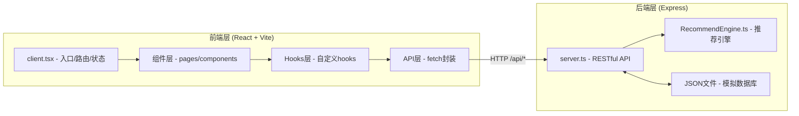
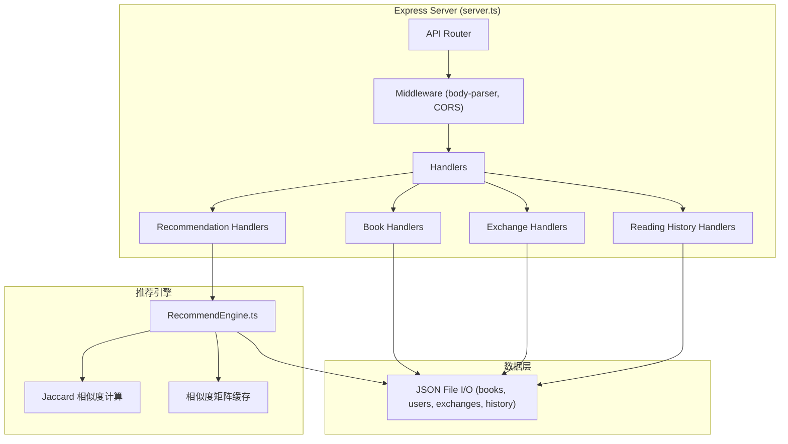
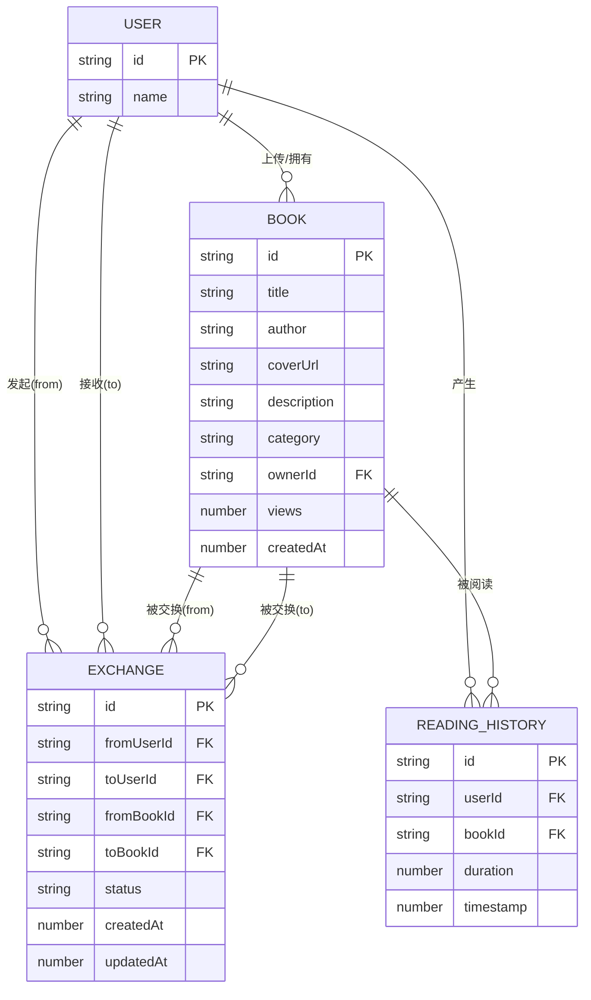

## 1. 架构设计



**文件调用关系与数据流向：**
1. `src/client.tsx` → 路由分发 → 各Page组件
2. Page组件 → 调用自定义Hooks → 通过fetch调用 `/api/*`
3. `src/server.ts` 接收API请求 → 读写JSON数据文件 → 必要时调用 `RecommendEngine`
4. `src/RecommendEngine.ts` 独立模块，纯函数计算Jaccard相似度，输出推荐结果

## 2. 技术说明

- **前端**：React 18 + TypeScript + Vite 5 + React Router DOM 6
- **构建工具**：Vite（代理 /api 到后端 3000 端口）
- **后端**：Express 4 + TypeScript + body-parser + uuid
- **数据库**：本地 JSON 文件模拟（books.json、users.json、exchanges.json、readingHistory.json）
- **状态管理**：React Hooks + Context（轻量全局状态）
- **样式方案**：原生 CSS（CSS Modules）+ CSS 变量，响应式设计

## 3. 路由定义

| 路由 | 页面组件 | 用途 |
|------|----------|------|
| `/` | HomePage | 首页：图书网格、搜索筛选、排行榜、详情模态框 |
| `/upload` | UploadPage | 图书上传页：表单提交 |
| `/exchanges` | ExchangesPage | 交换管理：待处理面板 + 交换历史 |
| `/recommendations` | RecommendationsPage | 推荐中心：个性化推荐列表 |

## 4. API 定义

### 4.1 TypeScript 类型定义

```typescript
// 图书类型
interface Book {
  id: string;
  title: string;
  author: string;
  coverUrl: string;
  description: string;
  category: '小说' | '科技' | '历史' | '艺术';
  ownerId: string;
  views: number;
  createdAt: number;
}

// 用户类型
interface User {
  id: string;
  name: string;
}

// 交换请求类型
interface Exchange {
  id: string;
  fromUserId: string;
  toUserId: string;
  fromBookId: string;
  toBookId: string;
  status: 'pending' | 'accepted' | 'rejected';
  createdAt: number;
  updatedAt: number;
}

// 阅读历史类型
interface ReadingHistory {
  id: string;
  userId: string;
  bookId: string;
  duration: number; // 停留秒数
  timestamp: number;
}

// 推荐结果类型
interface Recommendation {
  book: Book;
  reason: string;
  score: number;
}
```

### 4.2 RESTful API 接口

| 方法 | 路径 | 请求参数 | 响应 | 说明 |
|------|------|----------|------|------|
| GET | `/api/books` | query: `search?`, `category?` | `Book[]` | 获取图书列表，支持搜索和分类筛选 |
| POST | `/api/books` | body: `{ title, author, coverUrl, description, category, ownerId }` | `Book` | 上传新图书 |
| GET | `/api/books/popular` | - | `Book[]` | 获取本周最受欢迎TOP5（按views排序） |
| GET | `/api/exchanges` | query: `userId` | `Exchange[]` | 获取用户的交换记录 |
| POST | `/api/exchanges` | body: `{ fromUserId, toUserId, fromBookId, toBookId }` | `Exchange` | 发起交换申请 |
| PUT | `/api/exchanges/:id` | body: `{ status: 'accepted' \| 'rejected' }` | `Exchange` | 处理交换申请（同意/拒绝） |
| POST | `/api/reading-history` | body: `{ userId, bookId, duration }` | `ReadingHistory` | 记录阅读历史 |
| GET | `/api/recommendations` | query: `userId` | `Recommendation[]` | 获取个性化推荐列表 |

## 5. 服务端架构



## 6. 数据模型

### 6.1 ER 图



### 6.2 JSON 数据文件结构

**books.json:**
```json
{
  "books": [
    {
      "id": "uuid-1",
      "title": "百年孤独",
      "author": "加西亚·马尔克斯",
      "coverUrl": "https://...",
      "description": "魔幻现实主义经典...",
      "category": "小说",
      "ownerId": "user-1",
      "views": 156,
      "createdAt": 1717900000000
    }
  ]
}
```

**users.json:**
```json
{
  "users": [
    { "id": "user-1", "name": "小明" },
    { "id": "user-2", "name": "小红" }
  ]
}
```

**exchanges.json:**
```json
{
  "exchanges": [
    {
      "id": "ex-1",
      "fromUserId": "user-1",
      "toUserId": "user-2",
      "fromBookId": "book-a",
      "toBookId": "book-b",
      "status": "pending",
      "createdAt": 1717900000000,
      "updatedAt": 1717900000000
    }
  ]
}
```

**readingHistory.json:**
```json
{
  "history": [
    {
      "id": "rh-1",
      "userId": "user-1",
      "bookId": "book-1",
      "duration": 25,
      "timestamp": 1717900000000
    }
  ]
}
```

## 7. 推荐引擎算法（RecommendEngine.ts）

**核心算法：协同过滤（基于用户的 Jaccard 相似度）**

1. 输入：当前用户ID、所有用户阅读历史
2. 计算用户间 Jaccard 相似度：`J(A,B) = |A∩B| / |A∪B|`
   - A、B为两用户阅读过的图书ID集合
3. 找出与当前用户最相似的K个用户（Top-K近邻）
4. 汇总相似用户阅读过但当前用户未阅读的图书
5. 按相似度加权排序，输出推荐列表及推荐理由
6. **性能优化**：维护相似度矩阵缓存，数据变更时增量更新，确保≤100ms响应

## 8. 性能优化策略

- **React.memo**：图书卡片、排行榜项等纯展示组件包裹memo，避免不必要重渲染
- **动态导入**：详情模态框、上传页等非首屏必要组件使用React.lazy动态加载
- **防抖搜索**：搜索输入使用300ms防抖，减少API请求频率
- **相似度缓存**：推荐引擎预处理相似度矩阵，内存缓存，变更时增量更新
- **CSS 动画**：使用transform/opacity的GPU加速动画（卡片悬停上浮、淡入）
