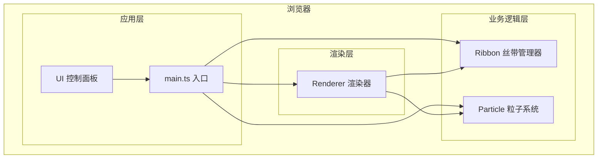

## 1. 架构设计



## 2. 技术描述

- **构建工具**：Vite（开启HMR热更新）
- **开发语言**：TypeScript（严格模式，目标ES2020，模块ESNext）
- **渲染技术**：HTML5 Canvas 2D API
- **样式方案**：原生CSS（无UI框架）

## 3. 文件结构

```
project/
├── package.json          # 项目依赖和脚本
├── tsconfig.json         # TypeScript配置
├── vite.config.js        # Vite配置
├── index.html            # 入口HTML
└── src/
    ├── main.ts           # 应用入口：初始化、事件绑定、渲染循环
    ├── ribbon.ts         # Ribbon类：丝带点集、颜色、粒子发射
    ├── particle.ts       # Particle类：粒子位置、速度、生命周期
    └── renderer.ts       # Renderer类：绘制丝带、粒子、背景、发光效果
```

## 4. 核心类设计

### 4.1 Particle 类

```typescript
interface ParticleData {
  x: number;
  y: number;
  vx: number;
  vy: number;
  color: string;
  life: number;      // 0-30帧
  maxLife: number;
  radius: number;
}
```

- `update()`: 更新位置，减少生命周期
- `isAlive()`: 判断是否存活
- `draw(ctx: CanvasRenderingContext2D)`: 绘制粒子

### 4.2 Ribbon 类

```typescript
interface Point {
  x: number;
  y: number;
  color: string;
}

type ColorMode = 'dynamic' | 'fire';

interface RibbonData {
  points: Point[];
  isDrawing: boolean;
  alpha: number;
  alphaDirection: number;  // 1 或 -1
  colorMode: ColorMode;
  fireColorIndex: number;
  lastTime: number;
}
```

- `addPoint(x, y, speed)`: 添加轨迹点并计算颜色
- `update()`: 更新透明度闪烁
- `emitParticle(): Particle | null`: 按概率发射粒子
- `draw(ctx)`: 绘制丝带（含发光效果）

### 4.3 Renderer 类

- `clear()`: 清除画布，绘制背景径向渐变
- `drawRibbon(ribbon)`: 绘制单条丝带
- `drawParticle(particle)`: 绘制单个粒子
- `renderFrame(ribbons, particles)`: 渲染一帧完整画面

## 5. 性能优化策略

- **帧率监控**：实时监测FPS，丝带数超过20时触发降级
- **粒子池**：粒子数量上限200，超出删除最早粒子
- **降级策略**：
  - 丝带数 ≤ 15：粒子发射概率10%，半径2px
  - 丝带数 > 20：粒子发射概率5%，半径1px
- **Canvas优化**：使用离屏缓存，减少不必要的重绘
