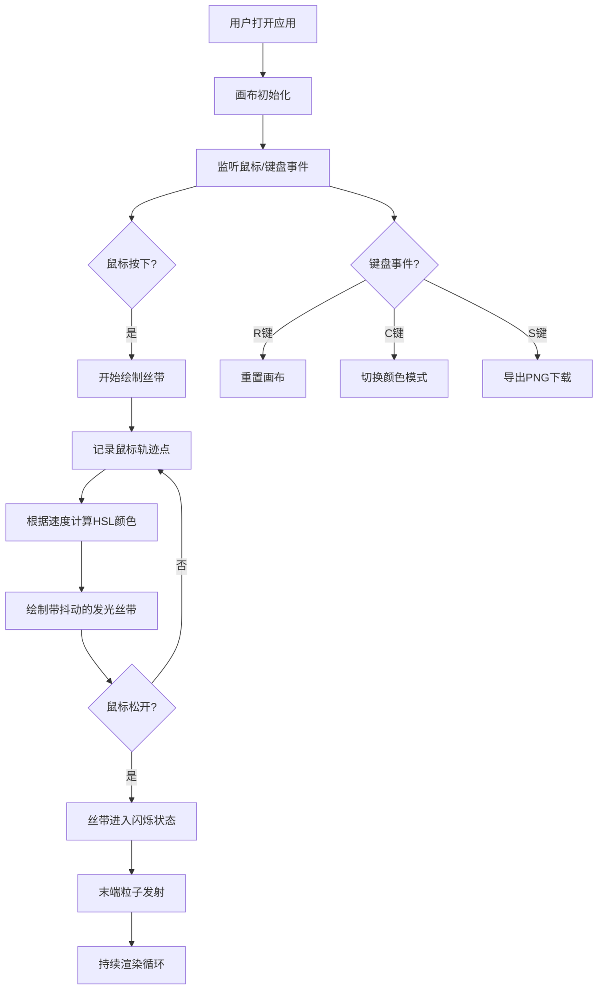

## 1. 产品概述

动态发光丝带特效画布应用，用户通过鼠标拖拽和键盘快捷键在浏览器中生成流动的、颜色渐变的非线性曲线艺术作品，提供沉浸式的视觉创作体验。

- 主要用途：创意艺术创作、视觉特效生成、交互艺术体验
- 解决问题：传统画布工具无法生成随时间流动、颜色渐变的非线性曲线艺术，用户交互缺乏沉浸式视觉反馈
- 目标用户：数字艺术家、创意设计师、交互艺术爱好者

## 2. 核心功能

### 2.1 功能模块

1. **主画布**：全屏Canvas画布，支持鼠标拖拽绘制发光丝带
2. **丝带绘制系统**：根据拖拽速度动态选择HSL颜色，带随机抖动的自然缠绕感
3. **粒子特效系统**：丝带尾端自动散落粒子，营造消散效果
4. **控制面板**：显示当前状态信息，提供快捷操作按钮
5. **快捷键系统**：支持重置画布、切换颜色模式、截图下载

### 2.2 功能详情

| 模块名称 | 功能描述 |
|---------|---------|
| 丝带绘制 | 鼠标按住拖拽生成4像素宽发光丝带，颜色按速度动态变化（慢速蓝紫、中速青绿、快速红橙），带0.5像素随机抖动 |
| 颜色系统 | HSL动态模式 / Fire预设模式（火红#FF4500、橙#FF8C00、黄#FFD700、白#FFF8DC）切换 |
| 丝带闪烁 | 鼠标松开后丝带透明度在0.7-1之间以1秒周期循环闪烁 |
| 粒子效果 | 丝带末端每帧10%概率发射2像素粒子，继承丝带颜色（透明度0.6），随机方向飘散，30帧后消失，上限200个 |
| 画布重置 | R键清除所有丝带，恢复背景#0A0A1A |
| 截图保存 | S键将画布导出为PNG自动下载 |
| 状态显示 | 控制栏显示颜色模式、丝带数量，主题色高亮 |
| 帮助提示 | 点击帮助按钮弹出快捷键列表气泡 |

## 3. 核心流程

用户打开应用 → 鼠标在画布上拖拽绘制丝带 → 丝带实时显示颜色渐变和发光效果 → 松开鼠标后丝带闪烁并产生粒子 → 可使用快捷键切换模式/重置/截图 → 通过控制栏按钮执行相应操作

## 4. 用户界面设计

### 4.1 设计风格

- **主色调**：深邃夜空蓝 #0A0A1A 作为背景
- **强调色**：Dynamic模式 #00BFFF，Fire模式 #FF4500
- **视觉风格**：深邃、梦幻、科技感
- **发光效果**：Canvas shadowBlur实现白色发光（shadowColor #FFFFFF，模糊半径8px）
- **磨砂玻璃**：控制栏采用rgba(255,255,255,0.05)背景 + backdrop-filter: blur(8px)
- **背景**：#0A0A1A 带径向渐变模拟深邃宇宙感

### 4.2 页面设计

| 区域 | 元素 | 说明 |
|-----|------|-----|
| 全屏画布 | Canvas | 占满整个视口，背景径向渐变 |
| 顶部控制栏 | 状态信息区 | 左侧显示颜色模式（主题色）和丝带数量，高度50px，左右间距20px |
| 顶部控制栏 | 操作按钮区 | 右侧三个圆形按钮：重置、截图、帮助 |
| 帮助气泡 | 快捷键列表 | #1A1A2E背景，#3A3A5E边框，圆角10px，0.3秒淡入 |

### 4.3 响应式设计

- 桌面优先设计，最小宽度800px时控制栏保持原样
- 低于800px时按钮缩小到80%尺寸
- 画布始终占满视口

## 5. 性能要求

- 15条丝带 + 200粒子时：稳定60FPS
- 超过20条丝带时：不低于40FPS，自动降级（粒子发射概率5%，半径缩小至1像素）
