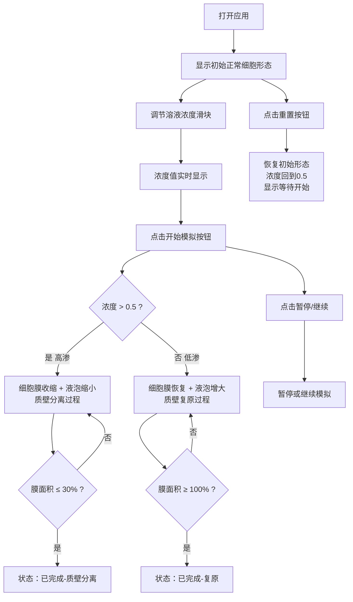

## 1. 产品概述

细胞质壁分离模拟工具是一款面向初中生物教学的交互式在线实验应用，帮助学生通过可视化交互直观理解植物细胞渗透压原理及质壁分离与复原过程。

- 目标用户：初中生物教师与学生
- 核心价值：将抽象的生物物理过程转化为可操作、可观察的动态模拟，降低学习门槛

## 2. 核心特性

### 2.1 用户角色

| 角色 | 注册方式 | 核心权限 |
|------|---------|---------|
| 学生/教师 | 无需注册 | 使用全部模拟功能、调节参数、观察实验过程 |

### 2.2 功能模块

1. **主页面**：细胞可视化视图、浓度控制面板、实时数据面板

### 2.3 页面详情

| 页面名称 | 模块名称 | 功能描述 |
|---------|---------|---------|
| 主页面 | 细胞视图 | Canvas绘制细胞壁、细胞膜、细胞核、液泡，支持动态缩放和动画 |
| 主页面 | 控制面板 | 浓度滑块（0.1-1.0）、开始/暂停/继续按钮、重置按钮 |
| 主页面 | 数据面板 | 实时显示浓度值、细胞膜收缩百分比、液泡体积百分比、模拟状态 |

## 3. 核心流程

用户打开应用后，可调节外界溶液浓度滑块，点击"开始模拟"观察细胞在高渗/低渗环境下的变化过程，也可随时暂停、继续或重置实验。

## 4. 用户界面设计

### 4.1 设计风格

- 主色调：浅绿色系（#E8F5E9 → #C8E6C9 渐变背景）
- 强调色：绿色#4CAF50（细胞壁/主按钮）、蓝色#2196F3（细胞膜）、橙色#FF9800（浓度）、红色#F44336（收缩）、紫色#9C27B0（液泡）
- 按钮风格：圆角8px，主按钮绿色背景，点击缩放动画0.1s
- 字体：无衬线系统字体（-apple-system, BlinkMacSystemFont, 'Segoe UI', Roboto, Oxygen, sans-serif）
- 字号：14px-18px
- 布局：细胞视图居中（60%宽度），卡片式控制面板

### 4.2 页面设计概览

| 页面名称 | 模块名称 | UI元素 |
|---------|---------|--------|
| 主页面 | 细胞视图 | Canvas画布、灰色#BDBDBD 1px圆角边框、阴影0 4px 6px rgba(0,0,0,0.1)、自适应缩放细胞结构 |
| 主页面 | 控制面板 | 白色卡片#FFFFFF、圆角16px、内边距24px；Material风格滑块（轨道#BDBDBD→#81C784，拇指#4CAF50）；主/次按钮 |
| 主页面 | 数据面板 | 2x2网格布局、标签-值形式、值加粗600、各数据对应颜色 |

### 4.3 响应式

- 桌面优先设计，最小支持1024px宽度
- 平板自适应，细胞视图与控制面板根据屏幕宽度调整比例

### 4.4 Canvas性能约束

- 稳定帧率30FPS以上
- 每次状态变化计算与渲染 ≤ 100ms
- 使用requestAnimationFrame驱动动画
