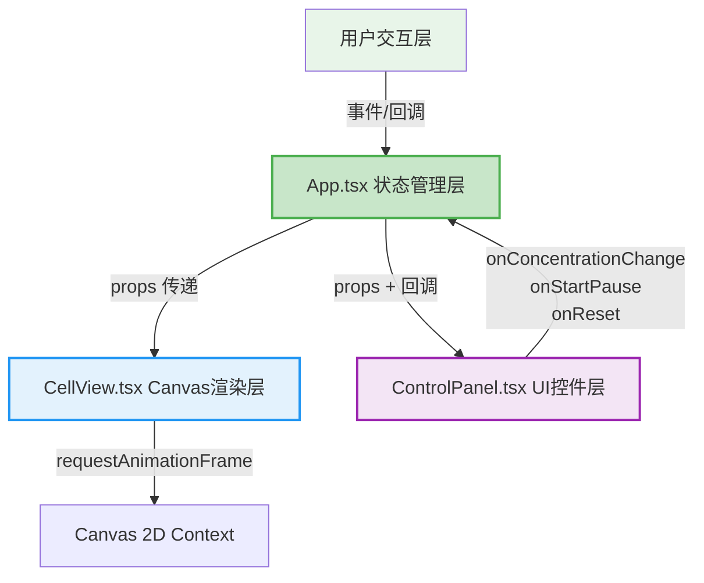

## 1. 架构设计



## 2. 技术说明

- 前端框架：React@18 + TypeScript
- 构建工具：Vite@5 + @vitejs/plugin-react
- 渲染引擎：HTML5 Canvas 2D API
- 状态管理：React useState/useEffect（无需额外状态库）
- 样式方案：纯CSS + CSS Variables（不使用Tailwind，按用户指定精确样式）

## 3. 路由定义

| 路由 | 用途 |
|-----|------|
| / | 主页面，细胞模拟实验界面 |

## 4. 数据模型

### 4.1 核心状态类型

```typescript
type SimulationStatus = 'idle' | 'running' | 'paused' | 'completed-plasmolysis' | 'completed-recovery';

interface CellState {
  concentration: number;       // 外界溶液浓度 0.1-1.0
  membraneAreaPercent: number; // 细胞膜面积百分比 30-100
  vacuolePercent: number;      // 液泡体积百分比 20-90
  status: SimulationStatus;    // 模拟状态
}
```

### 4.2 数据流向

1. **ControlPanel → App**：用户通过滑块调节 `concentration`，点击按钮触发 `onStartPause/onReset`
2. **App → CellView**：`concentration`、`membraneAreaPercent`、`vacuolePercent`、`status` 作为props传递
3. **CellView内部**：基于 `membraneAreaPercent` 计算细胞膜/液泡形状坐标，Canvas逐帧渲染
4. **App内部**：定时器（每秒）根据 `concentration` 与0.5的差值更新 `membraneAreaPercent` 和 `vacuolePercent`

## 5. 项目文件结构

```
auto156/
├── package.json
├── vite.config.js
├── tsconfig.json
├── index.html
└── src/
    ├── main.tsx          # React入口文件
    ├── App.tsx           # 主应用组件（全局状态管理）
    ├── CellView.tsx      # 细胞Canvas视图
    ├── ControlPanel.tsx  # 控制面板组件
    └── index.css         # 全局样式
```

## 6. 关键算法

### 6.1 细胞膜收缩/膨胀计算

```
每秒更新量 = (当前浓度 - 0.5) × 5%
高渗(浓度>0.5): membraneAreaPercent -= 更新量, 下限30%
低渗(浓度<0.5): membraneAreaPercent += |更新量|, 上限100%
```

### 6.2 液泡体积映射

```
初始70%: membraneAreaPercent 100% → vacuolePercent 70%
质壁分离: membraneAreaPercent 30% → vacuolePercent 20%
质壁复原: membraneAreaPercent 100% → vacuolePercent 90%
使用线性插值映射
```

### 6.3 细胞膜形状绘制

以Canvas中心为基准，椭圆形状：
- 细胞壁：固定大椭圆（绿色粗线2px）
- 细胞膜：根据 `membraneAreaPercent` 等比例缩小的椭圆，从四角向内收缩
- 细胞核：固定位置椭圆
- 液泡：根据 `vacuolePercent` 计算的半透明淡紫色区域
