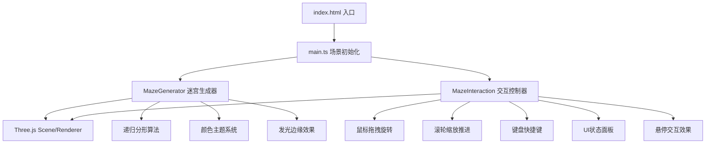

## 1. 架构设计



## 2. 技术说明

- **前端框架**：原生TypeScript + Three.js（无React/Vue，按用户指定）
- **构建工具**：Vite
- **核心依赖**：three, @types/three, typescript, vite
- **初始化方式**：手动创建配置文件，不使用Vite React/Vue模板

## 3. 文件结构

```
项目根目录/
├── package.json          # 依赖配置与脚本
├── index.html            # 入口HTML，全屏Canvas
├── tsconfig.json         # TypeScript严格模式配置
├── vite.config.js        # Vite构建配置
└── src/
    ├── main.ts           # 场景初始化与动画循环
    ├── MazeGenerator.ts  # 分形迷宫生成与管理层
    └── MazeInteraction.ts # 交互控制与UI面板
```

## 4. 模块职责

### 4.1 MazeGenerator.ts
- 递归生成分形迷宫几何体（2×2基础单元→每级4细分）
- 管理层级状态（最多6级）与子单元分裂逻辑
- 墙壁颜色渐变系统（HSL每层+10°，三种主题切换动画）
- 墙壁顶部发光边缘条生成与闪烁动画
- 子单元入口引导光球（脉动效果）
- 悬停单元高亮与寻路光点生成
- 迷宫整体60秒自转更新

### 4.2 MazeInteraction.ts
- 鼠标拖拽旋转视角（OrbitControls式实现，俯仰角-60°~60°限制）
- 滚轮缩放推进（每格0.5单位，触发层级细化）
- 键盘事件监听（R重置/C切主题/G切网格）
- Raycaster悬停检测与单元高亮
- UI状态面板渲染与交互（悬停扩展）
- 视角平滑过渡动画（smoothstep插值）
- FPS计算与显示

### 4.3 main.ts
- Three.js核心对象初始化（Scene/PerspectiveCamera/WebGLRenderer）
- 光照系统配置（环境光+方向光）
- 窗口Resize事件处理
- requestAnimationFrame动画主循环
- MazeGenerator与MazeInteraction集成

## 5. 关键技术实现

### 5.1 分形迷宫生成
```
基础单元(层级0): 2×2通道，通道宽1，墙厚0.2，墙高0.5
层级n → 层级n+1: 每条通道分裂为4条宽度减半的子通道
使用InstancedMesh优化大量重复几何体性能
```

### 5.2 颜色系统
```
三种主题HSL渐变:
  冷暖: hsl(205,75%,26%) → hsl(292,91%,24%)
  极光: hsl(153,100%,50%) → hsl(186,100%,69%)
  火焰: hsl(0,100%,71%) → hsl(49,100%,62%)
每层H色相+10°，切换主题1.5秒线性插值过渡
```

### 5.3 性能优化
- 按相机距离动态加载/卸载层级Mesh
- 复用BoxGeometry，使用MeshBasicMaterial/MeshStandardMaterial
- 发光边缘使用单独的细BoxGeometry叠加
- 限制最大6级递归避免几何爆炸
