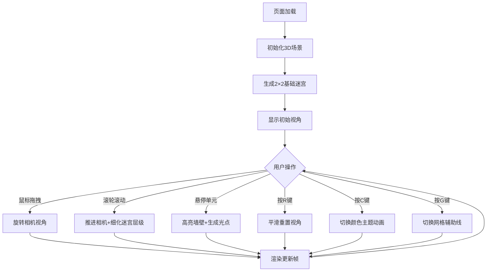

## 1. 产品概述

动态递归分形迷宫探索器 - 一个基于Three.js的交互式3D可视化应用，让用户通过鼠标拖拽和滚轮操作在三维空间中探索不断细化的自相似迷宫结构，营造无限递归和时空穿梭的视觉体验。

- 核心目标：提供沉浸式分形迷宫探索体验，展示数学美感与交互设计的结合
- 目标用户：对分形几何、3D可视化、创意编程感兴趣的开发者和艺术爱好者

## 2. 核心功能

### 2.1 功能模块

1. **3D分形迷宫场景**：递归生成自相似迷宫结构，支持最多6级分层细化
2. **视角交互控制**：鼠标拖拽旋转、滚轮缩放推进、键盘快捷键操作
3. **动态视觉效果**：墙壁颜色渐变流动、发光边缘闪烁、引导光球脉动、悬停呼吸效果
4. **主题与辅助系统**：三种颜色主题切换、网格辅助线显示、状态信息面板
5. **UI状态面板**：左下角半透明信息面板，显示层数、距离、主题等信息

### 2.2 功能详情

| 模块名称 | 功能描述 |
|----------|----------|
| 迷宫生成 | 初始2×2基础单元，每级分裂为4条更窄通道，墙壁高0.5单位 |
| 视角旋转 | 鼠标左键拖拽绕Y轴旋转，俯仰角限制-60°~60° |
| 滚轮缩放 | 每滚一格向中心推进0.5单位，触发迷宫层级细化 |
| 颜色系统 | 每层暖色偏移10°HSL，三种主题：冷暖渐变/极光渐变/火焰渐变 |
| 发光效果 | 墙壁顶部0.05单位发光边缘，滚轮停止后透明度0.6~1闪烁 |
| 引导光球 | 子单元入口处#00ffff半透明光球，1.5秒脉动周期 |
| 悬停交互 | 悬停单元墙壁亮度+20%，内部生成寻路小光点 |
| 键盘控制 | R键重置视角(1秒平滑过渡)、C键切换主题(1.5秒动画)、G键切换网格 |
| 自转效果 | 迷宫整体60秒周期绕Y轴缓慢自转 |
| 状态面板 | 左下角圆角半透明面板，显示层数/距离/主题，悬停扩展显示帧率和操作提示 |

## 3. 核心流程

用户打开页面 → 初始2×2迷宫显示 → 鼠标拖拽旋转视角观察 → 滚轮缩放推进深入层级 → 迷宫自动细化分裂 → 悬停单元查看细节 → 快捷键切换主题/网格/重置视角 → 持续探索无限递归结构

## 4. 用户界面设计

### 4.1 设计风格
- **主色调**：深灰#1a1a2e地面 + 动态渐变墙壁（深海蓝#0f4c75到暗紫#6a0572起始）
- **强调色**：青色#00ffff引导光球、亮蓝灰#e0e0ff文字
- **视觉风格**：赛博朋克深邃感 + 数学分形美感 + 微交互发光特效
- **布局**：全屏3D场景为主体，左下角悬浮状态面板

### 4.2 页面设计

| 区域 | UI元素 | 设计描述 |
|------|--------|----------|
| 中央主区域 | Three.js Canvas | 全屏3D迷宫场景，支持拖拽和滚轮交互 |
| 左下角 | 状态面板 | 背景透明度0.2圆角矩形，显示层数/距离/主题名；悬停扩展显示FPS和操作提示 |
| 全局 | 文字样式 | 亮蓝灰色#e0e0ff，系统无衬线字体 |

### 4.3 响应式设计
- 桌面端为主，全屏Canvas自适应窗口大小
- 状态面板固定定位，不随滚动变化

### 4.4 3D场景设计
- **环境**：深色背景营造宇宙深邃感，无雾效保持层次清晰度
- **光照**：环境光+方向光组合，确保墙壁颜色和发光边缘清晰可见
- **相机**：透视相机，初始俯视角度，平滑插值过渡动画
- **动画系统**：60秒迷宫自转、1.5秒光球脉动、2秒发光边缘闪烁、1秒视角重置过渡、1.5秒主题切换
- **性能优化**：几何体复用、层级按需生成、目标30FPS以上流畅运行
