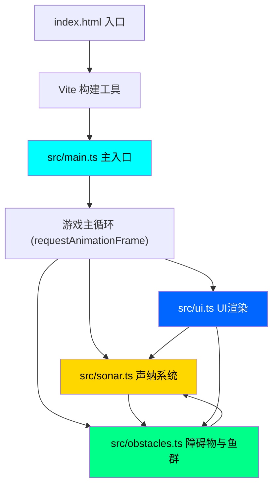

## 1. 架构设计



## 2. 技术描述

- **前端框架**：原生 TypeScript + Canvas 2D API（无React/Vue，按用户需求）
- **构建工具**：Vite 5.x
- **开发语言**：TypeScript 5.x（严格模式，目标ES2020，模块ESNext）
- **渲染层**：HTML5 Canvas 2D Context，全屏渲染
- **样式**：内联CSS + Canvas绘制，无Tailwind（Canvas应用不需要）
- **后端**：无，纯前端应用
- **数据持久化**：无，所有状态内存管理

## 3. 模块与文件结构

| 文件 | 职责 | 导出内容 |
|------|------|----------|
| `package.json` | 项目配置，依赖声明，启动脚本 | typescript, vite |
| `index.html` | 入口HTML，Canvas容器，UI DOM结构 | - |
| `tsconfig.json` | TypeScript编译配置（严格模式，ES2020） | - |
| `vite.config.js` | Vite构建配置（HMR开启） | - |
| `src/main.ts` | 主入口：画布初始化、事件绑定、主循环调度 | - |
| `src/sonar.ts` | 声纳脉冲波和回波粒子系统 | `emitPulse()`, `updateSonar()`, `renderSonar()` |
| `src/obstacles.ts` | 障碍物与鱼群管理 | `generateLayout()`, `updateFish()`, `checkCollision()`, `renderObstacles()` |
| `src/ui.ts` | UI界面元素渲染 | `renderUI()`, `renderHintBar()`, `renderEnergyIndicator()`, `renderDepthScale()`, `renderBioluminescent()` |

## 4. 核心数据结构定义

### 4.1 声纳脉冲 (SonarPulse)
```typescript
interface SonarPulse {
  x: number;          // 圆心X坐标
  y: number;          // 圆心Y坐标
  radius: number;     // 当前半径
  maxRadius: number;  // 最大半径（画布对角线）
  speed: number;      // 扩展速度 200px/s
  lineWidth: number;  // 线宽 2px
  alive: boolean;     // 是否存活
}
```

### 4.2 回波粒子 (EchoParticle)
```typescript
interface EchoParticle {
  x: number;           // 当前位置X
  y: number;           // 当前位置Y
  vx: number;          // 速度X（沿法线方向）
  vy: number;          // 速度Y
  radius: number;      // 半径 2-4px
  traveled: number;    // 已飞行距离
  maxDistance: number; // 最大飞行距离 80px
  alpha: number;       // 当前透明度
  alive: boolean;      // 是否存活
}
```

### 4.3 障碍物 (Obstacle)
```typescript
interface Obstacle {
  type: 'fish_school' | 'terrain' | 'shipwreck';
  points: { x: number; y: number }[];  // 多边形顶点
  edges: { start: Point; end: Point; normal: Point; length: number }[];
  color: string;
  saturationBoost: number;  // 深度模式下的饱和度增量
}
```

### 4.4 深海鱼 (DeepSeaFish)
```typescript
interface DeepSeaFish {
  x: number;           // 位置X
  y: number;           // 位置Y
  angle: number;       // 游动角度
  speed: number;       // 游动速度 30-60px/s
  bodyLength: number;  // 体长 16-24px
  bodyColor: string;   // 体色 #00FF88 ~ #0066FF
  trail: TrailParticle[];  // 拖尾粒子
  lastSonarContact: number;  // 上次声纳接触时间戳
  targetAngle: number; // 目标转向角度
}
```

### 4.5 浮游生物 (Plankton)
```typescript
interface Plankton {
  x: number;
  y: number;
  vx: number;
  vy: number;
  alpha: number;
}
```

### 4.6 能量指示器状态
```typescript
interface EnergyState {
  level: number;       // 0-1，0=绿色 1=红色
  lastPulseTime: number;
}
```

### 4.7 全局游戏状态
```typescript
interface GameState {
  mode: 'normal' | 'depth' | 'tracking';
  mouseX: number;
  mouseY: number;
  hoveredFish: DeepSeaFish | null;
  fadeInAlpha: number;  // R键淡入动画 0-1
}
```

## 5. 核心算法说明

### 5.1 声纳脉冲与障碍物碰撞检测
对每个存活脉冲，遍历所有障碍物的每条边，使用圆与线段相交检测。当脉冲圆半径触及某条边时：
1. 计算该边的法线方向（从圆心指向边的垂线方向）
2. 根据边长度按每10px生成1个粒子的密度，在边上均匀采样位置
3. 在每个采样位置生成 EchoParticle，初速度沿法线方向

### 5.2 鱼群AI游动逻辑
- 每帧更新：鱼位置按当前角度和速度前进
- 边界检测：接近画布边缘时反向
- 随机转向：每0.5-2秒随机调整目标角度±30度
- 平滑转向：当前角度向目标角度线性插值过渡

### 5.3 拖尾粒子系统
每条鱼每帧在当前位置生成3个 TrailParticle，带有微小位置偏移。粒子寿命1.5秒，透明度随寿命线性衰减至0。

### 5.4 深度映射算法
画布Y坐标映射到0-2000米深度：
```
depth = (y / canvasHeight) * 2000
```
深度模式下，判断障碍物中心点深度是否在鼠标深度±100米范围内，若是则饱和度提升30%。

## 6. 性能优化策略

1. **粒子对象池**：预先分配 EchoParticle 和 TrailParticle 对象数组，避免频繁GC
2. **离屏缓存**：静态障碍物（地形、沉船）渲染到离屏Canvas，每帧直接贴图
3. **帧率分离**：鱼群逻辑30FPS更新，渲染60FPS执行，使用累加器模式
4. **空间裁剪**：超出画布范围的粒子立即标记死亡，停止更新
5. **批量渲染**：同类型粒子一次性绘制，减少Canvas状态切换
