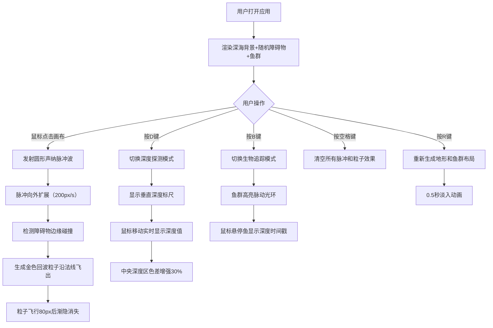

## 1. 产品概述

深海声纳回波探测与生物追踪模拟应用，通过鼠标和键盘交互模拟真实声纳脉冲在深海中的传播、反射和回波成像过程。主要面向海洋生物学家、教育工作者和游戏玩家，帮助用户直观感受声纳探测原理，观察障碍物（海底地形、鱼群、沉船）如何反射声波形成2D声纳图像。

- 核心价值：将抽象的声纳物理过程可视化为交互式动画，兼具教育意义和娱乐体验
- 目标用户：海洋生物学研究者、学生、模拟游戏爱好者

## 2. 核心功能

### 2.1 用户角色
无角色区分，所有用户拥有相同操作权限。

### 2.2 功能模块
1. **主画布区域**：深海背景渲染、声纳脉冲发射、回波粒子系统、障碍物显示、鱼群动画
2. **声纳探测系统**：点击发射圆形脉冲波、障碍物边缘反射、金色回波粒子生成
3. **深度探测模式（D键）**：垂直深度标尺、实时深度显示、深度区域色差增强
4. **生物追踪模式（B键）**：深海鱼群游动、发光拖尾效果、高亮脉冲光环、悬停深度信息
5. **场景控制系统**：空格键重置效果、R键随机重新生成地形和鱼群、淡入动画
6. **UI界面系统**：顶部操作提示栏、左下角声纳能量指示器、浮游生物背景动效

### 2.3 页面详情
| 页面名称 | 模块名称 | 功能描述 |
|-----------|-------------|---------------------|
| 主页面 | 声纳脉冲系统 | 点击画布发射圆形脉冲波（#00FFFF到#0088FF渐变，2像素线宽，200px/s扩展速度），遇障碍物反射生成金色回波粒子（#FFD700，2-4px半径，沿法线飞出80px后消失） |
| 主页面 | 深度探测模式 | D键切换，左侧0-2000米垂直标尺（100米刻度，500米加粗），鼠标移动显示实时深度，中央深度区色差增强30% |
| 主页面 | 生物追踪模式 | B键激活，10条发光深海鱼随机游动（体色#00FF88到#0066FF，体长16-24px，拖尾粒子每帧3个，寿命1.5秒），悬停显示深度时间戳 |
| 主页面 | 场景控制 | 空格键清空脉冲和粒子；R键重新生成布局并伴随0.5秒淡入动画 |
| 主页面 | UI界面 | 顶部40px高半透明提示栏（显示模式和快捷键），左下角圆形能量指示器（半径30px，脉冲后变红2秒渐变回绿），20个浮游生物光点（2px，#005566，0.5px/s飘动） |

## 3. 核心流程

用户进入页面后看到深海渐变背景和随机生成的障碍物与鱼群。通过鼠标点击画布发射声纳脉冲波，脉冲向外扩展并在遇到障碍物时产生回波粒子。按D键切换深度探测模式查看深度信息，按B键追踪鱼群位置。按空格键清除当前所有声纳效果，按R键重新生成整个场景布局。

## 4. 用户界面设计

### 4.1 设计风格
- **主色调**：深海蓝黑色系（背景#001122→#000011渐变）
- **强调色**：青色#00FFFF（声纳脉冲）、金色#FFD700（回波粒子）、绿色#00FF88（深度文字/鱼体色）、蓝色#0066FF（鱼体色）、黄色#FFFF00（追踪光环）
- **字体风格**：未来科技风发光字体，使用 text-shadow 模拟发光效果
- **整体氛围**：幽暗深海环境，带有未来科技感的HUD界面元素

### 4.2 页面设计概述
| 页面名称 | 模块名称 | UI元素 |
|-----------|-------------|-------------|
| 主页面 | 顶部提示栏 | 40px高半透明黑色背景（rgba(0,0,0,0.6)），#00FFFF发光文字，左侧显示当前模式，右侧显示快捷键说明 |
| 主页面 | 深度标尺 | 左侧固定宽度区域，0-2000米刻度，每100米细线，每500米加粗，#00FF88绿色数字标注 |
| 主页面 | 能量指示器 | 左下角圆形，半径30px，默认绿色#00FF88，脉冲后#FF4444红色，2秒渐变回绿，带发光外光晕 |
| 主页面 | 鱼群追踪光环 | 半径20px黄色#FFFF00圆环，1秒周期脉动（透明度0.3↔0.8） |
| 主页面 | 浮游生物 | 20个2px光点，#005566颜色，透明度0.3，0.5px/s缓慢飘动 |

### 4.3 响应式设计
- 桌面端优先，全屏Canvas自适应窗口尺寸
- 最小支持1024×768分辨率
- Canvas使用CSS 100vw×100vh，内部坐标系根据实际尺寸动态调整
- UI元素（提示栏、能量指示器、深度标尺）使用固定像素定位，不随画布缩放变形

### 4.4 动画与性能
- **帧率目标**：声纳脉冲和粒子60FPS，鱼群逻辑更新不低于30FPS
- **实现方式**：使用 requestAnimationFrame 主循环，分离逻辑更新和渲染
- **优化策略**：对象池复用粒子，离屏canvas缓存静态障碍物，帧率自适应
