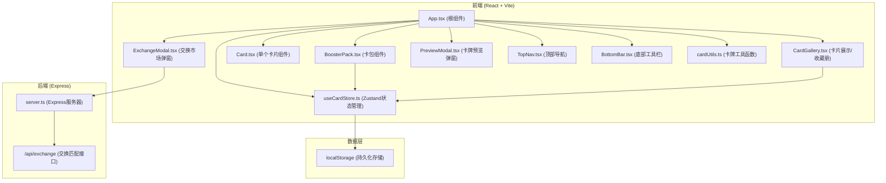
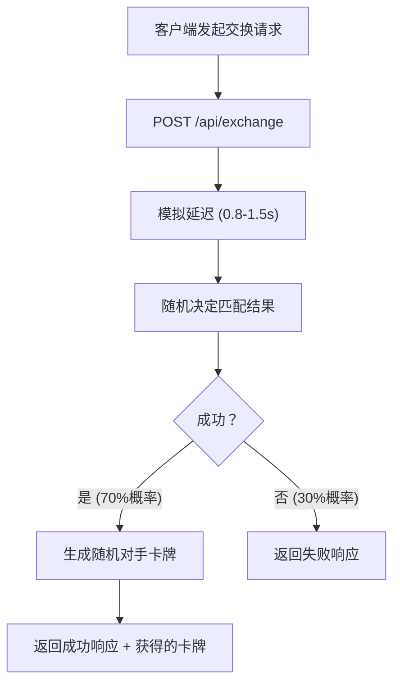
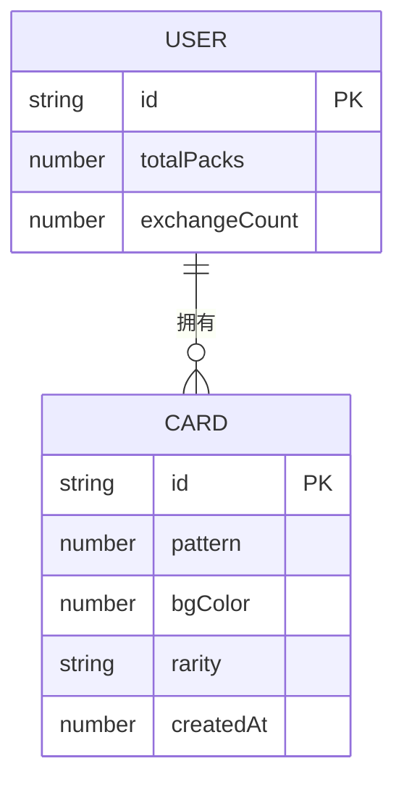

## 1. 架构设计



## 2. 技术描述
- **前端框架**：React@18 + TypeScript@5
- **构建工具**：Vite@5 + @vitejs/plugin-react@4
- **状态管理**：Zustand@4（轻量级状态管理，替代 Context）
- **样式方案**：CSS Modules + CSS 变量（无需 Tailwind，使用自定义深色主题变量）
- **路由**：react-router-dom@6（单页应用，主要为功能 Tab 切换）
- **后端**：Express@4 + TypeScript
- **数据持久化**：localStorage 存储用户卡牌数据
- **图标**：lucide-react

## 3. 路由定义
| 路由 | 用途 |
|-----|-----|
| `/` | 主页面（开包 + 收藏册 + 工具栏） |
| `/exchange` | 交换市场（通过弹窗实现，非独立路由） |

## 4. API 定义

### 4.1 交换匹配接口
```typescript
// POST /api/exchange
interface ExchangeRequest {
  offeredCardId: string;
  userId: string;
}

interface ExchangeResponse {
  success: boolean;
  message: string;
  receivedCard?: Card;
  matchedUserId?: string;
}

interface Card {
  id: string;
  pattern: number; // 0-7 共8种图案
  bgColor: number; // 0-5 共6种背景色
  rarity: 'common' | 'rare' | 'epic' | 'legendary';
  createdAt: number;
}
```

## 5. 服务器架构



## 6. 数据模型

### 6.1 数据模型定义


### 6.2 稀有度权重
| 稀有度 | 权重 | 概率 |
|-------|-----|-----|
| 普通 | 60 | 60% |
| 稀有 | 25 | 25% |
| 史诗 | 12 | 12% |
| 传说 | 3 | 3% |

## 7. 性能指标
- 开包响应延迟：< 200ms（本地生成，无需网络）
- 翻面动画帧率：稳定 60fps（CSS transform + opacity）
- 收藏册筛选渲染：< 500ms
- 交换响应：模拟 0.8-1.5s 延迟
