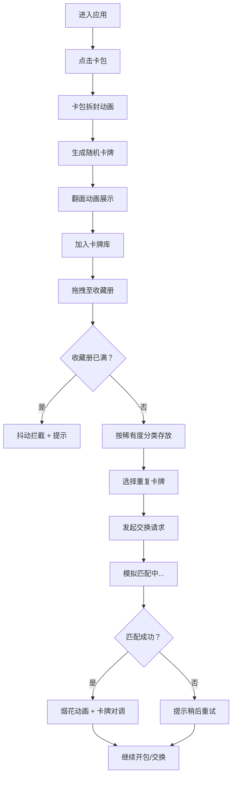

## 1. 产品概述
集换式卡牌开包模拟器是一款在浏览器中运行的虚拟卡牌收藏体验应用。用户通过点击卡包获得随机卡牌，拖拽整理至收藏册，并通过交换市场与其他用户匹配交换重复卡牌，最终集齐一套完整的主题卡组。

- 核心价值：提供沉浸式的卡牌开包体验，满足收集欲与策略交换乐趣
- 目标用户：卡牌游戏爱好者、收藏类游戏玩家

## 2. 核心功能

### 2.1 用户角色
无需注册登录，单用户本地体验。

### 2.2 功能模块
1. **开包系统**：卡包点击拆封、卡牌翻转动画、随机卡牌生成
2. **收藏册系统**：拖拽整理、稀有度分类、筛选排序、放大预览
3. **交换市场**：重复卡牌选择、模拟匹配、交换动画、结果反馈
4. **统计面板**：总卡牌数、稀有度分布、集齐进度

### 2.3 页面详情
| 页面名称 | 模块名称 | 功能描述 |
|---------|---------|---------|
| 主页面 | 顶部导航栏 | 显示总卡牌数、集齐进度条、功能标签切换 |
| 主页面 | 卡包展示区 | 居中展示卡包，点击拆封弹出随机卡牌，带翻面动画 |
| 主页面 | 收藏册区域 | 按稀有度分类展示卡牌，支持拖拽、筛选、排序、预览 |
| 主页面 | 底部操作栏 | 交换市场入口、开包统计、重置功能 |
| 交换市场弹窗 | 交换面板 | 选择重复卡牌发起交换，展示匹配状态与结果动画 |

## 3. 核心流程
用户进入应用后点击中央卡包 → 卡包拆封弹出随机卡牌（翻面动画）→ 卡牌自动加入待整理区或手动拖拽至收藏册 → 收藏册按稀有度分类存放 → 选择重复卡牌发起交换 → 系统模拟匹配（0.8-1.5秒延迟）→ 匹配成功显示烟花动画并完成交换 / 匹配失败提示重试 → 持续开包与交换直至集齐全套。

## 4. 用户界面设计

### 4.1 设计风格
- **主色调**：深色主题 `#0D1117` 背景，配合毛玻璃效果
- **稀有度配色**：
  - 普通：`#9CA3AF`（灰色）
  - 稀有：`#3B82F6`（蓝色）
  - 史诗：`#8B5CF6`（紫色）
  - 传说：`#F59E0B` → `#EF4444` 动态渐变（金色到红色）
- **圆角**：统一 12px 圆角
- **卡片阴影**：稀有度越高阴影越深，传说卡带彩色光晕
- **过渡动画**：所有交互 0.3s ease-out 缓动
- **字体**：展示字体采用 Orbitron（科技感），正文字体采用 Noto Sans SC

### 4.2 页面设计概述
| 页面名称 | 模块名称 | UI 元素 |
|---------|---------|---------|
| 主页面 | 顶部导航栏 | 毛玻璃效果固定栏，左对齐统计数据，居中进度条，右对齐标签 |
| 主页面 | 卡包展示区 | 中央大卡包，银色封条装饰，点击时有撕开动画 |
| 主页面 | 卡牌展示区 | 3D 旋转视角网格布局，悬停放大 1.1 倍 + 阴影过渡 |
| 主页面 | 收藏册区域 | 右侧抽屉式面板，按稀有度分 Tab，网格化卡片展示 |
| 主页面 | 底部工具栏 | 固定毛玻璃栏，交换市场按钮居中 |
| 弹窗层 | 卡牌预览 | 全屏半透明蒙层，卡片居中，滚动式背景虚化 |
| 弹窗层 | 交换市场 | 居中面板，展示我的卡牌与匹配状态 |

### 4.3 响应式
- **桌面端（≥1280px）**：四列卡片网格，收藏册常驻右侧
- **平板端（768px-1279px）**：两列卡片网格，收藏册折叠为抽屉
- **手机端（<768px）**：单列卡片网格，底部标签切换收藏册
- 所有触控交互支持触摸拖拽，按钮最小触控区域 48px

### 4.4 动画与特效
- **开包动画**：卡包撕开效果 → 卡牌弹出（0.5s 翻面 + 轻微回弹）
- **拖拽效果**：半透明缩略图（80x110px）跟随光标
- **交换成功**：2秒烟花粒子，粒子从卡片中心四散，大小 4-12px，颜色从 `#FFD700` 到 `#FF6B6B` 渐变
- **传说卡特效**：动态渐变光效边框，持续流动
