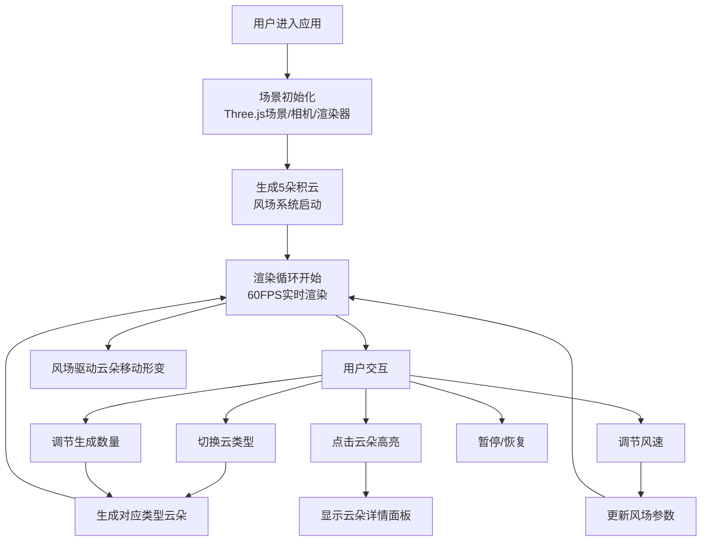

## 1. 产品概述
交互式三维云层动态模拟平台，为气象研究员提供可视化的云形成与消散研究工具。
- 主要目的：通过3D可视化模拟不同类型云朵在风场中的动态变化，支持积云、层云、卷云的实时生成、形变与消散过程研究
- 目标用户：气象研究员、气象教育工作者、大气科学学习者
- 市场价值：填补气象教学与科研中直观云动力学可视化工具的空白

## 2. 核心功能

### 2.1 用户角色
| 角色 | 注册方式 | 核心权限 |
|------|----------|----------|
| 气象研究员 | 无需注册，直接使用 | 场景交互、参数调节、数据观测 |

### 2.2 功能模块
1. **3D云层场景**：Three.js渲染的三维天空场景，包含渐变天空背景、太阳光源、多类型云朵
2. **云朵生成器**：支持积云、层云、卷云三种云型的程序化生成，由多个球体堆叠形成蓬松效果
3. **风场模拟系统**：随时间变化的向量场，驱动云朵移动、形变和旋转
4. **UI控制面板**：云类型切换、生成数量调节、风速控制、暂停/恢复功能
5. **交互与信息展示**：点击云朵高亮、云量统计、云朵详情面板

### 2.3 页面详情
| 页面名称 | 模块名称 | 功能描述 |
|----------|----------|----------|
| 主场景页面 | 3D画布 | 全屏Three.js渲染，支持鼠标旋转/缩放视角 |
| 主场景页面 | 云量统计面板 | 左上角实时显示积云、层云、卷云数量 |
| 主场景页面 | 控制面板 | 右上角云类型下拉、数量滑块、风速滑块、暂停按钮 |
| 主场景页面 | 云朵详情面板 | 点击云朵后显示类型、球体数量、当前高度 |
| 主场景页面 | 太阳效果 | 左下角半透明黄色光圈模拟太阳 |

## 3. 核心流程
用户进入应用 → 场景初始化（5朵积云自动生成，风场启动）→ 用户可通过控制面板切换云类型/调节参数 → 点击云朵查看详情 → 风场持续驱动云朵运动与形变 → 用户可暂停/恢复动态

## 4. 用户界面设计
### 4.1 设计风格
- 主色调：天空渐变（底部浅蓝#87CEEB → 顶部深蓝#1a1a2e）、云白（#FFFFFF、#D3D3D3、#F0F0F0）、灰云（#B0B0B0）
- 点缀色：太阳黄（#FFFFAA）、高亮黄（#FFFF00）
- UI风格：毛玻璃效果（半透明背景 + blur: 8px + 圆角12px）
- 按钮风格：圆角半透明按钮，hover状态轻微提亮
- 字体：现代无衬线字体，清晰可读
- 布局风格：浮动面板式布局，3D场景全屏，UI元素悬浮于四角

### 4.2 页面设计概述
| 页面名称 | 模块名称 | UI元素 |
|----------|----------|--------|
| 主场景 | 3D画布 | 全屏WebGL渲染，渐变色天空背景，太阳光圈位于(-5, 3, -5) |
| 主场景 | 左上角统计面板 | 毛玻璃卡片，展示三种云类型数量，带图标和数字 |
| 主场景 | 右上角控制面板 | 毛玻璃卡片，包含下拉选择器、两个滑块、暂停按钮 |
| 主场景 | 点击详情面板 | 毛玻璃卡片，动态显示被选中云朵的详细信息 |
| 主场景 | 操作提示 | 淡入淡出的旋转/缩放提示文字 |

### 4.3 响应式
- Desktop优先设计，全屏3D场景自适应窗口尺寸
- UI面板使用固定定位，在不同分辨率下保持合理位置
- 窗口resize事件触发Three.js渲染器和相机参数更新

### 4.4 3D场景指导
- 环境/氛围：渐变天空背景（#87CEEB → #1a1a2e），营造白天高空感
- 光照设置：环境光（AmbientLight 0.6）+ 方向光（DirectionalLight模拟太阳），从左下方向照射
- 相机设置：PerspectiveCamera，初始位置(0, 5, 15)，支持OrbitControls轨道控制
- 构图与焦点：云朵分布于场景中心区域（-10~10 X轴，2~8 Y轴，-5~5 Z轴）
- 交互与动画：OrbitControls鼠标拖拽旋转、滚轮缩放；云朵淡入淡出（生成1.5s、消失1s）；风场驱动平流运动；球体微位移形变
- 后处理效果：云朵半透明渲染，球体颜色随高度渐变
- 性能预算：总球体数≤5000，超出自动剔除最旧云朵，维持60FPS
