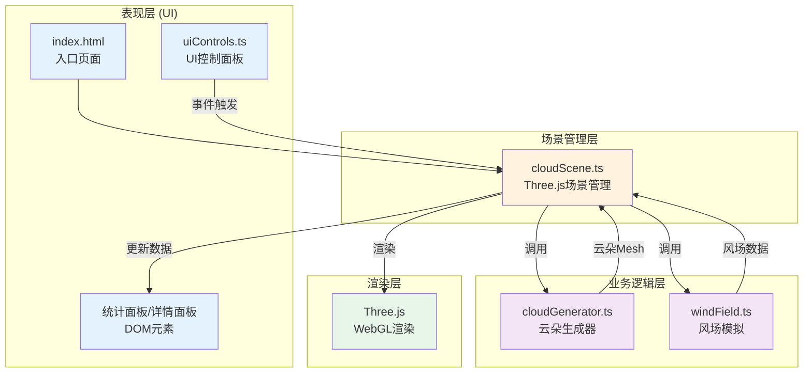

## 1. 架构设计



**数据流向说明：**
1. `uiControls.ts` → `cloudScene.ts`：用户操作事件（云类型切换、数量/风速调节、暂停）
2. `windField.ts` → `cloudScene.ts`：每帧输出风速风向向量数据
3. `cloudGenerator.ts` → `cloudScene.ts`：生成云朵Mesh对象组（Group）
4. `cloudScene.ts` → DOM：实时更新统计面板和详情面板数据

## 2. 技术说明
- 前端技术栈：TypeScript + Three.js + Vite
  - `three`：3D渲染引擎核心库
  - `@types/three`：Three.js的TypeScript类型定义
  - `typescript`：静态类型检查，严格模式
  - `vite`：构建工具与开发服务器
- 初始化工具：Vite vanilla-ts 模板
- 后端：无（纯前端3D可视化应用）
- 数据库：无

## 3. 路由定义
| 路由 | 用途 |
|------|------|
| / | 主场景页面（单页应用，无路由跳转） |

## 4. 项目文件结构与职责
```
auto161/
├── package.json              # 依赖配置与启动脚本
├── vite.config.js            # Vite构建配置
├── tsconfig.json             # TypeScript编译配置（严格模式，ES2020目标）
├── index.html                # 入口HTML页面
└── src/
    ├── main.ts               # 应用入口（初始化CloudScene）
    ├── cloudScene.ts         # 场景管理：整合所有模块，处理渲染循环与交互
    ├── cloudGenerator.ts     # 云朵生成：程序化生成三种云类型的Mesh
    ├── windField.ts          # 风场模拟：时间变化的向量场计算
    └── uiControls.ts         # UI控制：DOM面板创建与事件绑定
```

### 模块调用关系
- `main.ts` → 实例化 `CloudScene` 并启动
- `CloudScene`（cloudScene.ts）
  - 持有 `WindField` 实例，每帧调用 `windField.update(dt)` 获取风向量
  - 持有 `UIControls` 实例，监听其事件回调
  - 调用 `CloudGenerator` 静态方法生成云朵Mesh
  - 维护云朵对象池，处理添加/删除/更新逻辑
- `CloudGenerator`（cloudGenerator.ts）
  - 纯工具类，无状态，导出 `createCloud(type, config)` 方法
- `WindField`（windField.ts）
  - 独立类，内部维护时间与角度状态，输出 `{ velocity: Vector3 }`
- `UIControls`（uiControls.ts）
  - 独立类，创建DOM元素，通过回调函数与CloudScene通信

## 5. 核心数据模型

### 5.1 云类型枚举
```typescript
type CloudType = 'cumulus' | 'stratus' | 'cirrus';
```

### 5.2 云朵对象结构
```typescript
interface CloudData {
  id: number;
  type: CloudType;
  group: THREE.Group;          // Three.js对象组
  sphereCount: number;         // 球体数量
  createdAt: number;           // 创建时间戳
  basePosition: THREE.Vector3; // 基准位置
  fadeState: 'in' | 'visible' | 'out'; // 淡入淡出状态
  fadeProgress: number;        // 0~1 淡入淡出进度
  highlightTimer: number;      // 高亮剩余时间（ms）
}
```

### 5.3 风场数据
```typescript
interface WindData {
  velocity: THREE.Vector3; // 当前风速向量（单位/秒）
  direction: number;       // 风向角度（弧度）
  strength: number;        // 风速强度 0~5
}
```

## 6. 性能优化策略
- **球体池化**：复用SphereGeometry和Material，避免重复创建
- **InstanceMesh方案**（备选）：若性能不足可改为InstanceMesh批量渲染
- **自动剔除**：总球体数超过5000时，按创建时间删除最旧云朵
- **帧率控制**：requestAnimationFrame + deltaTime时间差计算，保证运动速度与帧率无关
- **半透明渲染优化**：使用AlphaTest + transparent，合理设置renderOrder
