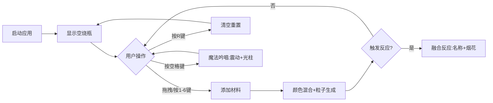

## 1. 产品概述

魔法药剂调配交互式应用是一款基于浏览器的化学实验虚拟化教学工具，通过魔法主题的视觉设计和实时交互反馈，让玩家像魔法师一样混合不同颜色的药水，观察反应效果并生成随机魔法药剂。

- **主要目的**：解决传统化学实验虚拟化教学中缺乏实时视觉反馈和趣味性的问题
- **目标用户**：学生、教育工作者、对化学或魔法主题感兴趣的普通用户
- **核心价值**：通过沉浸式的视觉效果和趣味交互，提升化学学习的参与感和记忆效果

## 2. 核心功能

### 2.1 功能模块

1. **主画布区域**：烧瓶展示、液体混合、粒子效果、光柱动画、融合反应
2. **左侧材料架**：6种魔法材料图标展示、拖拽交互
3. **右侧信息面板**：操作说明、快捷键提示、当前状态显示
4. **底部状态栏**：材料数量统计、上次反应结果显示

### 2.2 页面详情

| 页面名称 | 模块名称 | 功能描述 |
|---------|---------|---------|
| 主页面 | 烧瓶画布 | 宽240px高300px烧瓶，透明渐变瓶身，蓝色玻璃质感边框#4A90D9，悬停脉动光晕效果 |
| 主页面 | 材料拖拽 | 从材料架拖拽材料至烧瓶，光标跟随半透明图标（0.5倍缩放），落点0.3秒溅射动画（4-6个扩散圆点） |
| 主页面 | 液体混合 | RGB加权平均颜色混合，根据材料数量动态计算占比 |
| 主页面 | 粒子动画 | 每种材料产生独特粒子效果（气泡/光点/雾/光斑/旋涡/星点），最多50个粒子持续生成 |
| 主页面 | 键盘控制 | 1-6键添加材料，R键清空重置，空格键触发魔法吟唱（震动+波纹+彩色光柱） |
| 主页面 | 融合反应 | 特定颜色区域或5种材料时自动触发，悬浮反应名称+2秒烟花粒子喷射 |
| 主页面 | 材料架 | 60x60px圆角12px图标，金色外发光，悬停上浮效果 |
| 主页面 | 信息面板 | 半透明磨砂玻璃效果，backdrop-filter:blur(8px) |
| 主页面 | 状态栏 | 高度50px，显示材料数量和反应结果 |

## 3. 核心流程

用户打开应用后，可以通过两种方式添加材料：鼠标拖拽或键盘快捷键（1-6）。材料进入烧瓶后液体颜色实时混合并产生对应粒子效果。当达到触发条件时（颜色匹配或5种材料），自动触发融合反应，显示随机药剂名称并喷射烟花。用户可按R键重置，或按空格键触发魔法吟唱效果。

## 4. 用户界面设计

### 4.1 设计风格

- **主色调**：深紫黑色背景#0D0B1A，蓝色边框#4A90D9
- **材料颜色**：红#FF4444、蓝#4488FF、绿#44CC66、黄#FFCC00、紫#AA66FF、白#FFFFFF
- **面板样式**：半透明磨砂玻璃#1A1A2E透明度0.8，backdrop-filter:blur(8px)
- **按钮效果**：悬停0.2秒上浮transform:translateY(-4px)
- **字体**：选择具有魔法风格的衬线或装饰字体，标题36px，正文14px

### 4.2 页面设计概览

| 页面名称 | 模块名称 | UI元素 |
|---------|---------|--------|
| 主页面 | 烧瓶画布 | 渐变瓶身、蓝色边框、脉动光晕、液体动画、粒子系统 |
| 主页面 | 材料架 | 6个彩色图标、金色外发光、圆角12px、悬停上浮 |
| 主页面 | 信息面板 | 磨砂玻璃背景、操作说明、快捷键列表 |
| 主页面 | 状态栏 | 深色背景、材料数量统计、反应名称显示 |
| 主页面 | 融合效果 | 悬浮文字渐变光晕、缩放动画、彩色烟花粒子 |
| 主页面 | 吟唱效果 | 烧瓶震动、波纹扩散、互补色光柱、闪烁粒子 |

### 4.3 响应式设计

- **桌面视口(≥1280px)**：完整布局，烧瓶240x300px
- **平板视口(≥768px)**：烧瓶缩小至160x200px，面板自适应宽度
- **交互反馈**：所有动画在100ms内触发，维持60FPS
- **性能上限**：粒子总数不超过200个

## 5. 反应名称预设

1. 烈焰星云药剂
2. 暗影治愈药水
3. 月光祝福精华
4. 晨曦活力药剂
5. 森林守护药水
6. 星尘智慧精华
7. 龙血力量药剂
8. 梦境迷雾药水
9. 时间沙漏药剂
10. 元素混沌精华
