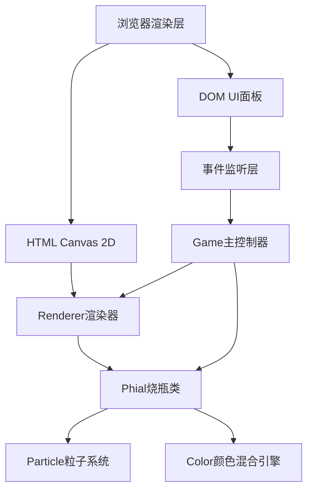

## 1. 架构设计



## 2. 技术栈说明

- **前端框架**：原生 TypeScript + HTML Canvas（无UI框架，高性能渲染）
- **构建工具**：Vite 5.x
- **语言版本**：TypeScript 5.x（严格模式，目标ES2020，模块ESNext）
- **样式**：原生CSS（CSS变量定义主题色）
- **性能优化**：Canvas分层渲染、requestAnimationFrame循环、粒子池化

## 3. 项目文件结构

| 文件路径 | 职责说明 |
|---------|---------|
| `/package.json` | 项目依赖配置，启动脚本 npm run dev |
| `/index.html` | 入口页面，DOM结构布局（Canvas+面板+状态栏） |
| `/tsconfig.json` | TypeScript严格模式配置 |
| `/vite.config.js` | Vite基础构建配置 |
| `/src/types.ts` | 类型定义：Material、Particle、PhialState等接口 |
| `/src/phial.ts` | 烧瓶类：液体混合逻辑、粒子生成、反应检测 |
| `/src/renderer.ts` | 渲染器：绘制烧瓶、材料、粒子、光柱、文字效果 |
| `/src/game.ts` | 主控制器：游戏循环、事件绑定、状态调度 |

## 4. 核心数据模型

### 4.1 Material（材料）
```typescript
interface Material {
  id: string;          // 唯一标识
  name: string;        // 中文名称
  color: string;       // 十六进制颜色值
  particleType: ParticleType;  // 粒子类型枚举
  key: string;         // 对应键盘按键（1-6）
}
```

### 4.2 Particle（粒子）
```typescript
interface Particle {
  x: number;           // X坐标
  y: number;           // Y坐标
  vx: number;          // X速度
  vy: number;          // Y速度
  radius: number;      // 半径
  color: string;       // 颜色
  alpha: number;       // 透明度
  life: number;        // 剩余生命周期
  maxLife: number;     // 最大生命周期
  type: ParticleType;  // 粒子类型
  rotation?: number;   // 旋转角度（旋涡粒子）
  rotSpeed?: number;   // 旋转速度
}
```

### 4.3 PhialState（烧瓶状态）
```typescript
interface PhialState {
  centerX: number;              // 烧瓶中心X
  centerY: number;              // 烧瓶中心Y
  width: number;                // 宽度
  height: number;               // 高度
  liquidLevel: number;          // 液体高度（0-1）
  liquidColor: RGB;             // 当前液体颜色
  materials: Material[];        // 已添加材料列表
  particles: Particle[];        // 活跃粒子池
  isReacting: boolean;          // 是否正在反应
  reactionName?: string;        // 反应名称
  reactionTime: number;         // 反应已持续时间
  isChanting: boolean;          // 是否正在吟唱
  chantTime: number;            // 吟唱已持续时间
  shakeOffset: { x: number; y: number };  // 震动偏移
  ripples: Ripple[];            // 波纹列表
  fireworks: Particle[];        // 烟花粒子池
  lastReactionName?: string;    // 上次反应名称
}
```

### 4.4 RGB颜色
```typescript
interface RGB {
  r: number;  // 0-255
  g: number;  // 0-255
  b: number;  // 0-255
}
```

## 5. 粒子类型枚举

```typescript
enum ParticleType {
  BUBBLE = 'bubble',        // 龙血果 - 上升气泡
  LIGHT_SPOT = 'light_spot',// 月光石 - 盘旋光点
  MIST = 'mist',            // 蛇鳞草 - 翻滚绿雾
  SPARKLE = 'sparkle',      // 晨曦露 - 闪烁光斑
  VORTEX = 'vortex',        // 暗影花 - 紫色旋涡
  STAR = 'star',            // 星尘 - 闪烁星点
  SPLASH = 'splash',        // 溅落动画
  FIREWORK = 'firework',    // 烟花粒子
  CHANT = 'chant'           // 光柱闪烁粒子
}
```

## 6. 核心算法

### 6.1 RGB加权平均混合
```
每种材料权重 = 1 / 材料总数
R_total = Σ(R_i * weight_i)
G_total = Σ(G_i * weight_i)  
B_total = Σ(B_i * weight_i)
```

### 6.2 色差计算（欧几里得距离）
```
colorDistance = sqrt((R1-R2)² + (G1-G2)² + (B1-B2)²)
当 distance < 30 时视为颜色匹配
```

### 6.3 互补色计算
```
R_complement = 255 - R_current
G_complement = 255 - G_current
B_complement = 255 - B_current
```

## 7. 性能约束

- 粒子上限：200个（普通粒子50 + 烟花60/秒×2秒 + 吟唱40/秒×1秒）
- 帧率目标：60FPS
- 渲染策略：单Canvas上下文，每帧清除重绘
- 粒子池化：复用已死亡粒子对象，减少GC压力
- 碰撞检测：仅检测落点是否在烧瓶区域内（简化几何判断）

## 8. 事件绑定

| 事件 | 处理方式 |
|-----|---------|
| mousedown(材料) | 记录拖拽起始状态，创建跟随幽灵元素 |
| mousemove(document) | 更新拖拽元素位置（半透明，0.5倍缩放） |
| mouseup(烧瓶区域) | 添加材料，触发溅射动画，清除拖拽状态 |
| mouseup(非烧瓶) | 仅清除拖拽状态 |
| keydown(1-6) | 添加对应材料，落点随机在瓶内 |
| keydown(R) | 重置烧瓶状态，清除所有粒子 |
| keydown(Space) | 触发魔法吟唱效果 |
| resize(window) | 重新计算画布尺寸和烧瓶位置 |
